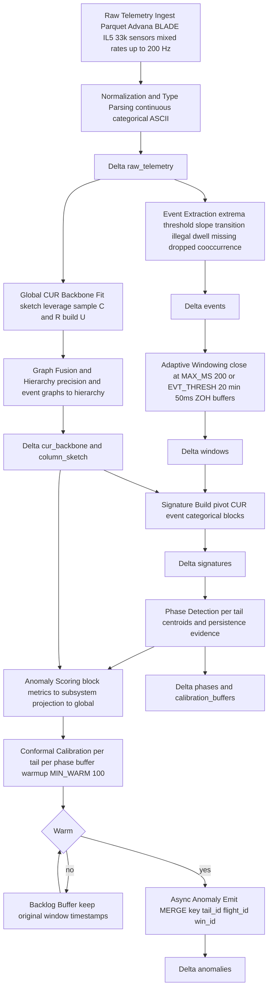
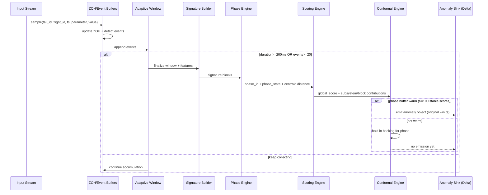
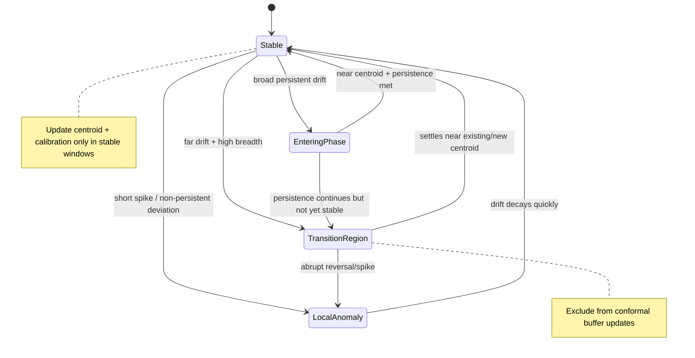
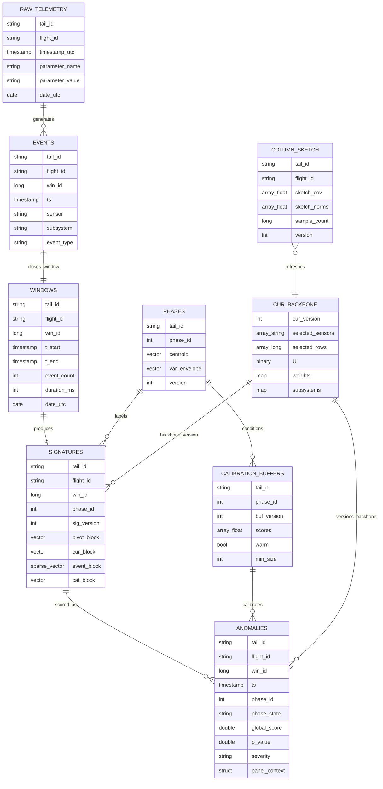
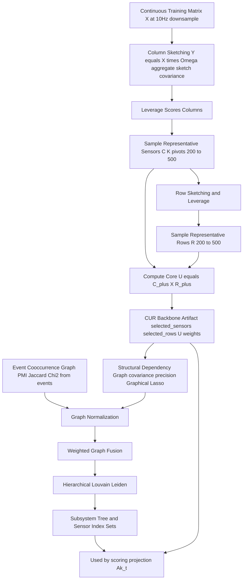
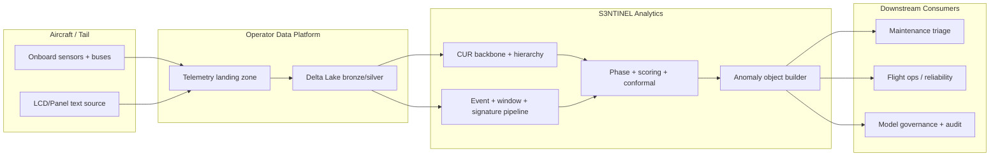
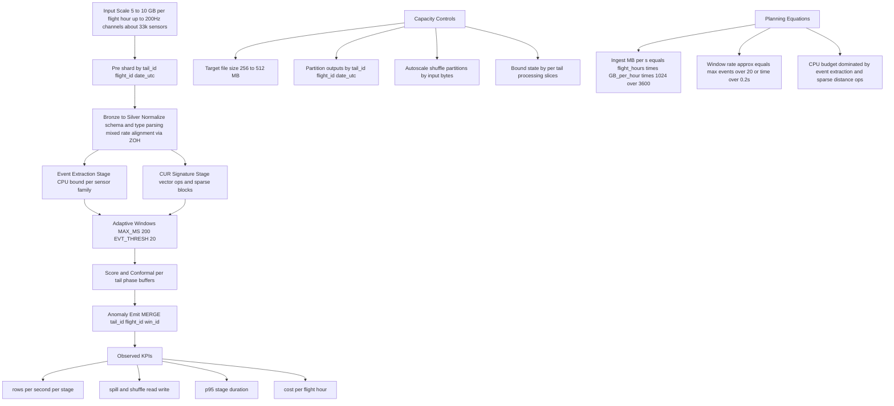

# Structural Anomaly System — Architecture Diagrams (v1)

**S3NTINEL:** Structural Streaming Sparse Event Nexus for Telemetry Inference with Network Envelope Learning

**Naming Convention (Canonical):** First `N` = **Nexus**; second `N` = **Network**.

These diagrams reflect the locked v1 spec in `Structural_Anomaly_System_Architecture.md`.

## 0) Operating Context

- Platform: DoD CDAO Advana BLADE enclave (IL5).
- Input format: Parquet telemetry.
- Fleet: AC/MC/HC-130J.
- Scale: ~100 TB total, ~5–10 GB per flight hour.
- Sensor/rate profile: ~33k sensors, mixed rates up to ~200 Hz.

## 1) End-to-End Layered Pipeline

## 2) Runtime Sequence (Per Window)

## 3) Phase State Machine

## 4) Delta Contracts & Relationships (ER)

## 5) CUR + Graph Fusion + Hierarchy Discovery

## 6) System Context (Operational Boundaries)

## 7) Throughput & Capacity Planning (50 DBU Batch)

## Notes
- Partitions for analytic outputs are `(tail_id, flight_id, date_utc)` where `date_utc = to_date(timestamp_utc)`.
- Backlog emissions after warm-up retain original window/event timestamps.
- `panel_context` is optional and populated from ASCII/LCD feature extraction.

## 8) Performance Test Checklist (Execution)

- Use profile matrix from `Structural_Anomaly_System_Architecture.md` section `12) Performance Test Protocol`.
- Run P1/P2/P3/P4 with identical config for 3 repeats each (same input slices).
- Capture p50/p95 stage times, spill/shuffle bytes, DBU, and cost per flight-hour.
- Validate correctness gates: no schema violations, no duplicate merge keys, backlog timestamps preserved.
- Promote config only if P1-P3 pass; use P4 for resilience-only verification.
