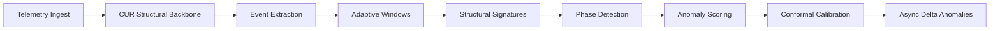
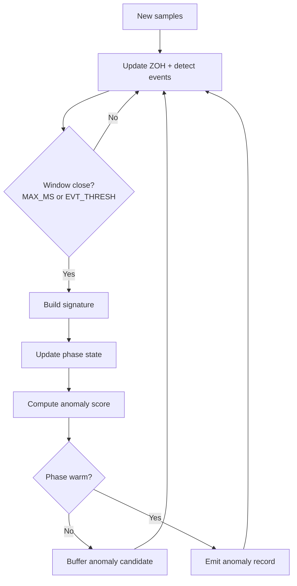
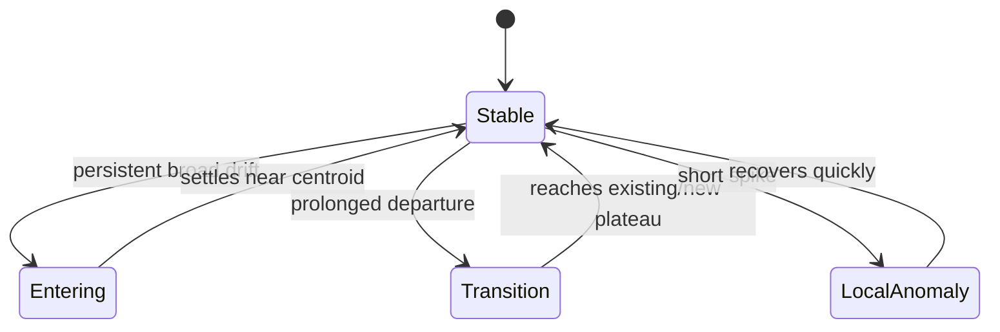
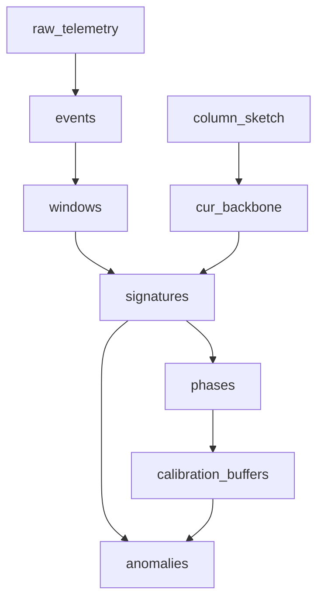
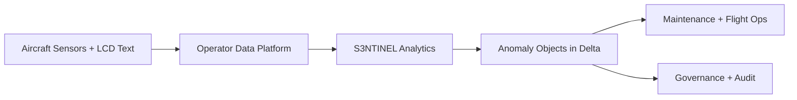
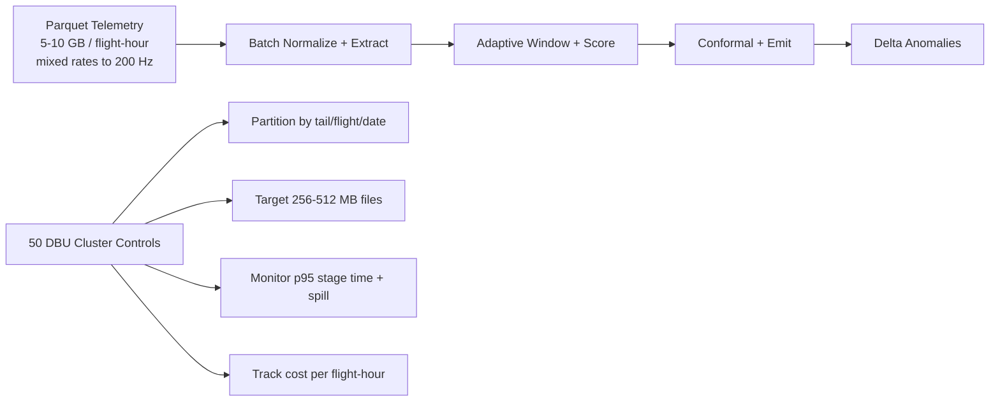

# S3NTINEL — Presentation Diagrams

**S3NTINEL**
Structural Streaming Sparse Event Nexus for Telemetry Inference with Network Envelope Learning

**Naming Convention (Canonical):** First `N` = **Nexus**; second `N` = **Network**.

These visuals are simplified for reviews, roadmap decks, and cross-functional alignment.

## Operating Context

- Advana BLADE enclave (IL5), Parquet telemetry source.
- AC/MC/HC-130J fleet, ~100 TB corpus.
- ~5–10 GB per flight hour; ~33k sensors from AFDX/A-MATS tap.
- Mixed-rate streams with high-refresh channels up to ~200 Hz.

## 1) Executive Pipeline



## 2) Runtime Decision Flow



## 3) Phase Behavior (Simple)



## 4) Data Products (Minimal Contract View)



## 5) NEL Concept (Hierarchy + Scoring)

```mermaid
graph TD
  A[Sensor/Event Signals] --> B[Dependency Graphs]
  B --> C[Hierarchical System Graph]
  C --> D[Nested Envelopes by Subsystem]
  D --> E[Local Scores A_k(t)]
  E --> F[Global Risk A(t)]
```

## 6) System Context



## 7) Throughput & Cost View



## Canonical Name

Use this expansion across technical and external materials:

**S3NTINEL: Structural Streaming Sparse Event Nexus for Telemetry Inference with Network Envelope Learning**

This keeps the two `N`s semantically distinct (`Nexus` vs `Network`).
