# Core Library Semantics

Each section summarizes one `core_libraries` component and the dataclasses it uses to represent domain semantics.

## Anomaly

libs/anomaly owns downstream anomaly attribution artifacts and attribution-vs-truth validation.

Dataclasses detected: `11`

```mermaid
flowchart TB
    core_libraries_anomaly["Anomaly\nlibs/anomaly owns downstream anomaly attribution artifacts and attribution-vs-truth v..."]
    core_libraries_anomaly_libs_anomaly_frames["frames.py"]
    core_libraries_anomaly --> core_libraries_anomaly_libs_anomaly_frames
    core_libraries_anomaly_libs_anomaly_frames_anomalysubsystemcontextframe["AnomalySubsystemContextFrame\nNo extracted dataclass fields."]
    core_libraries_anomaly_libs_anomaly_frames --> core_libraries_anomaly_libs_anomaly_frames_anomalysubsystemcontextframe
    core_libraries_anomaly_libs_anomaly_frames_anomalypanelcontextframe["AnomalyPanelContextFrame\nNo extracted dataclass fields."]
    core_libraries_anomaly_libs_anomaly_frames --> core_libraries_anomaly_libs_anomaly_frames_anomalypanelcontextframe
    core_libraries_anomaly_libs_anomaly_frames_anomalyparameterlocalizationframe["AnomalyParameterLocalizationFrame\nNo extracted dataclass fields."]
    core_libraries_anomaly_libs_anomaly_frames --> core_libraries_anomaly_libs_anomaly_frames_anomalyparameterlocalizationframe
    core_libraries_anomaly_libs_anomaly_frames_anomalyattributioncontextframe["AnomalyAttributionContextFrame\nNo extracted dataclass fields."]
    core_libraries_anomaly_libs_anomaly_frames --> core_libraries_anomaly_libs_anomaly_frames_anomalyattributioncontextframe
    core_libraries_anomaly_libs_anomaly_pipeline["pipeline.py"]
    core_libraries_anomaly --> core_libraries_anomaly_libs_anomaly_pipeline
    core_libraries_anomaly_libs_anomaly_pipeline_anomalyartifactset["AnomalyArtifactSet\nCarries window_attribution: AnomalyWindowAttributionTable, telemetry_..."]
    core_libraries_anomaly_libs_anomaly_pipeline --> core_libraries_anomaly_libs_anomaly_pipeline_anomalyartifactset
    core_libraries_anomaly_libs_anomaly_pipeline_anomalyattributionplan["AnomalyAttributionPlan\nCarries top_k_per_subsystem: int = 5."]
    core_libraries_anomaly_libs_anomaly_pipeline --> core_libraries_anomaly_libs_anomaly_pipeline_anomalyattributionplan
    core_libraries_anomaly_libs_anomaly_tables["tables.py"]
    core_libraries_anomaly --> core_libraries_anomaly_libs_anomaly_tables
    core_libraries_anomaly_libs_anomaly_tables_anomalywindowattributiontable["AnomalyWindowAttributionTable\nCarries partition_by: tuple[str, ...] = ('tail_id',)."]
    core_libraries_anomaly_libs_anomaly_tables --> core_libraries_anomaly_libs_anomaly_tables_anomalywindowattributiontable
    core_libraries_anomaly_libs_anomaly_tables_anomalytelemetryattributiontable["AnomalyTelemetryAttributionTable\nCarries partition_by: tuple[str, ...] = ('tail_id',)."]
    core_libraries_anomaly_libs_anomaly_tables --> core_libraries_anomaly_libs_anomaly_tables_anomalytelemetryattributiontable
    core_libraries_anomaly_libs_anomaly_tables_anomalyeventattributiontable["AnomalyEventAttributionTable\nCarries partition_by: tuple[str, ...] = ('tail_id',)."]
    core_libraries_anomaly_libs_anomaly_tables --> core_libraries_anomaly_libs_anomaly_tables_anomalyeventattributiontable
    core_libraries_anomaly_libs_anomaly_validator["validator.py"]
    core_libraries_anomaly --> core_libraries_anomaly_libs_anomaly_validator
    core_libraries_anomaly_libs_anomaly_validator_detectedlocalizationtruthmap["DetectedLocalizationTruthMap\nCarries detected_to_truth_id: dict[str, str], ambiguous_detected_ids:..."]
    core_libraries_anomaly_libs_anomaly_validator --> core_libraries_anomaly_libs_anomaly_validator_detectedlocalizationtruthmap
    core_libraries_anomaly_libs_anomaly_validator__truthwindowattributionmatch["_TruthWindowAttributionMatch\nCarries truth_window_id: str, dominant_subsystem_match: bool, dominan..."]
    core_libraries_anomaly_libs_anomaly_validator --> core_libraries_anomaly_libs_anomaly_validator__truthwindowattributionmatch
```

| Dataclass | Module | Semantic Kind | Represents | Payload Shape | Fields | LOC |
| --- | --- | --- | --- | --- | ---: | ---: |
| AnomalySubsystemContextFrame | `libs.anomaly.frames` | Frame Artifact | frame artifact for Anomaly Subsystem Context within libs/anomaly owns downstream anomaly attribution artifacts and attribution-vs-truth validation | No extracted dataclass fields. | 0 | 135 |
| AnomalyPanelContextFrame | `libs.anomaly.frames` | Frame Artifact | frame artifact for Anomaly Panel Context within libs/anomaly owns downstream anomaly attribution artifacts and attribution-vs-truth validation | No extracted dataclass fields. | 0 | 135 |
| AnomalyParameterLocalizationFrame | `libs.anomaly.frames` | Frame Artifact | frame artifact for Anomaly Parameter Localization within libs/anomaly owns downstream anomaly attribution artifacts and attribution-vs-truth validation | No extracted dataclass fields. | 0 | 500 |
| AnomalyAttributionContextFrame | `libs.anomaly.frames` | Frame Artifact | frame artifact for Anomaly Attribution Context within libs/anomaly owns downstream anomaly attribution artifacts and attribution-vs-truth validation | No extracted dataclass fields. | 0 | 37 |
| AnomalyArtifactSet | `libs.anomaly.pipeline` | Artifact Bundle | artifact bundle for Anomaly within libs/anomaly owns downstream anomaly attribution artifacts and attribution-vs-truth validation | Carries window_attribution: AnomalyWindowAttributionTable, telemetry_attribution: AnomalyTelemetryAttributionTable, event_attribution: AnomalyEventAttributionTable. | 3 | 4 |
| AnomalyAttributionPlan | `libs.anomaly.pipeline` | Execution Plan | execution plan for Anomaly Attribution within libs/anomaly owns downstream anomaly attribution artifacts and attribution-vs-truth validation | Carries top_k_per_subsystem: int = 5. | 1 | 134 |
| AnomalyWindowAttributionTable | `libs.anomaly.tables` | Table Artifact | table artifact for Anomaly Window Attribution within libs/anomaly owns downstream anomaly attribution artifacts and attribution-vs-truth validation | Carries partition_by: tuple[str, ...] = ('tail_id',). | 1 | 120 |
| AnomalyTelemetryAttributionTable | `libs.anomaly.tables` | Table Artifact | table artifact for Anomaly Telemetry Attribution within libs/anomaly owns downstream anomaly attribution artifacts and attribution-vs-truth validation | Carries partition_by: tuple[str, ...] = ('tail_id',). | 1 | 84 |
| AnomalyEventAttributionTable | `libs.anomaly.tables` | Table Artifact | table artifact for Anomaly Event Attribution within libs/anomaly owns downstream anomaly attribution artifacts and attribution-vs-truth validation | Carries partition_by: tuple[str, ...] = ('tail_id',). | 1 | 46 |
| DetectedLocalizationTruthMap | `libs.anomaly.validator` | Domain Dataclass | Detected Localization Truth Map within anomaly attribution validation against simulator misbehavior truth with fault wrappers | Carries detected_to_truth_id: dict[str, str], ambiguous_detected_ids: set[str]. | 2 | 55 |
| _TruthWindowAttributionMatch | `libs.anomaly.validator` | Domain Dataclass | Truth Window Attribution Match within anomaly attribution validation against simulator misbehavior truth with fault wrappers | Carries truth_window_id: str, dominant_subsystem_match: bool, dominant_subsystem_mappable: bool, dominant_subsystem_truth: str | None, +10 more. | 14 | 223 |

### Dataclass Fields

#### AnomalySubsystemContextFrame

- Module: `libs.anomaly.frames`
- Semantic kind: Frame Artifact
- Represents: frame artifact for Anomaly Subsystem Context within libs/anomaly owns downstream anomaly attribution artifacts and attribution-vs-truth validation
- Payload shape: No extracted dataclass fields.

No extracted dataclass fields.

#### AnomalyPanelContextFrame

- Module: `libs.anomaly.frames`
- Semantic kind: Frame Artifact
- Represents: frame artifact for Anomaly Panel Context within libs/anomaly owns downstream anomaly attribution artifacts and attribution-vs-truth validation
- Payload shape: No extracted dataclass fields.

No extracted dataclass fields.

#### AnomalyParameterLocalizationFrame

- Module: `libs.anomaly.frames`
- Semantic kind: Frame Artifact
- Represents: frame artifact for Anomaly Parameter Localization within libs/anomaly owns downstream anomaly attribution artifacts and attribution-vs-truth validation
- Payload shape: No extracted dataclass fields.

No extracted dataclass fields.

#### AnomalyAttributionContextFrame

- Module: `libs.anomaly.frames`
- Semantic kind: Frame Artifact
- Represents: frame artifact for Anomaly Attribution Context within libs/anomaly owns downstream anomaly attribution artifacts and attribution-vs-truth validation
- Payload shape: No extracted dataclass fields.

No extracted dataclass fields.

#### AnomalyArtifactSet

- Module: `libs.anomaly.pipeline`
- Semantic kind: Artifact Bundle
- Represents: artifact bundle for Anomaly within libs/anomaly owns downstream anomaly attribution artifacts and attribution-vs-truth validation
- Payload shape: Carries window_attribution: AnomalyWindowAttributionTable, telemetry_attribution: AnomalyTelemetryAttributionTable, event_attribution: AnomalyEventAttributionTable.

| Field | Type | Default | Role |
| --- | --- | --- | --- |
| window_attribution | AnomalyWindowAttributionTable |  | artifact or table reference |
| telemetry_attribution | AnomalyTelemetryAttributionTable |  | artifact or table reference |
| event_attribution | AnomalyEventAttributionTable |  | artifact or table reference |

#### AnomalyAttributionPlan

- Module: `libs.anomaly.pipeline`
- Semantic kind: Execution Plan
- Represents: execution plan for Anomaly Attribution within libs/anomaly owns downstream anomaly attribution artifacts and attribution-vs-truth validation
- Payload shape: Carries top_k_per_subsystem: int = 5.

| Field | Type | Default | Role |
| --- | --- | --- | --- |
| top_k_per_subsystem | int | 5 | numeric value |

#### AnomalyWindowAttributionTable

- Module: `libs.anomaly.tables`
- Semantic kind: Table Artifact
- Represents: table artifact for Anomaly Window Attribution within libs/anomaly owns downstream anomaly attribution artifacts and attribution-vs-truth validation
- Payload shape: Carries partition_by: tuple[str, ...] = ('tail_id',).

| Field | Type | Default | Role |
| --- | --- | --- | --- |
| partition_by | tuple[str, ...] | ('tail_id',) | partitioning contract |

#### AnomalyTelemetryAttributionTable

- Module: `libs.anomaly.tables`
- Semantic kind: Table Artifact
- Represents: table artifact for Anomaly Telemetry Attribution within libs/anomaly owns downstream anomaly attribution artifacts and attribution-vs-truth validation
- Payload shape: Carries partition_by: tuple[str, ...] = ('tail_id',).

| Field | Type | Default | Role |
| --- | --- | --- | --- |
| partition_by | tuple[str, ...] | ('tail_id',) | partitioning contract |

#### AnomalyEventAttributionTable

- Module: `libs.anomaly.tables`
- Semantic kind: Table Artifact
- Represents: table artifact for Anomaly Event Attribution within libs/anomaly owns downstream anomaly attribution artifacts and attribution-vs-truth validation
- Payload shape: Carries partition_by: tuple[str, ...] = ('tail_id',).

| Field | Type | Default | Role |
| --- | --- | --- | --- |
| partition_by | tuple[str, ...] | ('tail_id',) | partitioning contract |

#### DetectedLocalizationTruthMap

- Module: `libs.anomaly.validator`
- Semantic kind: Domain Dataclass
- Represents: Detected Localization Truth Map within anomaly attribution validation against simulator misbehavior truth with fault wrappers
- Payload shape: Carries detected_to_truth_id: dict[str, str], ambiguous_detected_ids: set[str].

| Field | Type | Default | Role |
| --- | --- | --- | --- |
| detected_to_truth_id | dict[str, str] |  | identity / key |
| ambiguous_detected_ids | set[str] |  | ordered or grouped values |

#### _TruthWindowAttributionMatch

- Module: `libs.anomaly.validator`
- Semantic kind: Domain Dataclass
- Represents: Truth Window Attribution Match within anomaly attribution validation against simulator misbehavior truth with fault wrappers
- Payload shape: Carries truth_window_id: str, dominant_subsystem_match: bool, dominant_subsystem_mappable: bool, dominant_subsystem_truth: str | None, +10 more.

| Field | Type | Default | Role |
| --- | --- | --- | --- |
| truth_window_id | str |  | identity / key |
| dominant_subsystem_match | bool |  | domain payload field |
| dominant_subsystem_mappable | bool |  | domain payload field |
| dominant_subsystem_truth | str | None |  | domain payload field |
| dominant_module_match | bool |  | domain payload field |
| dominant_module_mappable | bool |  | domain payload field |
| dominant_module_truth | str | None |  | domain payload field |
| telemetry_parameter_match | bool |  | domain payload field |
| event_parameter_match | bool |  | domain payload field |
| telemetry_truth_subsystem_present | bool |  | domain payload field |
| event_truth_subsystem_present | bool |  | domain payload field |
| telemetry_truth_module_present | bool |  | domain payload field |
| event_truth_module_present | bool |  | domain payload field |
| payload | dict[str, Any] |  | lookup or grouped mapping |

## Backbone

libs/backbone owns the continuous reconstruction backbone used to summarize normal multivariate structure and sensor importance.

Dataclasses detected: `8`

```mermaid
flowchart TB
    core_libraries_backbone["Backbone\nlibs/backbone owns the continuous reconstruction backbone used to summarize normal mu..."]
    core_libraries_backbone_libs_backbone_artifacts["artifacts.py"]
    core_libraries_backbone --> core_libraries_backbone_libs_backbone_artifacts
    core_libraries_backbone_libs_backbone_artifacts_backbonespec["BackboneSpec\nCarries sensor_count: int = 8, ridge_lambda: float = 1.0, event_prior..."]
    core_libraries_backbone_libs_backbone_artifacts --> core_libraries_backbone_libs_backbone_artifacts_backbonespec
    core_libraries_backbone_libs_backbone_artifacts_backbonesensorenergy["BackboneSensorEnergy\nCarries parameter_name: str, energy: float, support_count: int, event..."]
    core_libraries_backbone_libs_backbone_artifacts --> core_libraries_backbone_libs_backbone_artifacts_backbonesensorenergy
    core_libraries_backbone_libs_backbone_artifacts_backbonemodel["BackboneModel\nCarries selected_sensors_c: list[str], all_sensors: list[str], weight..."]
    core_libraries_backbone_libs_backbone_artifacts --> core_libraries_backbone_libs_backbone_artifacts_backbonemodel
    core_libraries_backbone_libs_backbone_tables["tables.py"]
    core_libraries_backbone --> core_libraries_backbone_libs_backbone_tables
    core_libraries_backbone_libs_backbone_tables_backboneselectedsensorframe["BackboneSelectedSensorFrame\nNo extracted dataclass fields."]
    core_libraries_backbone_libs_backbone_tables --> core_libraries_backbone_libs_backbone_tables_backboneselectedsensorframe
    core_libraries_backbone_libs_backbone_tables_backbonesensorenergytable["BackboneSensorEnergyTable\nNo extracted dataclass fields."]
    core_libraries_backbone_libs_backbone_tables --> core_libraries_backbone_libs_backbone_tables_backbonesensorenergytable
    core_libraries_backbone_libs_backbone_tables_backbonegramframe["BackboneGramFrame\nNo extracted dataclass fields."]
    core_libraries_backbone_libs_backbone_tables --> core_libraries_backbone_libs_backbone_tables_backbonegramframe
    core_libraries_backbone_libs_backbone_tables_backbonecrosstermframe["BackboneCrossTermFrame\nNo extracted dataclass fields."]
    core_libraries_backbone_libs_backbone_tables --> core_libraries_backbone_libs_backbone_tables_backbonecrosstermframe
    core_libraries_backbone_libs_backbone_tables_backbonetable["BackboneTable\nNo extracted dataclass fields."]
    core_libraries_backbone_libs_backbone_tables --> core_libraries_backbone_libs_backbone_tables_backbonetable
```

| Dataclass | Module | Semantic Kind | Represents | Payload Shape | Fields | LOC |
| --- | --- | --- | --- | --- | ---: | ---: |
| BackboneSpec | `libs.backbone.artifacts` | Specification | specification for Backbone within libs/backbone owns the continuous reconstruction backbone used to summarize normal multivariate structure and sensor importance | Carries sensor_count: int = 8, ridge_lambda: float = 1.0, event_prior_alpha: float = 0.35, backbone_version: int = 2. | 4 | 9 |
| BackboneSensorEnergy | `libs.backbone.artifacts` | Domain Dataclass | Backbone Sensor Energy within libs/backbone owns the continuous reconstruction backbone used to summarize normal multivariate structure and sensor importance | Carries parameter_name: str, energy: float, support_count: int, event_prior: float = 0.0, +3 more. | 7 | 46 |
| BackboneModel | `libs.backbone.artifacts` | Model | model for Backbone within libs/backbone owns the continuous reconstruction backbone used to summarize normal multivariate structure and sensor importance | Carries selected_sensors_c: list[str], all_sensors: list[str], weights_b: np.ndarray, lambda_ridge: float, +2 more. | 6 | 79 |
| BackboneSelectedSensorFrame | `libs.backbone.tables` | Frame Artifact | frame artifact for Backbone Selected Sensor within libs/backbone owns the continuous reconstruction backbone used to summarize normal multivariate structure and sensor importance | No extracted dataclass fields. | 0 | 23 |
| BackboneSensorEnergyTable | `libs.backbone.tables` | Table Artifact | table artifact for Backbone Sensor Energy within libs/backbone owns the continuous reconstruction backbone used to summarize normal multivariate structure and sensor importance | No extracted dataclass fields. | 0 | 108 |
| BackboneGramFrame | `libs.backbone.tables` | Frame Artifact | frame artifact for Backbone Gram within libs/backbone owns the continuous reconstruction backbone used to summarize normal multivariate structure and sensor importance | No extracted dataclass fields. | 0 | 23 |
| BackboneCrossTermFrame | `libs.backbone.tables` | Frame Artifact | frame artifact for Backbone Cross Term within libs/backbone owns the continuous reconstruction backbone used to summarize normal multivariate structure and sensor importance | No extracted dataclass fields. | 0 | 40 |
| BackboneTable | `libs.backbone.tables` | Table Artifact | table artifact for Backbone within libs/backbone owns the continuous reconstruction backbone used to summarize normal multivariate structure and sensor importance | No extracted dataclass fields. | 0 | 4 |

### Dataclass Fields

#### BackboneSpec

- Module: `libs.backbone.artifacts`
- Semantic kind: Specification
- Represents: specification for Backbone within libs/backbone owns the continuous reconstruction backbone used to summarize normal multivariate structure and sensor importance
- Payload shape: Carries sensor_count: int = 8, ridge_lambda: float = 1.0, event_prior_alpha: float = 0.35, backbone_version: int = 2.

| Field | Type | Default | Role |
| --- | --- | --- | --- |
| sensor_count | int | 8 | numeric value |
| ridge_lambda | float | 1.0 | model parameter or coefficient |
| event_prior_alpha | float | 0.35 | model parameter or coefficient |
| backbone_version | int | 2 | numeric value |

#### BackboneSensorEnergy

- Module: `libs.backbone.artifacts`
- Semantic kind: Domain Dataclass
- Represents: Backbone Sensor Energy within libs/backbone owns the continuous reconstruction backbone used to summarize normal multivariate structure and sensor importance
- Payload shape: Carries parameter_name: str, energy: float, support_count: int, event_prior: float = 0.0, +3 more.

| Field | Type | Default | Role |
| --- | --- | --- | --- |
| parameter_name | str |  | descriptive or categorical value |
| energy | float |  | numeric value |
| support_count | int |  | numeric value |
| event_prior | float | 0.0 | numeric value |
| selection_score | float | 0.0 | quantitative measure |
| selected_backbone | bool | False | selected feature set |
| backbone_version | int | 2 | numeric value |

#### BackboneModel

- Module: `libs.backbone.artifacts`
- Semantic kind: Model
- Represents: model for Backbone within libs/backbone owns the continuous reconstruction backbone used to summarize normal multivariate structure and sensor importance
- Payload shape: Carries selected_sensors_c: list[str], all_sensors: list[str], weights_b: np.ndarray, lambda_ridge: float, +2 more.

| Field | Type | Default | Role |
| --- | --- | --- | --- |
| selected_sensors_c | list[str] |  | selected sensor set |
| all_sensors | list[str] |  | sensor set |
| weights_b | np.ndarray |  | model parameter or coefficient |
| lambda_ridge | float |  | model parameter or coefficient |
| training_window_count | int |  | numeric value |
| backbone_version | int | 2 | numeric value |

#### BackboneSelectedSensorFrame

- Module: `libs.backbone.tables`
- Semantic kind: Frame Artifact
- Represents: frame artifact for Backbone Selected Sensor within libs/backbone owns the continuous reconstruction backbone used to summarize normal multivariate structure and sensor importance
- Payload shape: No extracted dataclass fields.

No extracted dataclass fields.

#### BackboneSensorEnergyTable

- Module: `libs.backbone.tables`
- Semantic kind: Table Artifact
- Represents: table artifact for Backbone Sensor Energy within libs/backbone owns the continuous reconstruction backbone used to summarize normal multivariate structure and sensor importance
- Payload shape: No extracted dataclass fields.

No extracted dataclass fields.

#### BackboneGramFrame

- Module: `libs.backbone.tables`
- Semantic kind: Frame Artifact
- Represents: frame artifact for Backbone Gram within libs/backbone owns the continuous reconstruction backbone used to summarize normal multivariate structure and sensor importance
- Payload shape: No extracted dataclass fields.

No extracted dataclass fields.

#### BackboneCrossTermFrame

- Module: `libs.backbone.tables`
- Semantic kind: Frame Artifact
- Represents: frame artifact for Backbone Cross Term within libs/backbone owns the continuous reconstruction backbone used to summarize normal multivariate structure and sensor importance
- Payload shape: No extracted dataclass fields.

No extracted dataclass fields.

#### BackboneTable

- Module: `libs.backbone.tables`
- Semantic kind: Table Artifact
- Represents: table artifact for Backbone within libs/backbone owns the continuous reconstruction backbone used to summarize normal multivariate structure and sensor importance
- Payload shape: No extracted dataclass fields.

No extracted dataclass fields.

## Behavior

libs/behavior owns the parameter behavior families used by simulation.

Dataclasses detected: `15`

```mermaid
flowchart TB
    core_libraries_behavior["Behavior\nlibs/behavior owns the parameter behavior families used by simulation"]
    core_libraries_behavior_libs_behavior_accumulative["accumulative.py"]
    core_libraries_behavior --> core_libraries_behavior_libs_behavior_accumulative
    core_libraries_behavior_libs_behavior_accumulative_accumulativecontract["AccumulativeContract\nCarries behavior_family: str = 'accumulative', defining_primitives: t..."]
    core_libraries_behavior_libs_behavior_accumulative --> core_libraries_behavior_libs_behavior_accumulative_accumulativecontract
    core_libraries_behavior_libs_behavior_base["base.py"]
    core_libraries_behavior --> core_libraries_behavior_libs_behavior_base
    core_libraries_behavior_libs_behavior_base_behaviorcontract["BehaviorContract\nCarries behavior_family: str, defining_primitives: tuple[str, ...], e..."]
    core_libraries_behavior_libs_behavior_base --> core_libraries_behavior_libs_behavior_base_behaviorcontract
    core_libraries_behavior_libs_behavior_base_behaviorprofileresult["BehaviorProfileResult\nCarries behavior_family_profiled: str, behavior_profile_confidence: f..."]
    core_libraries_behavior_libs_behavior_base --> core_libraries_behavior_libs_behavior_base_behaviorprofileresult
    core_libraries_behavior_libs_behavior_base_behaviorstepinput["BehaviorStepInput\nCarries dt_seconds: float, latent_state: Mapping[str, float], context..."]
    core_libraries_behavior_libs_behavior_base --> core_libraries_behavior_libs_behavior_base_behaviorstepinput
    core_libraries_behavior_libs_behavior_base_behaviorsample["BehaviorSample\nCarries parameter_name: str, parameter_value_clean: object | None, pa..."]
    core_libraries_behavior_libs_behavior_base --> core_libraries_behavior_libs_behavior_base_behaviorsample
    core_libraries_behavior_libs_behavior_discrete_state["discrete_state.py"]
    core_libraries_behavior --> core_libraries_behavior_libs_behavior_discrete_state
    core_libraries_behavior_libs_behavior_discrete_state_discretestatecontract["DiscreteStateContract\nCarries behavior_family: str = 'discrete_state', defining_primitives:..."]
    core_libraries_behavior_libs_behavior_discrete_state --> core_libraries_behavior_libs_behavior_discrete_state_discretestatecontract
    core_libraries_behavior_libs_behavior_inertial["inertial.py"]
    core_libraries_behavior --> core_libraries_behavior_libs_behavior_inertial
    core_libraries_behavior_libs_behavior_inertial_inertialcontract["InertialContract\nCarries behavior_family: str = 'inertial', defining_primitives: tuple..."]
    core_libraries_behavior_libs_behavior_inertial --> core_libraries_behavior_libs_behavior_inertial_inertialcontract
    core_libraries_behavior_libs_behavior_primitives["primitives.py"]
    core_libraries_behavior --> core_libraries_behavior_libs_behavior_primitives
    core_libraries_behavior_libs_behavior_primitives_behaviorprimitivespec["BehaviorPrimitiveSpec\nCarries name: str, description: str, supported_datatypes: tuple[str,..."]
    core_libraries_behavior_libs_behavior_primitives --> core_libraries_behavior_libs_behavior_primitives_behaviorprimitivespec
    core_libraries_behavior_libs_behavior_primitives_behaviorfamilydefinition["BehaviorFamilyDefinition\nCarries family: str, defining_primitives: tuple[str, ...], positive_w..."]
    core_libraries_behavior_libs_behavior_primitives --> core_libraries_behavior_libs_behavior_primitives_behaviorfamilydefinition
    core_libraries_behavior_libs_behavior_primitives_behaviorchoicecolumns["BehaviorChoiceColumns\nCarries family: 'Column', confidence: 'Column', mixed_unknown_score:..."]
    core_libraries_behavior_libs_behavior_primitives --> core_libraries_behavior_libs_behavior_primitives_behaviorchoicecolumns
    core_libraries_behavior_libs_behavior_primitives_behaviorchoicethresholds["BehaviorChoiceThresholds\nCarries low_score_threshold: float = 0.38, ambiguous_score_threshold:..."]
    core_libraries_behavior_libs_behavior_primitives --> core_libraries_behavior_libs_behavior_primitives_behaviorchoicethresholds
    core_libraries_behavior_libs_behavior_registry["registry.py"]
    core_libraries_behavior --> core_libraries_behavior_libs_behavior_registry
    core_libraries_behavior_libs_behavior_registry_behaviorregistry["BehaviorRegistry\nCarries _behaviors: dict[str, Behavior] = field(default_factory=dict)."]
    core_libraries_behavior_libs_behavior_registry --> core_libraries_behavior_libs_behavior_registry_behaviorregistry
    core_libraries_behavior_libs_behavior_regulated["regulated.py"]
    core_libraries_behavior --> core_libraries_behavior_libs_behavior_regulated
    core_libraries_behavior_libs_behavior_regulated_regulatedcontract["RegulatedContract\nCarries behavior_family: str = 'regulated', defining_primitives: tupl..."]
    core_libraries_behavior_libs_behavior_regulated --> core_libraries_behavior_libs_behavior_regulated_regulatedcontract
    core_libraries_behavior_libs_behavior_tracking["tracking.py"]
    core_libraries_behavior --> core_libraries_behavior_libs_behavior_tracking
    core_libraries_behavior_libs_behavior_tracking_trackingcontract["TrackingContract\nCarries behavior_family: str = 'tracking', defining_primitives: tuple..."]
    core_libraries_behavior_libs_behavior_tracking --> core_libraries_behavior_libs_behavior_tracking_trackingcontract
    core_libraries_behavior_libs_behavior_validation["validation.py"]
    core_libraries_behavior --> core_libraries_behavior_libs_behavior_validation
    core_libraries_behavior_libs_behavior_validation_familyvalidator["FamilyValidator\nCarries expected_family: str."]
    core_libraries_behavior_libs_behavior_validation --> core_libraries_behavior_libs_behavior_validation_familyvalidator
```

| Dataclass | Module | Semantic Kind | Represents | Payload Shape | Fields | LOC |
| --- | --- | --- | --- | --- | ---: | ---: |
| AccumulativeContract | `libs.behavior.accumulative` | Domain Dataclass | Accumulative Contract within accumulative behavior bundle: generator, profiler, validator, and violator | Carries behavior_family: str = 'accumulative', defining_primitives: tuple[str, ...] = BEHAVIOR_FAMILY_DEFINITIONS['accumulative'].defining_primitives, expected_traits: tuple[str, ...] = BEHAVIOR_FAMILY_DEFINITIONS['accumulative'].expected_traits, supported_datatypes: tuple[str, ...] = BEHAVIOR_FAMILY_DEFINITIONS['accumulative'].supported_datatypes, +1 more. | 5 | 6 |
| BehaviorContract | `libs.behavior.base` | Domain Dataclass | Behavior Contract within shared protocols and value objects for behavior-local simulation/profiling | Carries behavior_family: str, defining_primitives: tuple[str, ...], expected_traits: tuple[str, ...], supported_datatypes: tuple[str, ...], +1 more. | 5 | 6 |
| BehaviorProfileResult | `libs.behavior.base` | Domain Dataclass | Behavior Profile Result within shared protocols and value objects for behavior-local simulation/profiling | Carries behavior_family_profiled: str, behavior_profile_confidence: float, score_by_family: Mapping[str, float], profiled_features: Mapping[str, float | str | None]. | 4 | 5 |
| BehaviorStepInput | `libs.behavior.base` | Domain Dataclass | Behavior Step Input within shared protocols and value objects for behavior-local simulation/profiling | Carries dt_seconds: float, latent_state: Mapping[str, float], context: Mapping[str, Any] = field(default_factory=dict). | 3 | 4 |
| BehaviorSample | `libs.behavior.base` | Domain Dataclass | Behavior Sample within shared protocols and value objects for behavior-local simulation/profiling | Carries parameter_name: str, parameter_value_clean: object | None, parameter_value: object | None, state: Any = None, +1 more. | 5 | 6 |
| DiscreteStateContract | `libs.behavior.discrete_state` | Domain Dataclass | Discrete State Contract within discrete-state behavior bundle: generator, profiler, validator, and violator | Carries behavior_family: str = 'discrete_state', defining_primitives: tuple[str, ...] = BEHAVIOR_FAMILY_DEFINITIONS['discrete_state'].defining_primitives, expected_traits: tuple[str, ...] = BEHAVIOR_FAMILY_DEFINITIONS['discrete_state'].expected_traits, supported_datatypes: tuple[str, ...] = BEHAVIOR_FAMILY_DEFINITIONS['discrete_state'].supported_datatypes, +1 more. | 5 | 6 |
| InertialContract | `libs.behavior.inertial` | Domain Dataclass | Inertial Contract within inertial behavior bundle: generator, profiler, validator, and violator | Carries behavior_family: str = 'inertial', defining_primitives: tuple[str, ...] = BEHAVIOR_FAMILY_DEFINITIONS['inertial'].defining_primitives, expected_traits: tuple[str, ...] = BEHAVIOR_FAMILY_DEFINITIONS['inertial'].expected_traits, supported_datatypes: tuple[str, ...] = BEHAVIOR_FAMILY_DEFINITIONS['inertial'].supported_datatypes, +1 more. | 5 | 6 |
| BehaviorPrimitiveSpec | `libs.behavior.primitives` | Specification | specification for Behavior Primitive within libs/behavior owns the parameter behavior families used by simulation | Carries name: str, description: str, supported_datatypes: tuple[str, ...] = (). | 3 | 4 |
| BehaviorFamilyDefinition | `libs.behavior.primitives` | Domain Dataclass | Behavior Family Definition within shared primitive vocabulary and family scoring for behavior semantics | Carries family: str, defining_primitives: tuple[str, ...], positive_weights: Mapping[str, float], negative_weights: Mapping[str, float] = field(default_factory=dict), +3 more. | 7 | 8 |
| BehaviorChoiceColumns | `libs.behavior.primitives` | Domain Dataclass | Behavior Choice Columns within shared primitive vocabulary and family scoring for behavior semantics | Carries family: 'Column', confidence: 'Column', mixed_unknown_score: 'Column'. | 3 | 4 |
| BehaviorChoiceThresholds | `libs.behavior.primitives` | Domain Dataclass | Behavior Choice Thresholds within shared primitive vocabulary and family scoring for behavior semantics | Carries low_score_threshold: float = 0.38, ambiguous_score_threshold: float = 0.55, ambiguous_margin_threshold: float = 0.03, base_score: float = 0.85, +3 more. | 7 | 8 |
| BehaviorRegistry | `libs.behavior.registry` | Domain Dataclass | Behavior Registry within registry for behavior-local generator/profiler/validator/violator bundles | Carries _behaviors: dict[str, Behavior] = field(default_factory=dict). | 1 | 14 |
| RegulatedContract | `libs.behavior.regulated` | Domain Dataclass | Regulated Contract within regulated behavior bundle: generator, profiler, validator, and violator | Carries behavior_family: str = 'regulated', defining_primitives: tuple[str, ...] = BEHAVIOR_FAMILY_DEFINITIONS['regulated'].defining_primitives, expected_traits: tuple[str, ...] = BEHAVIOR_FAMILY_DEFINITIONS['regulated'].expected_traits, supported_datatypes: tuple[str, ...] = BEHAVIOR_FAMILY_DEFINITIONS['regulated'].supported_datatypes, +1 more. | 5 | 6 |
| TrackingContract | `libs.behavior.tracking` | Domain Dataclass | Tracking Contract within tracking behavior bundle: generator, profiler, validator, and violator | Carries behavior_family: str = 'tracking', defining_primitives: tuple[str, ...] = BEHAVIOR_FAMILY_DEFINITIONS['tracking'].defining_primitives, expected_traits: tuple[str, ...] = BEHAVIOR_FAMILY_DEFINITIONS['tracking'].expected_traits, supported_datatypes: tuple[str, ...] = BEHAVIOR_FAMILY_DEFINITIONS['tracking'].supported_datatypes, +1 more. | 5 | 6 |
| FamilyValidator | `libs.behavior.validation` | Domain Dataclass | Family Validator within shared validator helpers for behavior-family contracts | Carries expected_family: str. | 1 | 17 |

### Dataclass Fields

#### AccumulativeContract

- Module: `libs.behavior.accumulative`
- Semantic kind: Domain Dataclass
- Represents: Accumulative Contract within accumulative behavior bundle: generator, profiler, validator, and violator
- Payload shape: Carries behavior_family: str = 'accumulative', defining_primitives: tuple[str, ...] = BEHAVIOR_FAMILY_DEFINITIONS['accumulative'].defining_primitives, expected_traits: tuple[str, ...] = BEHAVIOR_FAMILY_DEFINITIONS['accumulative'].expected_traits, supported_datatypes: tuple[str, ...] = BEHAVIOR_FAMILY_DEFINITIONS['accumulative'].supported_datatypes, +1 more.

| Field | Type | Default | Role |
| --- | --- | --- | --- |
| behavior_family | str | 'accumulative' | descriptive or categorical value |
| defining_primitives | tuple[str, ...] | BEHAVIOR_FAMILY_DEFINITIONS['accumulative'].defining_primitives | ordered or grouped values |
| expected_traits | tuple[str, ...] | BEHAVIOR_FAMILY_DEFINITIONS['accumulative'].expected_traits | ordered or grouped values |
| supported_datatypes | tuple[str, ...] | BEHAVIOR_FAMILY_DEFINITIONS['accumulative'].supported_datatypes | ordered or grouped values |
| allowed_fault_families | tuple[str, ...] | BEHAVIOR_FAMILY_DEFINITIONS['accumulative'].allowed_fault_families | ordered or grouped values |

#### BehaviorContract

- Module: `libs.behavior.base`
- Semantic kind: Domain Dataclass
- Represents: Behavior Contract within shared protocols and value objects for behavior-local simulation/profiling
- Payload shape: Carries behavior_family: str, defining_primitives: tuple[str, ...], expected_traits: tuple[str, ...], supported_datatypes: tuple[str, ...], +1 more.

| Field | Type | Default | Role |
| --- | --- | --- | --- |
| behavior_family | str |  | descriptive or categorical value |
| defining_primitives | tuple[str, ...] |  | ordered or grouped values |
| expected_traits | tuple[str, ...] |  | ordered or grouped values |
| supported_datatypes | tuple[str, ...] |  | ordered or grouped values |
| allowed_fault_families | tuple[str, ...] |  | ordered or grouped values |

#### BehaviorProfileResult

- Module: `libs.behavior.base`
- Semantic kind: Domain Dataclass
- Represents: Behavior Profile Result within shared protocols and value objects for behavior-local simulation/profiling
- Payload shape: Carries behavior_family_profiled: str, behavior_profile_confidence: float, score_by_family: Mapping[str, float], profiled_features: Mapping[str, float | str | None].

| Field | Type | Default | Role |
| --- | --- | --- | --- |
| behavior_family_profiled | str |  | descriptive or categorical value |
| behavior_profile_confidence | float |  | numeric value |
| score_by_family | Mapping[str, float] |  | quantitative measure |
| profiled_features | Mapping[str, float | str | None] |  | artifact or table reference |

#### BehaviorStepInput

- Module: `libs.behavior.base`
- Semantic kind: Domain Dataclass
- Represents: Behavior Step Input within shared protocols and value objects for behavior-local simulation/profiling
- Payload shape: Carries dt_seconds: float, latent_state: Mapping[str, float], context: Mapping[str, Any] = field(default_factory=dict).

| Field | Type | Default | Role |
| --- | --- | --- | --- |
| dt_seconds | float |  | numeric value |
| latent_state | Mapping[str, float] |  | domain payload field |
| context | Mapping[str, Any] | field(default_factory=dict) | domain payload field |

#### BehaviorSample

- Module: `libs.behavior.base`
- Semantic kind: Domain Dataclass
- Represents: Behavior Sample within shared protocols and value objects for behavior-local simulation/profiling
- Payload shape: Carries parameter_name: str, parameter_value_clean: object | None, parameter_value: object | None, state: Any = None, +1 more.

| Field | Type | Default | Role |
| --- | --- | --- | --- |
| parameter_name | str |  | descriptive or categorical value |
| parameter_value_clean | object | None |  | domain payload field |
| parameter_value | object | None |  | domain payload field |
| state | Any | None | domain payload field |
| metadata | Mapping[str, Any] | field(default_factory=dict) | domain payload field |

#### DiscreteStateContract

- Module: `libs.behavior.discrete_state`
- Semantic kind: Domain Dataclass
- Represents: Discrete State Contract within discrete-state behavior bundle: generator, profiler, validator, and violator
- Payload shape: Carries behavior_family: str = 'discrete_state', defining_primitives: tuple[str, ...] = BEHAVIOR_FAMILY_DEFINITIONS['discrete_state'].defining_primitives, expected_traits: tuple[str, ...] = BEHAVIOR_FAMILY_DEFINITIONS['discrete_state'].expected_traits, supported_datatypes: tuple[str, ...] = BEHAVIOR_FAMILY_DEFINITIONS['discrete_state'].supported_datatypes, +1 more.

| Field | Type | Default | Role |
| --- | --- | --- | --- |
| behavior_family | str | 'discrete_state' | descriptive or categorical value |
| defining_primitives | tuple[str, ...] | BEHAVIOR_FAMILY_DEFINITIONS['discrete_state'].defining_primitives | ordered or grouped values |
| expected_traits | tuple[str, ...] | BEHAVIOR_FAMILY_DEFINITIONS['discrete_state'].expected_traits | ordered or grouped values |
| supported_datatypes | tuple[str, ...] | BEHAVIOR_FAMILY_DEFINITIONS['discrete_state'].supported_datatypes | ordered or grouped values |
| allowed_fault_families | tuple[str, ...] | BEHAVIOR_FAMILY_DEFINITIONS['discrete_state'].allowed_fault_families | ordered or grouped values |

#### InertialContract

- Module: `libs.behavior.inertial`
- Semantic kind: Domain Dataclass
- Represents: Inertial Contract within inertial behavior bundle: generator, profiler, validator, and violator
- Payload shape: Carries behavior_family: str = 'inertial', defining_primitives: tuple[str, ...] = BEHAVIOR_FAMILY_DEFINITIONS['inertial'].defining_primitives, expected_traits: tuple[str, ...] = BEHAVIOR_FAMILY_DEFINITIONS['inertial'].expected_traits, supported_datatypes: tuple[str, ...] = BEHAVIOR_FAMILY_DEFINITIONS['inertial'].supported_datatypes, +1 more.

| Field | Type | Default | Role |
| --- | --- | --- | --- |
| behavior_family | str | 'inertial' | descriptive or categorical value |
| defining_primitives | tuple[str, ...] | BEHAVIOR_FAMILY_DEFINITIONS['inertial'].defining_primitives | ordered or grouped values |
| expected_traits | tuple[str, ...] | BEHAVIOR_FAMILY_DEFINITIONS['inertial'].expected_traits | ordered or grouped values |
| supported_datatypes | tuple[str, ...] | BEHAVIOR_FAMILY_DEFINITIONS['inertial'].supported_datatypes | ordered or grouped values |
| allowed_fault_families | tuple[str, ...] | BEHAVIOR_FAMILY_DEFINITIONS['inertial'].allowed_fault_families | ordered or grouped values |

#### BehaviorPrimitiveSpec

- Module: `libs.behavior.primitives`
- Semantic kind: Specification
- Represents: specification for Behavior Primitive within libs/behavior owns the parameter behavior families used by simulation
- Payload shape: Carries name: str, description: str, supported_datatypes: tuple[str, ...] = ().

| Field | Type | Default | Role |
| --- | --- | --- | --- |
| name | str |  | descriptive or categorical value |
| description | str |  | descriptive or categorical value |
| supported_datatypes | tuple[str, ...] | () | ordered or grouped values |

#### BehaviorFamilyDefinition

- Module: `libs.behavior.primitives`
- Semantic kind: Domain Dataclass
- Represents: Behavior Family Definition within shared primitive vocabulary and family scoring for behavior semantics
- Payload shape: Carries family: str, defining_primitives: tuple[str, ...], positive_weights: Mapping[str, float], negative_weights: Mapping[str, float] = field(default_factory=dict), +3 more.

| Field | Type | Default | Role |
| --- | --- | --- | --- |
| family | str |  | descriptive or categorical value |
| defining_primitives | tuple[str, ...] |  | ordered or grouped values |
| positive_weights | Mapping[str, float] |  | model parameter or coefficient |
| negative_weights | Mapping[str, float] | field(default_factory=dict) | model parameter or coefficient |
| supported_datatypes | tuple[str, ...] | () | ordered or grouped values |
| expected_traits | tuple[str, ...] | () | ordered or grouped values |
| allowed_fault_families | tuple[str, ...] | () | ordered or grouped values |

#### BehaviorChoiceColumns

- Module: `libs.behavior.primitives`
- Semantic kind: Domain Dataclass
- Represents: Behavior Choice Columns within shared primitive vocabulary and family scoring for behavior semantics
- Payload shape: Carries family: 'Column', confidence: 'Column', mixed_unknown_score: 'Column'.

| Field | Type | Default | Role |
| --- | --- | --- | --- |
| family | 'Column' |  | domain payload field |
| confidence | 'Column' |  | domain payload field |
| mixed_unknown_score | 'Column' |  | quantitative measure |

#### BehaviorChoiceThresholds

- Module: `libs.behavior.primitives`
- Semantic kind: Domain Dataclass
- Represents: Behavior Choice Thresholds within shared primitive vocabulary and family scoring for behavior semantics
- Payload shape: Carries low_score_threshold: float = 0.38, ambiguous_score_threshold: float = 0.55, ambiguous_margin_threshold: float = 0.03, base_score: float = 0.85, +3 more.

| Field | Type | Default | Role |
| --- | --- | --- | --- |
| low_score_threshold | float | 0.38 | model parameter or coefficient |
| ambiguous_score_threshold | float | 0.55 | model parameter or coefficient |
| ambiguous_margin_threshold | float | 0.03 | model parameter or coefficient |
| base_score | float | 0.85 | quantitative measure |
| base_margin | float | 0.18 | numeric value |
| low_score_floor | float | 0.55 | quantitative measure |
| ambiguous_floor | float | 0.52 | numeric value |

#### BehaviorRegistry

- Module: `libs.behavior.registry`
- Semantic kind: Domain Dataclass
- Represents: Behavior Registry within registry for behavior-local generator/profiler/validator/violator bundles
- Payload shape: Carries _behaviors: dict[str, Behavior] = field(default_factory=dict).

| Field | Type | Default | Role |
| --- | --- | --- | --- |
| _behaviors | dict[str, Behavior] | field(default_factory=dict) | lookup or grouped mapping |

#### RegulatedContract

- Module: `libs.behavior.regulated`
- Semantic kind: Domain Dataclass
- Represents: Regulated Contract within regulated behavior bundle: generator, profiler, validator, and violator
- Payload shape: Carries behavior_family: str = 'regulated', defining_primitives: tuple[str, ...] = BEHAVIOR_FAMILY_DEFINITIONS['regulated'].defining_primitives, expected_traits: tuple[str, ...] = BEHAVIOR_FAMILY_DEFINITIONS['regulated'].expected_traits, supported_datatypes: tuple[str, ...] = BEHAVIOR_FAMILY_DEFINITIONS['regulated'].supported_datatypes, +1 more.

| Field | Type | Default | Role |
| --- | --- | --- | --- |
| behavior_family | str | 'regulated' | descriptive or categorical value |
| defining_primitives | tuple[str, ...] | BEHAVIOR_FAMILY_DEFINITIONS['regulated'].defining_primitives | ordered or grouped values |
| expected_traits | tuple[str, ...] | BEHAVIOR_FAMILY_DEFINITIONS['regulated'].expected_traits | ordered or grouped values |
| supported_datatypes | tuple[str, ...] | BEHAVIOR_FAMILY_DEFINITIONS['regulated'].supported_datatypes | ordered or grouped values |
| allowed_fault_families | tuple[str, ...] | BEHAVIOR_FAMILY_DEFINITIONS['regulated'].allowed_fault_families | ordered or grouped values |

#### TrackingContract

- Module: `libs.behavior.tracking`
- Semantic kind: Domain Dataclass
- Represents: Tracking Contract within tracking behavior bundle: generator, profiler, validator, and violator
- Payload shape: Carries behavior_family: str = 'tracking', defining_primitives: tuple[str, ...] = BEHAVIOR_FAMILY_DEFINITIONS['tracking'].defining_primitives, expected_traits: tuple[str, ...] = BEHAVIOR_FAMILY_DEFINITIONS['tracking'].expected_traits, supported_datatypes: tuple[str, ...] = BEHAVIOR_FAMILY_DEFINITIONS['tracking'].supported_datatypes, +1 more.

| Field | Type | Default | Role |
| --- | --- | --- | --- |
| behavior_family | str | 'tracking' | descriptive or categorical value |
| defining_primitives | tuple[str, ...] | BEHAVIOR_FAMILY_DEFINITIONS['tracking'].defining_primitives | ordered or grouped values |
| expected_traits | tuple[str, ...] | BEHAVIOR_FAMILY_DEFINITIONS['tracking'].expected_traits | ordered or grouped values |
| supported_datatypes | tuple[str, ...] | BEHAVIOR_FAMILY_DEFINITIONS['tracking'].supported_datatypes | ordered or grouped values |
| allowed_fault_families | tuple[str, ...] | BEHAVIOR_FAMILY_DEFINITIONS['tracking'].allowed_fault_families | ordered or grouped values |

#### FamilyValidator

- Module: `libs.behavior.validation`
- Semantic kind: Domain Dataclass
- Represents: Family Validator within shared validator helpers for behavior-family contracts
- Payload shape: Carries expected_family: str.

| Field | Type | Default | Role |
| --- | --- | --- | --- |
| expected_family | str |  | descriptive or categorical value |

## Common

libs/common now contains only narrow shared constants and helpers that are genuinely cross-cutting.

No dataclasses were detected in this library component.

## Config

Modules grouped under libs.config.

Dataclasses detected: `17`

```mermaid
flowchart TB
    core_libraries_config["Config\nModules grouped under libs.config"]
    core_libraries_config_libs_config_pipeline["pipeline.py"]
    core_libraries_config --> core_libraries_config_libs_config_pipeline
    core_libraries_config_libs_config_pipeline_pipelineexecutionsettings["PipelineExecutionSettings\nCarries table_format: str, raw_output_format: str, write_mode: str, f..."]
    core_libraries_config_libs_config_pipeline --> core_libraries_config_libs_config_pipeline_pipelineexecutionsettings
    core_libraries_config_libs_config_pipeline_pipelineartifactpaths["PipelineArtifactPaths\nCarries raw_input: str, raw_table: str, parameter_datatype_profile: s..."]
    core_libraries_config_libs_config_pipeline --> core_libraries_config_libs_config_pipeline_pipelineartifactpaths
    core_libraries_config_libs_config_pipeline_eventsettings["EventSettings\nCarries delta_threshold: float, slope_source: str, ema_alpha: float,..."]
    core_libraries_config_libs_config_pipeline --> core_libraries_config_libs_config_pipeline_eventsettings
    core_libraries_config_libs_config_pipeline_profilingsettings["ProfilingSettings\nCarries numeric_ratio_threshold: float, categorical_cardinality_max:..."]
    core_libraries_config_libs_config_pipeline --> core_libraries_config_libs_config_pipeline_profilingsettings
    core_libraries_config_libs_config_pipeline_windowingsettings["WindowingSettings\nCarries min_sampling_rate_hz: float, max_ms: int, min_ms: int, event_..."]
    core_libraries_config_libs_config_pipeline --> core_libraries_config_libs_config_pipeline_windowingsettings
    core_libraries_config_libs_config_pipeline_backbonesettings["BackboneSettings\nCarries sensor_count: int, ridge_lambda: float, max_sensor_universe:..."]
    core_libraries_config_libs_config_pipeline --> core_libraries_config_libs_config_pipeline_backbonesettings
    core_libraries_config_libs_config_pipeline_eventgraphsettings["EventGraphSettings\nCarries min_count: int, min_npmi: float, top_k_per_parameter_name: int."]
    core_libraries_config_libs_config_pipeline --> core_libraries_config_libs_config_pipeline_eventgraphsettings
    core_libraries_config_libs_config_pipeline_lagbandsettings["LagBandSettings\nCarries name: str, lower_seconds: float, upper_seconds: float, combin..."]
    core_libraries_config_libs_config_pipeline --> core_libraries_config_libs_config_pipeline_lagbandsettings
    core_libraries_config_libs_config_pipeline_laggraphsettings["LagGraphSettings\nCarries tau_max_seconds: float, min_count: int, max_mean_lag_seconds:..."]
    core_libraries_config_libs_config_pipeline --> core_libraries_config_libs_config_pipeline_laggraphsettings
    core_libraries_config_libs_config_pipeline_transitiongraphsettings["TransitionGraphSettings\nCarries min_count: int."]
    core_libraries_config_libs_config_pipeline --> core_libraries_config_libs_config_pipeline_transitiongraphsettings
    core_libraries_config_libs_config_pipeline_graphfusionsettings["GraphFusionSettings\nCarries alpha: float, beta: float, gamma: float, min_fused_edge_weigh..."]
    core_libraries_config_libs_config_pipeline --> core_libraries_config_libs_config_pipeline_graphfusionsettings
    core_libraries_config_libs_config_pipeline_graphsettings["GraphSettings\nCarries precision_ridge_lambda: float, min_abs_partial_corr: float, m..."]
    core_libraries_config_libs_config_pipeline --> core_libraries_config_libs_config_pipeline_graphsettings
    core_libraries_config_libs_config_pipeline_hierarchysettings["HierarchySettings\nCarries top_k_per_parameter_name: int, subsystem_min_edge_weight: flo..."]
    core_libraries_config_libs_config_pipeline --> core_libraries_config_libs_config_pipeline_hierarchysettings
    core_libraries_config_libs_config_pipeline_phasesettings["PhaseSettings\nCarries phase_count: int, detect_sensor_count: int, detect_event_type..."]
    core_libraries_config_libs_config_pipeline --> core_libraries_config_libs_config_pipeline_phasesettings
    core_libraries_config_libs_config_pipeline_scoringsettings["ScoringSettings\nCarries max_bridge_reference_rows: int, min_warm: int."]
    core_libraries_config_libs_config_pipeline --> core_libraries_config_libs_config_pipeline_scoringsettings
    core_libraries_config_libs_config_pipeline_anomalysettings["AnomalySettings\nCarries subsystem_top_sensors_k: int."]
    core_libraries_config_libs_config_pipeline --> core_libraries_config_libs_config_pipeline_anomalysettings
    core_libraries_config_libs_config_pipeline_pipelinecontextsettings["PipelineContextSettings\nCarries profiling: ProfilingSettings, events: EventSettings, windowin..."]
    core_libraries_config_libs_config_pipeline --> core_libraries_config_libs_config_pipeline_pipelinecontextsettings
```

| Dataclass | Module | Semantic Kind | Represents | Payload Shape | Fields | LOC |
| --- | --- | --- | --- | --- | ---: | ---: |
| PipelineExecutionSettings | `libs.config.pipeline` | Configuration | configuration for Pipeline Execution within modules grouped under libs.config | Carries table_format: str, raw_output_format: str, write_mode: str, fit_write_mode: str. | 4 | 5 |
| PipelineArtifactPaths | `libs.config.pipeline` | Domain Dataclass | Pipeline Artifact Paths within typed pipeline configuration derived from defaults.yaml plus env overrides | Carries raw_input: str, raw_table: str, parameter_datatype_profile: str, continuous_scaling_profile: str, +27 more. | 31 | 32 |
| EventSettings | `libs.config.pipeline` | Configuration | configuration for Event within modules grouped under libs.config | Carries delta_threshold: float, slope_source: str, ema_alpha: float, slope_threshold_mode: str, +11 more. | 15 | 16 |
| ProfilingSettings | `libs.config.pipeline` | Configuration | configuration for Profiling within modules grouped under libs.config | Carries numeric_ratio_threshold: float, categorical_cardinality_max: int, behavior_significant_diff_threshold: float, behavior_center_band_width: float, +5 more. | 9 | 10 |
| WindowingSettings | `libs.config.pipeline` | Configuration | configuration for Windowing within modules grouped under libs.config | Carries min_sampling_rate_hz: float, max_ms: int, min_ms: int, event_threshold: int, +2 more. | 6 | 7 |
| BackboneSettings | `libs.config.pipeline` | Configuration | configuration for Backbone within modules grouped under libs.config | Carries sensor_count: int, ridge_lambda: float, max_sensor_universe: int, event_prior_alpha: float. | 4 | 5 |
| EventGraphSettings | `libs.config.pipeline` | Configuration | configuration for Event Graph within modules grouped under libs.config | Carries min_count: int, min_npmi: float, top_k_per_parameter_name: int. | 3 | 4 |
| LagBandSettings | `libs.config.pipeline` | Configuration | configuration for Lag Band within modules grouped under libs.config | Carries name: str, lower_seconds: float, upper_seconds: float, combine_weight: float. | 4 | 5 |
| LagGraphSettings | `libs.config.pipeline` | Configuration | configuration for Lag Graph within modules grouped under libs.config | Carries tau_max_seconds: float, min_count: int, max_mean_lag_seconds: float | None, top_k_outgoing: int, +1 more. | 5 | 6 |
| TransitionGraphSettings | `libs.config.pipeline` | Configuration | configuration for Transition Graph within modules grouped under libs.config | Carries min_count: int. | 1 | 2 |
| GraphFusionSettings | `libs.config.pipeline` | Configuration | configuration for Graph Fusion within modules grouped under libs.config | Carries alpha: float, beta: float, gamma: float, min_fused_edge_weight: float. | 4 | 5 |
| GraphSettings | `libs.config.pipeline` | Configuration | configuration for Graph within modules grouped under libs.config | Carries precision_ridge_lambda: float, min_abs_partial_corr: float, max_sensor_universe: int, event: EventGraphSettings, +3 more. | 7 | 8 |
| HierarchySettings | `libs.config.pipeline` | Configuration | configuration for Hierarchy within modules grouped under libs.config | Carries top_k_per_parameter_name: int, subsystem_min_edge_weight: float | None, system_min_edge_weight: float | None. | 3 | 4 |
| PhaseSettings | `libs.config.pipeline` | Configuration | configuration for Phase within modules grouped under libs.config | Carries phase_count: int, detect_sensor_count: int, detect_event_type_count: int, detect_categorical_state_count: int, +3 more. | 7 | 8 |
| ScoringSettings | `libs.config.pipeline` | Configuration | configuration for Scoring within modules grouped under libs.config | Carries max_bridge_reference_rows: int, min_warm: int. | 2 | 3 |
| AnomalySettings | `libs.config.pipeline` | Configuration | configuration for Anomaly within modules grouped under libs.config | Carries subsystem_top_sensors_k: int. | 1 | 2 |
| PipelineContextSettings | `libs.config.pipeline` | Configuration | configuration for Pipeline Context within modules grouped under libs.config | Carries profiling: ProfilingSettings, events: EventSettings, windowing: WindowingSettings, backbone: BackboneSettings, +5 more. | 9 | 10 |

### Dataclass Fields

#### PipelineExecutionSettings

- Module: `libs.config.pipeline`
- Semantic kind: Configuration
- Represents: configuration for Pipeline Execution within modules grouped under libs.config
- Payload shape: Carries table_format: str, raw_output_format: str, write_mode: str, fit_write_mode: str.

| Field | Type | Default | Role |
| --- | --- | --- | --- |
| table_format | str |  | descriptive or categorical value |
| raw_output_format | str |  | descriptive or categorical value |
| write_mode | str |  | descriptive or categorical value |
| fit_write_mode | str |  | descriptive or categorical value |

#### PipelineArtifactPaths

- Module: `libs.config.pipeline`
- Semantic kind: Domain Dataclass
- Represents: Pipeline Artifact Paths within typed pipeline configuration derived from defaults.yaml plus env overrides
- Payload shape: Carries raw_input: str, raw_table: str, parameter_datatype_profile: str, continuous_scaling_profile: str, +27 more.

| Field | Type | Default | Role |
| --- | --- | --- | --- |
| raw_input | str |  | descriptive or categorical value |
| raw_table | str |  | artifact or table reference |
| parameter_datatype_profile | str |  | artifact or table reference |
| continuous_scaling_profile | str |  | artifact or table reference |
| parameter_behavior_primitive_profile | str |  | artifact or table reference |
| parameter_behavior_profile | str |  | artifact or table reference |
| parameter_event_profile | str |  | artifact or table reference |
| events | str |  | descriptive or categorical value |
| window_policy_profile | str |  | artifact or table reference |
| windows | str |  | descriptive or categorical value |
| phase_labels | str |  | descriptive or categorical value |
| window_features | str |  | artifact or table reference |
| backbone | str |  | descriptive or categorical value |
| backbone_sensor_energy | str |  | descriptive or categorical value |
| precision_graph | str |  | artifact or table reference |
| event_graph | str |  | artifact or table reference |
| lag_profile | str |  | artifact or table reference |
| lag_graph | str |  | artifact or table reference |
| transition_graph | str |  | artifact or table reference |
| fused_graph | str |  | artifact or table reference |
| graph_parameter_universe | str |  | descriptive or categorical value |
| hierarchy_sensor_map | str |  | descriptive or categorical value |
| phase_windows | str |  | artifact or table reference |
| phase_baselines | str |  | artifact or table reference |
| phase_label_centroids | str |  | artifact or table reference |
| window_scores_raw | str |  | quantitative measure |
| window_scores_calibrated | str |  | quantitative measure |
| anomaly_window_attribution | str |  | artifact or table reference |
| anomaly_telemetry_attribution | str |  | artifact or table reference |
| anomaly_event_attribution | str |  | artifact or table reference |
| explorer_bundle | str |  | artifact or table reference |

#### EventSettings

- Module: `libs.config.pipeline`
- Semantic kind: Configuration
- Represents: configuration for Event within modules grouped under libs.config
- Payload shape: Carries delta_threshold: float, slope_source: str, ema_alpha: float, slope_threshold_mode: str, +11 more.

| Field | Type | Default | Role |
| --- | --- | --- | --- |
| delta_threshold | float |  | model parameter or coefficient |
| slope_source | str |  | descriptive or categorical value |
| ema_alpha | float |  | model parameter or coefficient |
| slope_threshold_mode | str |  | model parameter or coefficient |
| slope_threshold_quantile | float |  | model parameter or coefficient |
| slope_threshold_scale | float |  | model parameter or coefficient |
| slope_threshold_min | float |  | model parameter or coefficient |
| slope_abs_threshold | float |  | model parameter or coefficient |
| slope_min_persistence_samples | int |  | numeric value |
| slope_reemit_ratio | float |  | numeric value |
| warmup_points | int |  | numeric value |
| low_scale_responsiveness | float | 1.0 | numeric value |
| repeatability_aggressiveness | float | 1.0 | numeric value |
| drift_conservatism | float | 1.0 | numeric value |
| chatter_suppression | float | 1.0 | numeric value |

#### ProfilingSettings

- Module: `libs.config.pipeline`
- Semantic kind: Configuration
- Represents: configuration for Profiling within modules grouped under libs.config
- Payload shape: Carries numeric_ratio_threshold: float, categorical_cardinality_max: int, behavior_significant_diff_threshold: float, behavior_center_band_width: float, +5 more.

| Field | Type | Default | Role |
| --- | --- | --- | --- |
| numeric_ratio_threshold | float |  | model parameter or coefficient |
| categorical_cardinality_max | int |  | numeric value |
| behavior_significant_diff_threshold | float |  | model parameter or coefficient |
| behavior_center_band_width | float |  | numeric value |
| behavior_soft_bound_width | float |  | numeric value |
| behavior_hard_bound_width | float |  | numeric value |
| behavior_mixed_unknown_low_score_threshold | float |  | model parameter or coefficient |
| behavior_mixed_unknown_ambiguous_score_threshold | float |  | model parameter or coefficient |
| behavior_mixed_unknown_ambiguous_margin_threshold | float |  | model parameter or coefficient |

#### WindowingSettings

- Module: `libs.config.pipeline`
- Semantic kind: Configuration
- Represents: configuration for Windowing within modules grouped under libs.config
- Payload shape: Carries min_sampling_rate_hz: float, max_ms: int, min_ms: int, event_threshold: int, +2 more.

| Field | Type | Default | Role |
| --- | --- | --- | --- |
| min_sampling_rate_hz | float |  | numeric value |
| max_ms | int |  | numeric value |
| min_ms | int |  | numeric value |
| event_threshold | int |  | model parameter or coefficient |
| inactivity_timeout_ms | int |  | temporal marker |
| strategy | str |  | descriptive or categorical value |

#### BackboneSettings

- Module: `libs.config.pipeline`
- Semantic kind: Configuration
- Represents: configuration for Backbone within modules grouped under libs.config
- Payload shape: Carries sensor_count: int, ridge_lambda: float, max_sensor_universe: int, event_prior_alpha: float.

| Field | Type | Default | Role |
| --- | --- | --- | --- |
| sensor_count | int |  | numeric value |
| ridge_lambda | float |  | model parameter or coefficient |
| max_sensor_universe | int |  | numeric value |
| event_prior_alpha | float |  | model parameter or coefficient |

#### EventGraphSettings

- Module: `libs.config.pipeline`
- Semantic kind: Configuration
- Represents: configuration for Event Graph within modules grouped under libs.config
- Payload shape: Carries min_count: int, min_npmi: float, top_k_per_parameter_name: int.

| Field | Type | Default | Role |
| --- | --- | --- | --- |
| min_count | int |  | numeric value |
| min_npmi | float |  | numeric value |
| top_k_per_parameter_name | int |  | numeric value |

#### LagBandSettings

- Module: `libs.config.pipeline`
- Semantic kind: Configuration
- Represents: configuration for Lag Band within modules grouped under libs.config
- Payload shape: Carries name: str, lower_seconds: float, upper_seconds: float, combine_weight: float.

| Field | Type | Default | Role |
| --- | --- | --- | --- |
| name | str |  | descriptive or categorical value |
| lower_seconds | float |  | numeric value |
| upper_seconds | float |  | numeric value |
| combine_weight | float |  | model parameter or coefficient |

#### LagGraphSettings

- Module: `libs.config.pipeline`
- Semantic kind: Configuration
- Represents: configuration for Lag Graph within modules grouped under libs.config
- Payload shape: Carries tau_max_seconds: float, min_count: int, max_mean_lag_seconds: float | None, top_k_outgoing: int, +1 more.

| Field | Type | Default | Role |
| --- | --- | --- | --- |
| tau_max_seconds | float |  | numeric value |
| min_count | int |  | numeric value |
| max_mean_lag_seconds | float | None |  | domain payload field |
| top_k_outgoing | int |  | numeric value |
| bands | tuple[LagBandSettings, ...] |  | ordered or grouped values |

#### TransitionGraphSettings

- Module: `libs.config.pipeline`
- Semantic kind: Configuration
- Represents: configuration for Transition Graph within modules grouped under libs.config
- Payload shape: Carries min_count: int.

| Field | Type | Default | Role |
| --- | --- | --- | --- |
| min_count | int |  | numeric value |

#### GraphFusionSettings

- Module: `libs.config.pipeline`
- Semantic kind: Configuration
- Represents: configuration for Graph Fusion within modules grouped under libs.config
- Payload shape: Carries alpha: float, beta: float, gamma: float, min_fused_edge_weight: float.

| Field | Type | Default | Role |
| --- | --- | --- | --- |
| alpha | float |  | model parameter or coefficient |
| beta | float |  | model parameter or coefficient |
| gamma | float |  | numeric value |
| min_fused_edge_weight | float |  | model parameter or coefficient |

#### GraphSettings

- Module: `libs.config.pipeline`
- Semantic kind: Configuration
- Represents: configuration for Graph within modules grouped under libs.config
- Payload shape: Carries precision_ridge_lambda: float, min_abs_partial_corr: float, max_sensor_universe: int, event: EventGraphSettings, +3 more.

| Field | Type | Default | Role |
| --- | --- | --- | --- |
| precision_ridge_lambda | float |  | model parameter or coefficient |
| min_abs_partial_corr | float |  | numeric value |
| max_sensor_universe | int |  | numeric value |
| event | EventGraphSettings |  | domain payload field |
| lag | LagGraphSettings |  | domain payload field |
| transition | TransitionGraphSettings |  | domain payload field |
| fusion | GraphFusionSettings |  | domain payload field |

#### HierarchySettings

- Module: `libs.config.pipeline`
- Semantic kind: Configuration
- Represents: configuration for Hierarchy within modules grouped under libs.config
- Payload shape: Carries top_k_per_parameter_name: int, subsystem_min_edge_weight: float | None, system_min_edge_weight: float | None.

| Field | Type | Default | Role |
| --- | --- | --- | --- |
| top_k_per_parameter_name | int |  | numeric value |
| subsystem_min_edge_weight | float | None |  | model parameter or coefficient |
| system_min_edge_weight | float | None |  | model parameter or coefficient |

#### PhaseSettings

- Module: `libs.config.pipeline`
- Semantic kind: Configuration
- Represents: configuration for Phase within modules grouped under libs.config
- Payload shape: Carries phase_count: int, detect_sensor_count: int, detect_event_type_count: int, detect_categorical_state_count: int, +3 more.

| Field | Type | Default | Role |
| --- | --- | --- | --- |
| phase_count | int |  | numeric value |
| detect_sensor_count | int |  | numeric value |
| detect_event_type_count | int |  | numeric value |
| detect_categorical_state_count | int |  | numeric value |
| stable_drift_quantile | float |  | numeric value |
| transition_penalty | float |  | numeric value |
| min_dwell_windows | int |  | artifact or table reference |

#### ScoringSettings

- Module: `libs.config.pipeline`
- Semantic kind: Configuration
- Represents: configuration for Scoring within modules grouped under libs.config
- Payload shape: Carries max_bridge_reference_rows: int, min_warm: int.

| Field | Type | Default | Role |
| --- | --- | --- | --- |
| max_bridge_reference_rows | int |  | numeric value |
| min_warm | int |  | numeric value |

#### AnomalySettings

- Module: `libs.config.pipeline`
- Semantic kind: Configuration
- Represents: configuration for Anomaly within modules grouped under libs.config
- Payload shape: Carries subsystem_top_sensors_k: int.

| Field | Type | Default | Role |
| --- | --- | --- | --- |
| subsystem_top_sensors_k | int |  | numeric value |

#### PipelineContextSettings

- Module: `libs.config.pipeline`
- Semantic kind: Configuration
- Represents: configuration for Pipeline Context within modules grouped under libs.config
- Payload shape: Carries profiling: ProfilingSettings, events: EventSettings, windowing: WindowingSettings, backbone: BackboneSettings, +5 more.

| Field | Type | Default | Role |
| --- | --- | --- | --- |
| profiling | ProfilingSettings |  | domain payload field |
| events | EventSettings |  | domain payload field |
| windowing | WindowingSettings |  | domain payload field |
| backbone | BackboneSettings |  | domain payload field |
| graph | GraphSettings |  | domain payload field |
| hierarchy | HierarchySettings |  | domain payload field |
| phase | PhaseSettings |  | domain payload field |
| scoring | ScoringSettings |  | domain payload field |
| anomaly | AnomalySettings |  | domain payload field |

## Events

libs/events owns canonical event detection and event validation.

Dataclasses detected: `35`

```mermaid
flowchart TB
    core_libraries_events["Events\nlibs/events owns canonical event detection and event validation"]
    core_libraries_events_libs_events_calibration["calibration.py"]
    core_libraries_events --> core_libraries_events_libs_events_calibration
    core_libraries_events_libs_events_calibration_continuouseventcalibrationspec["ContinuousEventCalibrationSpec\nCarries slope_sources: tuple[str, ...] = ('ema', 'raw'), ema_alphas:..."]
    core_libraries_events_libs_events_calibration --> core_libraries_events_libs_events_calibration_continuouseventcalibrationspec
    core_libraries_events_libs_events_categorical["categorical.py"]
    core_libraries_events --> core_libraries_events_libs_events_categorical
    core_libraries_events_libs_events_categorical_categoricaldetectorconfig["CategoricalDetectorConfig\nCarries min_dwell_seconds: float = 0.0, max_dwell_seconds: float = 0...."]
    core_libraries_events_libs_events_categorical --> core_libraries_events_libs_events_categorical_categoricaldetectorconfig
    core_libraries_events_libs_events_categorical_categoricalsequencestatelayout["CategoricalSequenceStateLayout\nCarries last_state: str = 'last_state', last_state_ts: str = 'last_st..."]
    core_libraries_events_libs_events_categorical --> core_libraries_events_libs_events_categorical_categoricalsequencestatelayout
    core_libraries_events_libs_events_categorical_categoricaleventdetector["CategoricalEventDetector\nCarries config: CategoricalDetectorConfig = field(default_factory=Cat..."]
    core_libraries_events_libs_events_categorical --> core_libraries_events_libs_events_categorical_categoricaleventdetector
    core_libraries_events_libs_events_continuous["continuous.py"]
    core_libraries_events --> core_libraries_events_libs_events_continuous
    core_libraries_events_libs_events_continuous_continuousdetectorconfig["ContinuousDetectorConfig\nCarries delta_threshold: float = 0.0, ema_alpha: float = 0.35, slope_..."]
    core_libraries_events_libs_events_continuous --> core_libraries_events_libs_events_continuous_continuousdetectorconfig
    core_libraries_events_libs_events_continuous_continuoussequencestatelayout["ContinuousSequenceStateLayout\nCarries last_switch_index: str = 'last_switch_index', last_oscillatio..."]
    core_libraries_events_libs_events_continuous --> core_libraries_events_libs_events_continuous_continuoussequencestatelayout
    core_libraries_events_libs_events_continuous_continuouseventdetector["ContinuousEventDetector\nCarries config: ContinuousDetectorConfig = field(default_factory=Cont..."]
    core_libraries_events_libs_events_continuous --> core_libraries_events_libs_events_continuous_continuouseventdetector
    core_libraries_events_libs_events_pipeline["pipeline.py"]
    core_libraries_events --> core_libraries_events_libs_events_pipeline
    core_libraries_events_libs_events_pipeline_eventorderingpolicy["EventOrderingPolicy\nCarries source_ordering: SequenceOrderingPolicy = field(default_facto..."]
    core_libraries_events_libs_events_pipeline --> core_libraries_events_libs_events_pipeline_eventorderingpolicy
    core_libraries_events_libs_events_pipeline_eventsourceframe["EventSourceFrame\nCarries numeric_df: 'DataFrame', categorical_df: 'DataFrame', orderin..."]
    core_libraries_events_libs_events_pipeline --> core_libraries_events_libs_events_pipeline_eventsourceframe
    core_libraries_events_libs_events_pipeline_eventartifactset["EventArtifactSet\nCarries source_frame: EventSourceFrame, events: EventsTable."]
    core_libraries_events_libs_events_pipeline --> core_libraries_events_libs_events_pipeline_eventartifactset
    core_libraries_events_libs_events_pipeline_eventdetectionplan["EventDetectionPlan\nCarries continuous_detector: ContinuousEventDetector, categorical_det..."]
    core_libraries_events_libs_events_pipeline --> core_libraries_events_libs_events_pipeline_eventdetectionplan
    core_libraries_events_libs_events_profiling["profiling.py"]
    core_libraries_events --> core_libraries_events_libs_events_profiling
    core_libraries_events_libs_events_profiling_eventprofileconfig["EventProfileConfig\nCarries slope_source: str = 'ema', slope_threshold_mode: str = 'fixed..."]
    core_libraries_events_libs_events_profiling --> core_libraries_events_libs_events_profiling_eventprofileconfig
    core_libraries_events_libs_events_profiling_parametereventprofile["ParameterEventProfile\nNo extracted dataclass fields."]
    core_libraries_events_libs_events_profiling --> core_libraries_events_libs_events_profiling_parametereventprofile
    core_libraries_events_libs_events_tables["tables.py"]
    core_libraries_events --> core_libraries_events_libs_events_tables
    core_libraries_events_libs_events_tables_eventstable["EventsTable\nCarries partition_by: tuple[str, ...] = ('tail_id',)."]
    core_libraries_events_libs_events_tables --> core_libraries_events_libs_events_tables_eventstable
    core_libraries_events_libs_events_types["types.py"]
    core_libraries_events --> core_libraries_events_libs_events_types
    core_libraries_events_libs_events_types_event["Event\nCarries event_type_detected: str."]
    core_libraries_events_libs_events_types --> core_libraries_events_libs_events_types_event
    core_libraries_events_libs_events_types_continuousevent["ContinuousEvent\nNo extracted dataclass fields."]
    core_libraries_events_libs_events_types --> core_libraries_events_libs_events_types_continuousevent
    core_libraries_events_libs_events_types_categoricalevent["CategoricalEvent\nNo extracted dataclass fields."]
    core_libraries_events_libs_events_types --> core_libraries_events_libs_events_types_categoricalevent
    core_libraries_events_libs_events_types_thresholdevent["ThresholdEvent\nCarries event_type_detected: str = EventType.THRESHOLD."]
    core_libraries_events_libs_events_types --> core_libraries_events_libs_events_types_thresholdevent
    core_libraries_events_libs_events_types_slopepositiveevent["SlopePositiveEvent\nCarries event_type_detected: str = EventType.SLOPE_POS."]
    core_libraries_events_libs_events_types --> core_libraries_events_libs_events_types_slopepositiveevent
    core_libraries_events_libs_events_types_slopenegativeevent["SlopeNegativeEvent\nCarries event_type_detected: str = EventType.SLOPE_NEG."]
    core_libraries_events_libs_events_types --> core_libraries_events_libs_events_types_slopenegativeevent
    core_libraries_events_libs_events_types_switchevent["SwitchEvent\nCarries event_type_detected: str = EventType.SWITCH."]
    core_libraries_events_libs_events_types --> core_libraries_events_libs_events_types_switchevent
    core_libraries_events_libs_events_types_extremaevent["ExtremaEvent\nCarries event_type_detected: str = EventType.EXTREMA."]
    core_libraries_events_libs_events_types --> core_libraries_events_libs_events_types_extremaevent
    core_libraries_events_libs_events_types_oscillationevent["OscillationEvent\nCarries event_type_detected: str = EventType.OSCILLATION."]
    core_libraries_events_libs_events_types --> core_libraries_events_libs_events_types_oscillationevent
    core_libraries_events_libs_events_types_driftguardevent["DriftGuardEvent\nCarries event_type_detected: str = EventType.DRIFT_GUARD."]
    core_libraries_events_libs_events_types --> core_libraries_events_libs_events_types_driftguardevent
    core_libraries_events_libs_events_types_stateenterevent["StateEnterEvent\nCarries event_type_detected: str = EventType.STATE_ENTER."]
    core_libraries_events_libs_events_types --> core_libraries_events_libs_events_types_stateenterevent
    core_libraries_events_libs_events_types_stateexitevent["StateExitEvent\nCarries event_type_detected: str = EventType.STATE_EXIT."]
    core_libraries_events_libs_events_types --> core_libraries_events_libs_events_types_stateexitevent
    core_libraries_events_libs_events_types_droppedevent["DroppedEvent\nCarries event_type_detected: str = EventType.DROPPED."]
    core_libraries_events_libs_events_types --> core_libraries_events_libs_events_types_droppedevent
    core_libraries_events_libs_events_types_dwellbucketevent["DwellBucketEvent\nCarries event_type_detected: str = EventType.DWELL_BUCKET."]
    core_libraries_events_libs_events_types --> core_libraries_events_libs_events_types_dwellbucketevent
    core_libraries_events_libs_events_types_transitionevent["TransitionEvent\nCarries event_type_detected: str = EventType.TRANSITION."]
    core_libraries_events_libs_events_types --> core_libraries_events_libs_events_types_transitionevent
    core_libraries_events_libs_events_types_dwellviolationevent["DwellViolationEvent\nCarries event_type_detected: str = EventType.DWELL_VIOLATION."]
    core_libraries_events_libs_events_types --> core_libraries_events_libs_events_types_dwellviolationevent
    core_libraries_events_libs_events_types_illegaltransitionevent["IllegalTransitionEvent\nCarries event_type_detected: str = EventType.ILLEGAL_TRANSITION."]
    core_libraries_events_libs_events_types --> core_libraries_events_libs_events_types_illegaltransitionevent
    core_libraries_events_libs_events_types_categoricaldwellguardevent["CategoricalDwellGuardEvent\nCarries event_type_detected: str = EventType.DWELL_GUARD."]
    core_libraries_events_libs_events_types --> core_libraries_events_libs_events_types_categoricaldwellguardevent
    core_libraries_events_libs_events_validator["validator.py"]
    core_libraries_events --> core_libraries_events_libs_events_validator
    core_libraries_events_libs_events_validator_eventmatchresult["EventMatchResult\nCarries matched_label_ids: frozenset[int], matched_det_ids: frozenset..."]
    core_libraries_events_libs_events_validator --> core_libraries_events_libs_events_validator_eventmatchresult
    core_libraries_events_libs_events_validator__sloperunsummary["_SlopeRunSummary\nCarries family_name: str, row_indexes: tuple[int, ...]."]
    core_libraries_events_libs_events_validator --> core_libraries_events_libs_events_validator__sloperunsummary
    core_libraries_events_libs_events_validator__labeledsloperun["_LabeledSlopeRun\nCarries event_key: tuple[str, str, str], family_name: str, row_indexe..."]
    core_libraries_events_libs_events_validator --> core_libraries_events_libs_events_validator__labeledsloperun
```

| Dataclass | Module | Semantic Kind | Represents | Payload Shape | Fields | LOC |
| --- | --- | --- | --- | --- | ---: | ---: |
| ContinuousEventCalibrationSpec | `libs.events.calibration` | Specification | specification for Continuous Event Calibration within libs/events owns canonical event detection and event validation | Carries slope_sources: tuple[str, ...] = ('ema', 'raw'), ema_alphas: tuple[float, ...] = (0.2, 0.35, 0.5), slope_abs_thresholds: tuple[float, ...] = (0.0, 0.5, 1.0), delta_threshold: float = 0.0, +5 more. | 9 | 37 |
| CategoricalDetectorConfig | `libs.events.categorical` | Configuration | configuration for Categorical Detector within libs/events owns canonical event detection and event validation | Carries min_dwell_seconds: float = 0.0, max_dwell_seconds: float = 0.0, emit_state_enter: bool = True, emit_state_exit: bool = True, +2 more. | 6 | 7 |
| CategoricalSequenceStateLayout | `libs.events.categorical` | Domain Dataclass | Categorical Sequence State Layout within categorical transition and missing/dropped event detection | Carries last_state: str = 'last_state', last_state_ts: str = 'last_state_ts', last_dwell_guard_ts: str = 'last_dwell_guard_ts', missing: str = 'missing', +1 more. | 5 | 164 |
| CategoricalEventDetector | `libs.events.categorical` | Domain Dataclass | Categorical Event Detector within categorical transition and missing/dropped event detection | Carries config: CategoricalDetectorConfig = field(default_factory=CategoricalDetectorConfig), state_layout: CategoricalSequenceStateLayout = field(default_factory=CategoricalSequenceStateLayout), sequence_plan: SegmentedSequencePlan = field(default_factory=lambda: SegmentedSequencePlan(ordering=SequenceOrderingPolicy(key_columns=('tail_id', 'flight_id', 'parameter_name'), order_columns=('sample_seq_id',), timestamp_column='timestamp_utc', row_number_column='sample_seq_id'), policy=_default_event_segment_policy())). | 3 | 164 |
| ContinuousDetectorConfig | `libs.events.continuous` | Configuration | configuration for Continuous Detector within libs/events owns canonical event detection and event validation | Carries delta_threshold: float = 0.0, ema_alpha: float = 0.35, slope_source: str = 'ema', slope_threshold_mode: str = 'fixed', +33 more. | 37 | 38 |
| ContinuousSequenceStateLayout | `libs.events.continuous` | Domain Dataclass | Continuous Sequence State Layout within continuous-channel event detection over spark dataframes | Carries last_switch_index: str = 'last_switch_index', last_oscillation_index: str = 'last_oscillation_index', last_drift_guard_index: str = 'last_drift_guard_index', drift_guard_cum_abs: str = 'drift_guard_cum_abs', +6 more. | 10 | 194 |
| ContinuousEventDetector | `libs.events.continuous` | Domain Dataclass | Continuous Event Detector within continuous-channel event detection over spark dataframes | Carries config: ContinuousDetectorConfig = field(default_factory=ContinuousDetectorConfig), state_layout: ContinuousSequenceStateLayout = field(default_factory=ContinuousSequenceStateLayout), sequence_plan: SegmentedSequencePlan = field(default_factory=lambda: SegmentedSequencePlan(ordering=SequenceOrderingPolicy(key_columns=('tail_id', 'flight_id', 'parameter_name'), order_columns=('sample_seq_id',), timestamp_column='timestamp_utc', row_number_column='sample_seq_id'), policy=_default_event_segment_policy())). | 3 | 490 |
| EventOrderingPolicy | `libs.events.pipeline` | Policy | policy for Event Ordering within libs/events owns canonical event detection and event validation | Carries source_ordering: SequenceOrderingPolicy = field(default_factory=lambda: SequenceOrderingPolicy(key_columns=('tail_id', 'flight_id', 'parameter_name'), order_columns=('timestamp_utc', 'parameter_value', 'value_num'), timestamp_column='timestamp_utc', row_number_column='sample_seq_id')), event_ordering: SequenceOrderingPolicy = field(default_factory=lambda: SequenceOrderingPolicy(key_columns=('tail_id', 'flight_id'), order_columns=('timestamp_utc', 'parameter_name', 'event_type_detected', 'payload_json'), timestamp_column='timestamp_utc', row_number_column='event_seq_id')). | 2 | 17 |
| EventSourceFrame | `libs.events.pipeline` | Frame Artifact | frame artifact for Event Source within libs/events owns canonical event detection and event validation | Carries numeric_df: 'DataFrame', categorical_df: 'DataFrame', ordering: EventOrderingPolicy = field(default_factory=EventOrderingPolicy). | 3 | 113 |
| EventArtifactSet | `libs.events.pipeline` | Artifact Bundle | artifact bundle for Event within libs/events owns canonical event detection and event validation | Carries source_frame: EventSourceFrame, events: EventsTable. | 2 | 3 |
| EventDetectionPlan | `libs.events.pipeline` | Execution Plan | execution plan for Event Detection within libs/events owns canonical event detection and event validation | Carries continuous_detector: ContinuousEventDetector, categorical_detector: CategoricalEventDetector = field(default_factory=CategoricalEventDetector), ordering: EventOrderingPolicy = field(default_factory=EventOrderingPolicy). | 3 | 81 |
| EventProfileConfig | `libs.events.profiling` | Configuration | Base detector settings and generic morphology-policy gains | Carries slope_source: str = 'ema', slope_threshold_mode: str = 'fixed', slope_threshold_quantile: float = 0.75, slope_threshold_scale: float = 0.35, +9 more. | 13 | 52 |
| ParameterEventProfile | `libs.events.profiling` | Profile | Detector-policy recommendations inferred from raw parameter morphology | No extracted dataclass fields. | 0 | 427 |
| EventsTable | `libs.events.tables` | Table Artifact | table artifact for Events within libs/events owns canonical event detection and event validation | Carries partition_by: tuple[str, ...] = ('tail_id',). | 1 | 6 |
| Event | `libs.events.types` | Domain Event | domain event for Event within libs/events owns canonical event detection and event validation | Carries event_type_detected: str. | 1 | 70 |
| ContinuousEvent | `libs.events.types` | Domain Event | domain event for Continuous within libs/events owns canonical event detection and event validation | No extracted dataclass fields. | 0 | 2 |
| CategoricalEvent | `libs.events.types` | Domain Event | domain event for Categorical within libs/events owns canonical event detection and event validation | No extracted dataclass fields. | 0 | 2 |
| ThresholdEvent | `libs.events.types` | Domain Event | domain event for Threshold within libs/events owns canonical event detection and event validation | Carries event_type_detected: str = EventType.THRESHOLD. | 1 | 35 |
| SlopePositiveEvent | `libs.events.types` | Domain Event | domain event for Slope Positive within libs/events owns canonical event detection and event validation | Carries event_type_detected: str = EventType.SLOPE_POS. | 1 | 44 |
| SlopeNegativeEvent | `libs.events.types` | Domain Event | domain event for Slope Negative within libs/events owns canonical event detection and event validation | Carries event_type_detected: str = EventType.SLOPE_NEG. | 1 | 44 |
| SwitchEvent | `libs.events.types` | Domain Event | domain event for Switch within libs/events owns canonical event detection and event validation | Carries event_type_detected: str = EventType.SWITCH. | 1 | 15 |
| ExtremaEvent | `libs.events.types` | Domain Event | domain event for Extrema within libs/events owns canonical event detection and event validation | Carries event_type_detected: str = EventType.EXTREMA. | 1 | 16 |
| OscillationEvent | `libs.events.types` | Domain Event | domain event for Oscillation within libs/events owns canonical event detection and event validation | Carries event_type_detected: str = EventType.OSCILLATION. | 1 | 22 |
| DriftGuardEvent | `libs.events.types` | Domain Event | domain event for Drift Guard within libs/events owns canonical event detection and event validation | Carries event_type_detected: str = EventType.DRIFT_GUARD. | 1 | 21 |
| StateEnterEvent | `libs.events.types` | Domain Event | domain event for State Enter within libs/events owns canonical event detection and event validation | Carries event_type_detected: str = EventType.STATE_ENTER. | 1 | 9 |
| StateExitEvent | `libs.events.types` | Domain Event | domain event for State Exit within libs/events owns canonical event detection and event validation | Carries event_type_detected: str = EventType.STATE_EXIT. | 1 | 20 |
| DroppedEvent | `libs.events.types` | Domain Event | domain event for Dropped within libs/events owns canonical event detection and event validation | Carries event_type_detected: str = EventType.DROPPED. | 1 | 9 |
| DwellBucketEvent | `libs.events.types` | Domain Event | domain event for Dwell Bucket within libs/events owns canonical event detection and event validation | Carries event_type_detected: str = EventType.DWELL_BUCKET. | 1 | 21 |
| TransitionEvent | `libs.events.types` | Domain Event | domain event for Transition within libs/events owns canonical event detection and event validation | Carries event_type_detected: str = EventType.TRANSITION. | 1 | 20 |
| DwellViolationEvent | `libs.events.types` | Domain Event | domain event for Dwell Violation within libs/events owns canonical event detection and event validation | Carries event_type_detected: str = EventType.DWELL_VIOLATION. | 1 | 22 |
| IllegalTransitionEvent | `libs.events.types` | Domain Event | domain event for Illegal Transition within libs/events owns canonical event detection and event validation | Carries event_type_detected: str = EventType.ILLEGAL_TRANSITION. | 1 | 9 |
| CategoricalDwellGuardEvent | `libs.events.types` | Domain Event | domain event for Categorical Dwell Guard within libs/events owns canonical event detection and event validation | Carries event_type_detected: str = EventType.DWELL_GUARD. | 1 | 21 |
| EventMatchResult | `libs.events.validator` | Domain Dataclass | Event Match Result within streaming and summary validators for detector outputs against simulator labels | Carries matched_label_ids: frozenset[int], matched_det_ids: frozenset[int], matched_deltas_seconds: tuple[float, ...], nearest_label_delta_by_id: dict[int, float], +1 more. | 5 | 6 |
| _SlopeRunSummary | `libs.events.validator` | Domain Dataclass | Slope Run Summary within streaming and summary validators for detector outputs against simulator labels | Carries family_name: str, row_indexes: tuple[int, ...]. | 2 | 3 |
| _LabeledSlopeRun | `libs.events.validator` | Domain Dataclass | Labeled Slope Run within streaming and summary validators for detector outputs against simulator labels | Carries event_key: tuple[str, str, str], family_name: str, row_indexes: tuple[int, ...], label_row_indexes: tuple[int, ...], +3 more. | 7 | 8 |

### Dataclass Fields

#### ContinuousEventCalibrationSpec

- Module: `libs.events.calibration`
- Semantic kind: Specification
- Represents: specification for Continuous Event Calibration within libs/events owns canonical event detection and event validation
- Payload shape: Carries slope_sources: tuple[str, ...] = ('ema', 'raw'), ema_alphas: tuple[float, ...] = (0.2, 0.35, 0.5), slope_abs_thresholds: tuple[float, ...] = (0.0, 0.5, 1.0), delta_threshold: float = 0.0, +5 more.

| Field | Type | Default | Role |
| --- | --- | --- | --- |
| slope_sources | tuple[str, ...] | ('ema', 'raw') | ordered or grouped values |
| ema_alphas | tuple[float, ...] | (0.2, 0.35, 0.5) | model parameter or coefficient |
| slope_abs_thresholds | tuple[float, ...] | (0.0, 0.5, 1.0) | model parameter or coefficient |
| delta_threshold | float | 0.0 | model parameter or coefficient |
| window_max_ms | int | 5000 | numeric value |
| window_event_threshold | int | 10 | model parameter or coefficient |
| window_min_ms | int | 25 | numeric value |
| window_inactivity_timeout_ms | int | 0 | temporal marker |
| window_strategy | str | 'segmented' | descriptive or categorical value |

#### CategoricalDetectorConfig

- Module: `libs.events.categorical`
- Semantic kind: Configuration
- Represents: configuration for Categorical Detector within libs/events owns canonical event detection and event validation
- Payload shape: Carries min_dwell_seconds: float = 0.0, max_dwell_seconds: float = 0.0, emit_state_enter: bool = True, emit_state_exit: bool = True, +2 more.

| Field | Type | Default | Role |
| --- | --- | --- | --- |
| min_dwell_seconds | float | 0.0 | numeric value |
| max_dwell_seconds | float | 0.0 | numeric value |
| emit_state_enter | bool | True | domain payload field |
| emit_state_exit | bool | True | domain payload field |
| emit_dwell_bucket | bool | True | domain payload field |
| illegal_transitions | frozenset[tuple[str, str]] | frozenset() | domain payload field |

#### CategoricalSequenceStateLayout

- Module: `libs.events.categorical`
- Semantic kind: Domain Dataclass
- Represents: Categorical Sequence State Layout within categorical transition and missing/dropped event detection
- Payload shape: Carries last_state: str = 'last_state', last_state_ts: str = 'last_state_ts', last_dwell_guard_ts: str = 'last_dwell_guard_ts', missing: str = 'missing', +1 more.

| Field | Type | Default | Role |
| --- | --- | --- | --- |
| last_state | str | 'last_state' | descriptive or categorical value |
| last_state_ts | str | 'last_state_ts' | descriptive or categorical value |
| last_dwell_guard_ts | str | 'last_dwell_guard_ts' | descriptive or categorical value |
| missing | str | 'missing' | descriptive or categorical value |
| emitted_events | str | 'emitted_events' | artifact or table reference |

#### CategoricalEventDetector

- Module: `libs.events.categorical`
- Semantic kind: Domain Dataclass
- Represents: Categorical Event Detector within categorical transition and missing/dropped event detection
- Payload shape: Carries config: CategoricalDetectorConfig = field(default_factory=CategoricalDetectorConfig), state_layout: CategoricalSequenceStateLayout = field(default_factory=CategoricalSequenceStateLayout), sequence_plan: SegmentedSequencePlan = field(default_factory=lambda: SegmentedSequencePlan(ordering=SequenceOrderingPolicy(key_columns=('tail_id', 'flight_id', 'parameter_name'), order_columns=('sample_seq_id',), timestamp_column='timestamp_utc', row_number_column='sample_seq_id'), policy=_default_event_segment_policy())).

| Field | Type | Default | Role |
| --- | --- | --- | --- |
| config | CategoricalDetectorConfig | field(default_factory=CategoricalDetectorConfig) | domain payload field |
| state_layout | CategoricalSequenceStateLayout | field(default_factory=CategoricalSequenceStateLayout) | domain payload field |
| sequence_plan | SegmentedSequencePlan | field(default_factory=lambda: SegmentedSequencePlan(ordering=SequenceOrderingPolicy(key_columns=('tail_id', 'flight_id', 'parameter_name'), order_columns=('sample_seq_id',), timestamp_column='timestamp_utc', row_number_column='sample_seq_id'), policy=_default_event_segment_policy())) | domain model or execution contract |

#### ContinuousDetectorConfig

- Module: `libs.events.continuous`
- Semantic kind: Configuration
- Represents: configuration for Continuous Detector within libs/events owns canonical event detection and event validation
- Payload shape: Carries delta_threshold: float = 0.0, ema_alpha: float = 0.35, slope_source: str = 'ema', slope_threshold_mode: str = 'fixed', +33 more.

| Field | Type | Default | Role |
| --- | --- | --- | --- |
| delta_threshold | float | 0.0 | model parameter or coefficient |
| ema_alpha | float | 0.35 | model parameter or coefficient |
| slope_source | str | 'ema' | descriptive or categorical value |
| slope_threshold_mode | str | 'fixed' | model parameter or coefficient |
| slope_threshold_quantile | float | 0.75 | model parameter or coefficient |
| slope_threshold_scale | float | 0.35 | model parameter or coefficient |
| slope_threshold_min | float | 1e-06 | model parameter or coefficient |
| residual_z_threshold | float | 3.0 | model parameter or coefficient |
| slope_abs_threshold | float | 2.0 | model parameter or coefficient |
| slope_min_persistence_samples | int | 2 | numeric value |
| slope_reemit_ratio | float | 1.5 | numeric value |
| switch_z_threshold | float | 4.0 | model parameter or coefficient |
| switch_delta_z_threshold | float | 3.0 | model parameter or coefficient |
| switch_min_abs_delta | float | 15.0 | numeric value |
| switch_delta_scale | float | 6.0 | numeric value |
| switch_residual_z_min | float | 0.75 | numeric value |
| switch_refractory_samples | int | 20 | numeric value |
| emit_switch_events | bool | True | artifact or table reference |
| emit_oscillation_events | bool | True | artifact or table reference |
| emit_threshold_events | bool | True | artifact or table reference |
| min_sigma | float | 0.001 | numeric value |
| oscillation_window | int | 8 | artifact or table reference |
| oscillation_amplitude_window | int | 200 | artifact or table reference |
| oscillation_ema_alpha | float | 0.12 | model parameter or coefficient |
| oscillation_sign_changes | int | 4 | numeric value |
| oscillation_min_amplitude | float | 10.0 | numeric value |
| oscillation_min_extrema | int | 4 | numeric value |
| oscillation_period_cv_max | float | 0.9 | numeric value |
| oscillation_min_period_samples | int | 2 | numeric value |
| oscillation_min_alternation_ratio | float | 0.6 | numeric value |
| oscillation_period_ema_alpha | float | 0.2 | model parameter or coefficient |
| oscillation_period_band_ratio | float | 0.8 | numeric value |
| oscillation_refractory_samples | int | 80 | numeric value |
| drift_guard_abs_change | float | 0.0 | numeric value |
| drift_guard_max_gap_samples | int | 0 | numeric value |
| emit_extrema_events | bool | False | artifact or table reference |
| warmup_points | int | 4 | numeric value |

#### ContinuousSequenceStateLayout

- Module: `libs.events.continuous`
- Semantic kind: Domain Dataclass
- Represents: Continuous Sequence State Layout within continuous-channel event detection over spark dataframes
- Payload shape: Carries last_switch_index: str = 'last_switch_index', last_oscillation_index: str = 'last_oscillation_index', last_drift_guard_index: str = 'last_drift_guard_index', drift_guard_cum_abs: str = 'drift_guard_cum_abs', +6 more.

| Field | Type | Default | Role |
| --- | --- | --- | --- |
| last_switch_index | str | 'last_switch_index' | descriptive or categorical value |
| last_oscillation_index | str | 'last_oscillation_index' | descriptive or categorical value |
| last_drift_guard_index | str | 'last_drift_guard_index' | descriptive or categorical value |
| drift_guard_cum_abs | str | 'drift_guard_cum_abs' | descriptive or categorical value |
| slope_run_sign | str | 'slope_run_sign' | descriptive or categorical value |
| slope_run_length | str | 'slope_run_length' | descriptive or categorical value |
| slope_run_peak_abs_delta | str | 'slope_run_peak_abs_delta' | descriptive or categorical value |
| slope_run_emitted | str | 'slope_run_emitted' | descriptive or categorical value |
| slope_run_last_emitted_peak_abs_delta | str | 'slope_run_last_emitted_peak_abs_delta' | descriptive or categorical value |
| emitted_events | str | 'emitted_events' | artifact or table reference |

#### ContinuousEventDetector

- Module: `libs.events.continuous`
- Semantic kind: Domain Dataclass
- Represents: Continuous Event Detector within continuous-channel event detection over spark dataframes
- Payload shape: Carries config: ContinuousDetectorConfig = field(default_factory=ContinuousDetectorConfig), state_layout: ContinuousSequenceStateLayout = field(default_factory=ContinuousSequenceStateLayout), sequence_plan: SegmentedSequencePlan = field(default_factory=lambda: SegmentedSequencePlan(ordering=SequenceOrderingPolicy(key_columns=('tail_id', 'flight_id', 'parameter_name'), order_columns=('sample_seq_id',), timestamp_column='timestamp_utc', row_number_column='sample_seq_id'), policy=_default_event_segment_policy())).

| Field | Type | Default | Role |
| --- | --- | --- | --- |
| config | ContinuousDetectorConfig | field(default_factory=ContinuousDetectorConfig) | domain payload field |
| state_layout | ContinuousSequenceStateLayout | field(default_factory=ContinuousSequenceStateLayout) | domain payload field |
| sequence_plan | SegmentedSequencePlan | field(default_factory=lambda: SegmentedSequencePlan(ordering=SequenceOrderingPolicy(key_columns=('tail_id', 'flight_id', 'parameter_name'), order_columns=('sample_seq_id',), timestamp_column='timestamp_utc', row_number_column='sample_seq_id'), policy=_default_event_segment_policy())) | domain model or execution contract |

#### EventOrderingPolicy

- Module: `libs.events.pipeline`
- Semantic kind: Policy
- Represents: policy for Event Ordering within libs/events owns canonical event detection and event validation
- Payload shape: Carries source_ordering: SequenceOrderingPolicy = field(default_factory=lambda: SequenceOrderingPolicy(key_columns=('tail_id', 'flight_id', 'parameter_name'), order_columns=('timestamp_utc', 'parameter_value', 'value_num'), timestamp_column='timestamp_utc', row_number_column='sample_seq_id')), event_ordering: SequenceOrderingPolicy = field(default_factory=lambda: SequenceOrderingPolicy(key_columns=('tail_id', 'flight_id'), order_columns=('timestamp_utc', 'parameter_name', 'event_type_detected', 'payload_json'), timestamp_column='timestamp_utc', row_number_column='event_seq_id')).

| Field | Type | Default | Role |
| --- | --- | --- | --- |
| source_ordering | SequenceOrderingPolicy | field(default_factory=lambda: SequenceOrderingPolicy(key_columns=('tail_id', 'flight_id', 'parameter_name'), order_columns=('timestamp_utc', 'parameter_value', 'value_num'), timestamp_column='timestamp_utc', row_number_column='sample_seq_id')) | domain model or execution contract |
| event_ordering | SequenceOrderingPolicy | field(default_factory=lambda: SequenceOrderingPolicy(key_columns=('tail_id', 'flight_id'), order_columns=('timestamp_utc', 'parameter_name', 'event_type_detected', 'payload_json'), timestamp_column='timestamp_utc', row_number_column='event_seq_id')) | domain model or execution contract |

#### EventSourceFrame

- Module: `libs.events.pipeline`
- Semantic kind: Frame Artifact
- Represents: frame artifact for Event Source within libs/events owns canonical event detection and event validation
- Payload shape: Carries numeric_df: 'DataFrame', categorical_df: 'DataFrame', ordering: EventOrderingPolicy = field(default_factory=EventOrderingPolicy).

| Field | Type | Default | Role |
| --- | --- | --- | --- |
| numeric_df | 'DataFrame' |  | domain payload field |
| categorical_df | 'DataFrame' |  | domain payload field |
| ordering | EventOrderingPolicy | field(default_factory=EventOrderingPolicy) | domain model or execution contract |

#### EventArtifactSet

- Module: `libs.events.pipeline`
- Semantic kind: Artifact Bundle
- Represents: artifact bundle for Event within libs/events owns canonical event detection and event validation
- Payload shape: Carries source_frame: EventSourceFrame, events: EventsTable.

| Field | Type | Default | Role |
| --- | --- | --- | --- |
| source_frame | EventSourceFrame |  | artifact or table reference |
| events | EventsTable |  | domain model or execution contract |

#### EventDetectionPlan

- Module: `libs.events.pipeline`
- Semantic kind: Execution Plan
- Represents: execution plan for Event Detection within libs/events owns canonical event detection and event validation
- Payload shape: Carries continuous_detector: ContinuousEventDetector, categorical_detector: CategoricalEventDetector = field(default_factory=CategoricalEventDetector), ordering: EventOrderingPolicy = field(default_factory=EventOrderingPolicy).

| Field | Type | Default | Role |
| --- | --- | --- | --- |
| continuous_detector | ContinuousEventDetector |  | domain payload field |
| categorical_detector | CategoricalEventDetector | field(default_factory=CategoricalEventDetector) | domain payload field |
| ordering | EventOrderingPolicy | field(default_factory=EventOrderingPolicy) | domain model or execution contract |

#### EventProfileConfig

- Module: `libs.events.profiling`
- Semantic kind: Configuration
- Represents: Base detector settings and generic morphology-policy gains
- Payload shape: Carries slope_source: str = 'ema', slope_threshold_mode: str = 'fixed', slope_threshold_quantile: float = 0.75, slope_threshold_scale: float = 0.35, +9 more.

| Field | Type | Default | Role |
| --- | --- | --- | --- |
| slope_source | str | 'ema' | descriptive or categorical value |
| slope_threshold_mode | str | 'fixed' | model parameter or coefficient |
| slope_threshold_quantile | float | 0.75 | model parameter or coefficient |
| slope_threshold_scale | float | 0.35 | model parameter or coefficient |
| slope_threshold_min | float | 1e-06 | model parameter or coefficient |
| slope_abs_threshold | float | 2.0 | model parameter or coefficient |
| slope_min_persistence_samples | int | 2 | numeric value |
| slope_reemit_ratio | float | 1.5 | numeric value |
| warmup_points | int | 4 | numeric value |
| low_scale_responsiveness | float | 1.0 | numeric value |
| repeatability_aggressiveness | float | 1.0 | numeric value |
| drift_conservatism | float | 1.0 | numeric value |
| chatter_suppression | float | 1.0 | numeric value |

#### ParameterEventProfile

- Module: `libs.events.profiling`
- Semantic kind: Profile
- Represents: Detector-policy recommendations inferred from raw parameter morphology
- Payload shape: No extracted dataclass fields.

No extracted dataclass fields.

#### EventsTable

- Module: `libs.events.tables`
- Semantic kind: Table Artifact
- Represents: table artifact for Events within libs/events owns canonical event detection and event validation
- Payload shape: Carries partition_by: tuple[str, ...] = ('tail_id',).

| Field | Type | Default | Role |
| --- | --- | --- | --- |
| partition_by | tuple[str, ...] | ('tail_id',) | partitioning contract |

#### Event

- Module: `libs.events.types`
- Semantic kind: Domain Event
- Represents: domain event for Event within libs/events owns canonical event detection and event validation
- Payload shape: Carries event_type_detected: str.

| Field | Type | Default | Role |
| --- | --- | --- | --- |
| event_type_detected | str |  | descriptive or categorical value |

#### ContinuousEvent

- Module: `libs.events.types`
- Semantic kind: Domain Event
- Represents: domain event for Continuous within libs/events owns canonical event detection and event validation
- Payload shape: No extracted dataclass fields.

No extracted dataclass fields.

#### CategoricalEvent

- Module: `libs.events.types`
- Semantic kind: Domain Event
- Represents: domain event for Categorical within libs/events owns canonical event detection and event validation
- Payload shape: No extracted dataclass fields.

No extracted dataclass fields.

#### ThresholdEvent

- Module: `libs.events.types`
- Semantic kind: Domain Event
- Represents: domain event for Threshold within libs/events owns canonical event detection and event validation
- Payload shape: Carries event_type_detected: str = EventType.THRESHOLD.

| Field | Type | Default | Role |
| --- | --- | --- | --- |
| event_type_detected | str | EventType.THRESHOLD | descriptive or categorical value |

#### SlopePositiveEvent

- Module: `libs.events.types`
- Semantic kind: Domain Event
- Represents: domain event for Slope Positive within libs/events owns canonical event detection and event validation
- Payload shape: Carries event_type_detected: str = EventType.SLOPE_POS.

| Field | Type | Default | Role |
| --- | --- | --- | --- |
| event_type_detected | str | EventType.SLOPE_POS | descriptive or categorical value |

#### SlopeNegativeEvent

- Module: `libs.events.types`
- Semantic kind: Domain Event
- Represents: domain event for Slope Negative within libs/events owns canonical event detection and event validation
- Payload shape: Carries event_type_detected: str = EventType.SLOPE_NEG.

| Field | Type | Default | Role |
| --- | --- | --- | --- |
| event_type_detected | str | EventType.SLOPE_NEG | descriptive or categorical value |

#### SwitchEvent

- Module: `libs.events.types`
- Semantic kind: Domain Event
- Represents: domain event for Switch within libs/events owns canonical event detection and event validation
- Payload shape: Carries event_type_detected: str = EventType.SWITCH.

| Field | Type | Default | Role |
| --- | --- | --- | --- |
| event_type_detected | str | EventType.SWITCH | descriptive or categorical value |

#### ExtremaEvent

- Module: `libs.events.types`
- Semantic kind: Domain Event
- Represents: domain event for Extrema within libs/events owns canonical event detection and event validation
- Payload shape: Carries event_type_detected: str = EventType.EXTREMA.

| Field | Type | Default | Role |
| --- | --- | --- | --- |
| event_type_detected | str | EventType.EXTREMA | descriptive or categorical value |

#### OscillationEvent

- Module: `libs.events.types`
- Semantic kind: Domain Event
- Represents: domain event for Oscillation within libs/events owns canonical event detection and event validation
- Payload shape: Carries event_type_detected: str = EventType.OSCILLATION.

| Field | Type | Default | Role |
| --- | --- | --- | --- |
| event_type_detected | str | EventType.OSCILLATION | descriptive or categorical value |

#### DriftGuardEvent

- Module: `libs.events.types`
- Semantic kind: Domain Event
- Represents: domain event for Drift Guard within libs/events owns canonical event detection and event validation
- Payload shape: Carries event_type_detected: str = EventType.DRIFT_GUARD.

| Field | Type | Default | Role |
| --- | --- | --- | --- |
| event_type_detected | str | EventType.DRIFT_GUARD | descriptive or categorical value |

#### StateEnterEvent

- Module: `libs.events.types`
- Semantic kind: Domain Event
- Represents: domain event for State Enter within libs/events owns canonical event detection and event validation
- Payload shape: Carries event_type_detected: str = EventType.STATE_ENTER.

| Field | Type | Default | Role |
| --- | --- | --- | --- |
| event_type_detected | str | EventType.STATE_ENTER | descriptive or categorical value |

#### StateExitEvent

- Module: `libs.events.types`
- Semantic kind: Domain Event
- Represents: domain event for State Exit within libs/events owns canonical event detection and event validation
- Payload shape: Carries event_type_detected: str = EventType.STATE_EXIT.

| Field | Type | Default | Role |
| --- | --- | --- | --- |
| event_type_detected | str | EventType.STATE_EXIT | descriptive or categorical value |

#### DroppedEvent

- Module: `libs.events.types`
- Semantic kind: Domain Event
- Represents: domain event for Dropped within libs/events owns canonical event detection and event validation
- Payload shape: Carries event_type_detected: str = EventType.DROPPED.

| Field | Type | Default | Role |
| --- | --- | --- | --- |
| event_type_detected | str | EventType.DROPPED | descriptive or categorical value |

#### DwellBucketEvent

- Module: `libs.events.types`
- Semantic kind: Domain Event
- Represents: domain event for Dwell Bucket within libs/events owns canonical event detection and event validation
- Payload shape: Carries event_type_detected: str = EventType.DWELL_BUCKET.

| Field | Type | Default | Role |
| --- | --- | --- | --- |
| event_type_detected | str | EventType.DWELL_BUCKET | descriptive or categorical value |

#### TransitionEvent

- Module: `libs.events.types`
- Semantic kind: Domain Event
- Represents: domain event for Transition within libs/events owns canonical event detection and event validation
- Payload shape: Carries event_type_detected: str = EventType.TRANSITION.

| Field | Type | Default | Role |
| --- | --- | --- | --- |
| event_type_detected | str | EventType.TRANSITION | descriptive or categorical value |

#### DwellViolationEvent

- Module: `libs.events.types`
- Semantic kind: Domain Event
- Represents: domain event for Dwell Violation within libs/events owns canonical event detection and event validation
- Payload shape: Carries event_type_detected: str = EventType.DWELL_VIOLATION.

| Field | Type | Default | Role |
| --- | --- | --- | --- |
| event_type_detected | str | EventType.DWELL_VIOLATION | descriptive or categorical value |

#### IllegalTransitionEvent

- Module: `libs.events.types`
- Semantic kind: Domain Event
- Represents: domain event for Illegal Transition within libs/events owns canonical event detection and event validation
- Payload shape: Carries event_type_detected: str = EventType.ILLEGAL_TRANSITION.

| Field | Type | Default | Role |
| --- | --- | --- | --- |
| event_type_detected | str | EventType.ILLEGAL_TRANSITION | descriptive or categorical value |

#### CategoricalDwellGuardEvent

- Module: `libs.events.types`
- Semantic kind: Domain Event
- Represents: domain event for Categorical Dwell Guard within libs/events owns canonical event detection and event validation
- Payload shape: Carries event_type_detected: str = EventType.DWELL_GUARD.

| Field | Type | Default | Role |
| --- | --- | --- | --- |
| event_type_detected | str | EventType.DWELL_GUARD | descriptive or categorical value |

#### EventMatchResult

- Module: `libs.events.validator`
- Semantic kind: Domain Dataclass
- Represents: Event Match Result within streaming and summary validators for detector outputs against simulator labels
- Payload shape: Carries matched_label_ids: frozenset[int], matched_det_ids: frozenset[int], matched_deltas_seconds: tuple[float, ...], nearest_label_delta_by_id: dict[int, float], +1 more.

| Field | Type | Default | Role |
| --- | --- | --- | --- |
| matched_label_ids | frozenset[int] |  | domain payload field |
| matched_det_ids | frozenset[int] |  | domain payload field |
| matched_deltas_seconds | tuple[float, ...] |  | ordered or grouped values |
| nearest_label_delta_by_id | dict[int, float] |  | identity / key |
| nearest_detection_delta_by_id | dict[int, float] |  | identity / key |

#### _SlopeRunSummary

- Module: `libs.events.validator`
- Semantic kind: Domain Dataclass
- Represents: Slope Run Summary within streaming and summary validators for detector outputs against simulator labels
- Payload shape: Carries family_name: str, row_indexes: tuple[int, ...].

| Field | Type | Default | Role |
| --- | --- | --- | --- |
| family_name | str |  | descriptive or categorical value |
| row_indexes | tuple[int, ...] |  | ordered or grouped values |

#### _LabeledSlopeRun

- Module: `libs.events.validator`
- Semantic kind: Domain Dataclass
- Represents: Labeled Slope Run within streaming and summary validators for detector outputs against simulator labels
- Payload shape: Carries event_key: tuple[str, str, str], family_name: str, row_indexes: tuple[int, ...], label_row_indexes: tuple[int, ...], +3 more.

| Field | Type | Default | Role |
| --- | --- | --- | --- |
| event_key | tuple[str, str, str] |  | domain feature set |
| family_name | str |  | descriptive or categorical value |
| row_indexes | tuple[int, ...] |  | ordered or grouped values |
| label_row_indexes | tuple[int, ...] |  | ordered or grouped values |
| label_timestamps | tuple[datetime, ...] |  | temporal marker |
| start_ts | datetime |  | domain payload field |
| end_ts | datetime |  | domain payload field |

## Graph

libs/graph owns graph-domain models built from telemetry windows and events.

Dataclasses detected: `24`

```mermaid
flowchart TB
    core_libraries_graph["Graph\nlibs/graph owns graph-domain models built from telemetry windows and events"]
    core_libraries_graph_libs_graph_evaluation["evaluation.py"]
    core_libraries_graph --> core_libraries_graph_libs_graph_evaluation
    core_libraries_graph_libs_graph_evaluation_graphstageevaluationspec["GraphStageEvaluationSpec\nCarries stability_sample_fraction: float = 0.8, stability_sample_coun..."]
    core_libraries_graph_libs_graph_evaluation --> core_libraries_graph_libs_graph_evaluation_graphstageevaluationspec
    core_libraries_graph_libs_graph_event["event.py"]
    core_libraries_graph --> core_libraries_graph_libs_graph_event
    core_libraries_graph_libs_graph_event_eventgraphspec["EventGraphSpec\nCarries min_count: int = 1, min_npmi: float = 0.0, top_k_per_paramete..."]
    core_libraries_graph_libs_graph_event --> core_libraries_graph_libs_graph_event_eventgraphspec
    core_libraries_graph_libs_graph_event_eventgraph["EventGraph\nCarries spec: EventGraphSpec, edges: pd.DataFrame."]
    core_libraries_graph_libs_graph_event --> core_libraries_graph_libs_graph_event_eventgraph
    core_libraries_graph_libs_graph_fused["fused.py"]
    core_libraries_graph --> core_libraries_graph_libs_graph_fused
    core_libraries_graph_libs_graph_fused_fusedgraphspec["FusedGraphSpec\nCarries alpha: float = 1.0, beta: float = 1.0, gamma: float = 1.0."]
    core_libraries_graph_libs_graph_fused --> core_libraries_graph_libs_graph_fused_fusedgraphspec
    core_libraries_graph_libs_graph_fused_fusedgraph["FusedGraph\nCarries spec: FusedGraphSpec, edges: pd.DataFrame."]
    core_libraries_graph_libs_graph_fused --> core_libraries_graph_libs_graph_fused_fusedgraph
    core_libraries_graph_libs_graph_hierarchy_artifacts["hierarchy_artifacts.py"]
    core_libraries_graph --> core_libraries_graph_libs_graph_hierarchy_artifacts
    core_libraries_graph_libs_graph_hierarchy_artifacts_hierarchyspec["HierarchySpec\nCarries min_edge_weight: float = 0.05, top_k_per_parameter_name: int..."]
    core_libraries_graph_libs_graph_hierarchy_artifacts --> core_libraries_graph_libs_graph_hierarchy_artifacts_hierarchyspec
    core_libraries_graph_libs_graph_hierarchy_artifacts_modulecompatibilityprofile["ModuleCompatibilityProfile\nCarries datatype: str | None = None, behavior_family: str | None = None."]
    core_libraries_graph_libs_graph_hierarchy_artifacts --> core_libraries_graph_libs_graph_hierarchy_artifacts_modulecompatibilityprofile
    core_libraries_graph_libs_graph_hierarchy_artifacts_graphhierarchy["GraphHierarchy\nCarries spec: HierarchySpec, rows: pd.DataFrame."]
    core_libraries_graph_libs_graph_hierarchy_artifacts --> core_libraries_graph_libs_graph_hierarchy_artifacts_graphhierarchy
    core_libraries_graph_libs_graph_lag["lag.py"]
    core_libraries_graph --> core_libraries_graph_libs_graph_lag
    core_libraries_graph_libs_graph_lag_lagbandspec["LagBandSpec\nCarries name: str, lower_seconds: float, upper_seconds: float, combin..."]
    core_libraries_graph_libs_graph_lag --> core_libraries_graph_libs_graph_lag_lagbandspec
    core_libraries_graph_libs_graph_pipeline["pipeline.py"]
    core_libraries_graph --> core_libraries_graph_libs_graph_pipeline
    core_libraries_graph_libs_graph_pipeline_graphbuildstepdiagnostics["GraphBuildStepDiagnostics\nCarries step_name: str, row_count: int, timing_ms: float."]
    core_libraries_graph_libs_graph_pipeline --> core_libraries_graph_libs_graph_pipeline_graphbuildstepdiagnostics
    core_libraries_graph_libs_graph_pipeline_graphbuilddiagnostics["GraphBuildDiagnostics\nCarries steps: list[GraphBuildStepDiagnostics], total_timing_ms: float."]
    core_libraries_graph_libs_graph_pipeline --> core_libraries_graph_libs_graph_pipeline_graphbuilddiagnostics
    core_libraries_graph_libs_graph_precision["precision.py"]
    core_libraries_graph --> core_libraries_graph_libs_graph_precision
    core_libraries_graph_libs_graph_precision_precisiongraphspec["PrecisionGraphSpec\nCarries selected_sensors: tuple[str, ...], ridge_lambda: float = 1.0,..."]
    core_libraries_graph_libs_graph_precision --> core_libraries_graph_libs_graph_precision_precisiongraphspec
    core_libraries_graph_libs_graph_precision_precisiongraph["PrecisionGraph\nCarries spec: PrecisionGraphSpec, edges: pd.DataFrame."]
    core_libraries_graph_libs_graph_precision --> core_libraries_graph_libs_graph_precision_precisiongraph
    core_libraries_graph_libs_graph_tables["tables.py"]
    core_libraries_graph --> core_libraries_graph_libs_graph_tables
    core_libraries_graph_libs_graph_tables_precisiongraphtable["PrecisionGraphTable\nNo extracted dataclass fields."]
    core_libraries_graph_libs_graph_tables --> core_libraries_graph_libs_graph_tables_precisiongraphtable
    core_libraries_graph_libs_graph_tables_eventgraphtable["EventGraphTable\nNo extracted dataclass fields."]
    core_libraries_graph_libs_graph_tables --> core_libraries_graph_libs_graph_tables_eventgraphtable
    core_libraries_graph_libs_graph_tables_lagcandidatepairsframe["LagCandidatePairsFrame\nNo extracted dataclass fields."]
    core_libraries_graph_libs_graph_tables --> core_libraries_graph_libs_graph_tables_lagcandidatepairsframe
    core_libraries_graph_libs_graph_tables_lagprofiletable["LagProfileTable\nNo extracted dataclass fields."]
    core_libraries_graph_libs_graph_tables --> core_libraries_graph_libs_graph_tables_lagprofiletable
    core_libraries_graph_libs_graph_tables_laggraphtable["LagGraphTable\nNo extracted dataclass fields."]
    core_libraries_graph_libs_graph_tables --> core_libraries_graph_libs_graph_tables_laggraphtable
    core_libraries_graph_libs_graph_tables_transitiongraphtable["TransitionGraphTable\nNo extracted dataclass fields."]
    core_libraries_graph_libs_graph_tables --> core_libraries_graph_libs_graph_tables_transitiongraphtable
    core_libraries_graph_libs_graph_tables_fusedgraphtable["FusedGraphTable\nNo extracted dataclass fields."]
    core_libraries_graph_libs_graph_tables --> core_libraries_graph_libs_graph_tables_fusedgraphtable
    core_libraries_graph_libs_graph_tables_graphparameteruniversetable["GraphParameterUniverseTable\nNo extracted dataclass fields."]
    core_libraries_graph_libs_graph_tables --> core_libraries_graph_libs_graph_tables_graphparameteruniversetable
    core_libraries_graph_libs_graph_tables_hierarchysensormaptable["HierarchySensorMapTable\nNo extracted dataclass fields."]
    core_libraries_graph_libs_graph_tables --> core_libraries_graph_libs_graph_tables_hierarchysensormaptable
    core_libraries_graph_libs_graph_transition["transition.py"]
    core_libraries_graph --> core_libraries_graph_libs_graph_transition
    core_libraries_graph_libs_graph_transition_transitiongraphspec["TransitionGraphSpec\nCarries min_count: int = 1."]
    core_libraries_graph_libs_graph_transition --> core_libraries_graph_libs_graph_transition_transitiongraphspec
    core_libraries_graph_libs_graph_transition_transitiongraph["TransitionGraph\nCarries spec: TransitionGraphSpec, edges: pd.DataFrame."]
    core_libraries_graph_libs_graph_transition --> core_libraries_graph_libs_graph_transition_transitiongraph
```

| Dataclass | Module | Semantic Kind | Represents | Payload Shape | Fields | LOC |
| --- | --- | --- | --- | --- | ---: | ---: |
| GraphStageEvaluationSpec | `libs.graph.evaluation` | Specification | specification for Graph Stage Evaluation within libs/graph owns graph-domain models built from telemetry windows and events | Carries stability_sample_fraction: float = 0.8, stability_sample_count: int = 2, stability_hash_modulus: int = 10. | 3 | 4 |
| EventGraphSpec | `libs.graph.event` | Specification | specification for Event Graph within libs/graph owns graph-domain models built from telemetry windows and events | Carries min_count: int = 1, min_npmi: float = 0.0, top_k_per_parameter_name: int = 8. | 3 | 4 |
| EventGraph | `libs.graph.event` | Domain Dataclass | Event Graph within libs/graph owns graph-domain models built from telemetry windows and events | Carries spec: EventGraphSpec, edges: pd.DataFrame. | 2 | 298 |
| FusedGraphSpec | `libs.graph.fused` | Specification | specification for Fused Graph within libs/graph owns graph-domain models built from telemetry windows and events | Carries alpha: float = 1.0, beta: float = 1.0, gamma: float = 1.0. | 3 | 4 |
| FusedGraph | `libs.graph.fused` | Domain Dataclass | Fused Graph within libs/graph owns graph-domain models built from telemetry windows and events | Carries spec: FusedGraphSpec, edges: pd.DataFrame. | 2 | 52 |
| HierarchySpec | `libs.graph.hierarchy_artifacts` | Specification | specification for Hierarchy within libs/graph owns graph-domain models built from telemetry windows and events | Carries min_edge_weight: float = 0.05, top_k_per_parameter_name: int = 3, subsystem_min_edge_weight: float | None = None, system_min_edge_weight: float | None = None. | 4 | 5 |
| ModuleCompatibilityProfile | `libs.graph.hierarchy_artifacts` | Profile | profile for Module Compatibility within libs/graph owns graph-domain models built from telemetry windows and events | Carries datatype: str | None = None, behavior_family: str | None = None. | 2 | 3 |
| GraphHierarchy | `libs.graph.hierarchy_artifacts` | Domain Dataclass | Graph Hierarchy within libs/graph owns graph-domain models built from telemetry windows and events | Carries spec: HierarchySpec, rows: pd.DataFrame. | 2 | 373 |
| LagBandSpec | `libs.graph.lag` | Specification | specification for Lag Band within libs/graph owns graph-domain models built from telemetry windows and events | Carries name: str, lower_seconds: float, upper_seconds: float, combine_weight: float. | 4 | 5 |
| GraphBuildStepDiagnostics | `libs.graph.pipeline` | Domain Dataclass | Graph Build Step Diagnostics within graph artifact builders for spark fitting stages | Carries step_name: str, row_count: int, timing_ms: float. | 3 | 4 |
| GraphBuildDiagnostics | `libs.graph.pipeline` | Domain Dataclass | Graph Build Diagnostics within graph artifact builders for spark fitting stages | Carries steps: list[GraphBuildStepDiagnostics], total_timing_ms: float. | 2 | 16 |
| PrecisionGraphSpec | `libs.graph.precision` | Specification | specification for Precision Graph within libs/graph owns graph-domain models built from telemetry windows and events | Carries selected_sensors: tuple[str, ...], ridge_lambda: float = 1.0, min_abs_partial_corr: float = 0.05. | 3 | 4 |
| PrecisionGraph | `libs.graph.precision` | Domain Dataclass | Precision Graph within libs/graph owns graph-domain models built from telemetry windows and events | Carries spec: PrecisionGraphSpec, edges: pd.DataFrame. | 2 | 138 |
| PrecisionGraphTable | `libs.graph.tables` | Table Artifact | table artifact for Precision Graph within libs/graph owns graph-domain models built from telemetry windows and events | No extracted dataclass fields. | 0 | 29 |
| EventGraphTable | `libs.graph.tables` | Table Artifact | table artifact for Event Graph within libs/graph owns graph-domain models built from telemetry windows and events | No extracted dataclass fields. | 0 | 26 |
| LagCandidatePairsFrame | `libs.graph.tables` | Frame Artifact | frame artifact for Lag Candidate Pairs within libs/graph owns graph-domain models built from telemetry windows and events | No extracted dataclass fields. | 0 | 6 |
| LagProfileTable | `libs.graph.tables` | Table Artifact | table artifact for Lag Profile within libs/graph owns graph-domain models built from telemetry windows and events | No extracted dataclass fields. | 0 | 24 |
| LagGraphTable | `libs.graph.tables` | Table Artifact | table artifact for Lag Graph within libs/graph owns graph-domain models built from telemetry windows and events | No extracted dataclass fields. | 0 | 28 |
| TransitionGraphTable | `libs.graph.tables` | Table Artifact | table artifact for Transition Graph within libs/graph owns graph-domain models built from telemetry windows and events | No extracted dataclass fields. | 0 | 10 |
| FusedGraphTable | `libs.graph.tables` | Table Artifact | table artifact for Fused Graph within libs/graph owns graph-domain models built from telemetry windows and events | No extracted dataclass fields. | 0 | 28 |
| GraphParameterUniverseTable | `libs.graph.tables` | Table Artifact | table artifact for Graph Parameter Universe within libs/graph owns graph-domain models built from telemetry windows and events | No extracted dataclass fields. | 0 | 25 |
| HierarchySensorMapTable | `libs.graph.tables` | Table Artifact | table artifact for Hierarchy Sensor Map within libs/graph owns graph-domain models built from telemetry windows and events | No extracted dataclass fields. | 0 | 33 |
| TransitionGraphSpec | `libs.graph.transition` | Specification | specification for Transition Graph within libs/graph owns graph-domain models built from telemetry windows and events | Carries min_count: int = 1. | 1 | 2 |
| TransitionGraph | `libs.graph.transition` | Domain Dataclass | Transition Graph within libs/graph owns graph-domain models built from telemetry windows and events | Carries spec: TransitionGraphSpec, edges: pd.DataFrame. | 2 | 67 |

### Dataclass Fields

#### GraphStageEvaluationSpec

- Module: `libs.graph.evaluation`
- Semantic kind: Specification
- Represents: specification for Graph Stage Evaluation within libs/graph owns graph-domain models built from telemetry windows and events
- Payload shape: Carries stability_sample_fraction: float = 0.8, stability_sample_count: int = 2, stability_hash_modulus: int = 10.

| Field | Type | Default | Role |
| --- | --- | --- | --- |
| stability_sample_fraction | float | 0.8 | numeric value |
| stability_sample_count | int | 2 | numeric value |
| stability_hash_modulus | int | 10 | numeric value |

#### EventGraphSpec

- Module: `libs.graph.event`
- Semantic kind: Specification
- Represents: specification for Event Graph within libs/graph owns graph-domain models built from telemetry windows and events
- Payload shape: Carries min_count: int = 1, min_npmi: float = 0.0, top_k_per_parameter_name: int = 8.

| Field | Type | Default | Role |
| --- | --- | --- | --- |
| min_count | int | 1 | numeric value |
| min_npmi | float | 0.0 | numeric value |
| top_k_per_parameter_name | int | 8 | numeric value |

#### EventGraph

- Module: `libs.graph.event`
- Semantic kind: Domain Dataclass
- Represents: Event Graph within libs/graph owns graph-domain models built from telemetry windows and events
- Payload shape: Carries spec: EventGraphSpec, edges: pd.DataFrame.

| Field | Type | Default | Role |
| --- | --- | --- | --- |
| spec | EventGraphSpec |  | domain model or execution contract |
| edges | pd.DataFrame |  | domain model or execution contract |

#### FusedGraphSpec

- Module: `libs.graph.fused`
- Semantic kind: Specification
- Represents: specification for Fused Graph within libs/graph owns graph-domain models built from telemetry windows and events
- Payload shape: Carries alpha: float = 1.0, beta: float = 1.0, gamma: float = 1.0.

| Field | Type | Default | Role |
| --- | --- | --- | --- |
| alpha | float | 1.0 | model parameter or coefficient |
| beta | float | 1.0 | model parameter or coefficient |
| gamma | float | 1.0 | numeric value |

#### FusedGraph

- Module: `libs.graph.fused`
- Semantic kind: Domain Dataclass
- Represents: Fused Graph within libs/graph owns graph-domain models built from telemetry windows and events
- Payload shape: Carries spec: FusedGraphSpec, edges: pd.DataFrame.

| Field | Type | Default | Role |
| --- | --- | --- | --- |
| spec | FusedGraphSpec |  | domain model or execution contract |
| edges | pd.DataFrame |  | domain model or execution contract |

#### HierarchySpec

- Module: `libs.graph.hierarchy_artifacts`
- Semantic kind: Specification
- Represents: specification for Hierarchy within libs/graph owns graph-domain models built from telemetry windows and events
- Payload shape: Carries min_edge_weight: float = 0.05, top_k_per_parameter_name: int = 3, subsystem_min_edge_weight: float | None = None, system_min_edge_weight: float | None = None.

| Field | Type | Default | Role |
| --- | --- | --- | --- |
| min_edge_weight | float | 0.05 | model parameter or coefficient |
| top_k_per_parameter_name | int | 3 | numeric value |
| subsystem_min_edge_weight | float | None | None | model parameter or coefficient |
| system_min_edge_weight | float | None | None | model parameter or coefficient |

#### ModuleCompatibilityProfile

- Module: `libs.graph.hierarchy_artifacts`
- Semantic kind: Profile
- Represents: profile for Module Compatibility within libs/graph owns graph-domain models built from telemetry windows and events
- Payload shape: Carries datatype: str | None = None, behavior_family: str | None = None.

| Field | Type | Default | Role |
| --- | --- | --- | --- |
| datatype | str | None | None | domain payload field |
| behavior_family | str | None | None | domain payload field |

#### GraphHierarchy

- Module: `libs.graph.hierarchy_artifacts`
- Semantic kind: Domain Dataclass
- Represents: Graph Hierarchy within libs/graph owns graph-domain models built from telemetry windows and events
- Payload shape: Carries spec: HierarchySpec, rows: pd.DataFrame.

| Field | Type | Default | Role |
| --- | --- | --- | --- |
| spec | HierarchySpec |  | domain model or execution contract |
| rows | pd.DataFrame |  | domain model or execution contract |

#### LagBandSpec

- Module: `libs.graph.lag`
- Semantic kind: Specification
- Represents: specification for Lag Band within libs/graph owns graph-domain models built from telemetry windows and events
- Payload shape: Carries name: str, lower_seconds: float, upper_seconds: float, combine_weight: float.

| Field | Type | Default | Role |
| --- | --- | --- | --- |
| name | str |  | descriptive or categorical value |
| lower_seconds | float |  | numeric value |
| upper_seconds | float |  | numeric value |
| combine_weight | float |  | model parameter or coefficient |

#### GraphBuildStepDiagnostics

- Module: `libs.graph.pipeline`
- Semantic kind: Domain Dataclass
- Represents: Graph Build Step Diagnostics within graph artifact builders for spark fitting stages
- Payload shape: Carries step_name: str, row_count: int, timing_ms: float.

| Field | Type | Default | Role |
| --- | --- | --- | --- |
| step_name | str |  | descriptive or categorical value |
| row_count | int |  | numeric value |
| timing_ms | float |  | numeric value |

#### GraphBuildDiagnostics

- Module: `libs.graph.pipeline`
- Semantic kind: Domain Dataclass
- Represents: Graph Build Diagnostics within graph artifact builders for spark fitting stages
- Payload shape: Carries steps: list[GraphBuildStepDiagnostics], total_timing_ms: float.

| Field | Type | Default | Role |
| --- | --- | --- | --- |
| steps | list[GraphBuildStepDiagnostics] |  | ordered or grouped values |
| total_timing_ms | float |  | numeric value |

#### PrecisionGraphSpec

- Module: `libs.graph.precision`
- Semantic kind: Specification
- Represents: specification for Precision Graph within libs/graph owns graph-domain models built from telemetry windows and events
- Payload shape: Carries selected_sensors: tuple[str, ...], ridge_lambda: float = 1.0, min_abs_partial_corr: float = 0.05.

| Field | Type | Default | Role |
| --- | --- | --- | --- |
| selected_sensors | tuple[str, ...] |  | selected sensor set |
| ridge_lambda | float | 1.0 | model parameter or coefficient |
| min_abs_partial_corr | float | 0.05 | numeric value |

#### PrecisionGraph

- Module: `libs.graph.precision`
- Semantic kind: Domain Dataclass
- Represents: Precision Graph within libs/graph owns graph-domain models built from telemetry windows and events
- Payload shape: Carries spec: PrecisionGraphSpec, edges: pd.DataFrame.

| Field | Type | Default | Role |
| --- | --- | --- | --- |
| spec | PrecisionGraphSpec |  | domain model or execution contract |
| edges | pd.DataFrame |  | domain model or execution contract |

#### PrecisionGraphTable

- Module: `libs.graph.tables`
- Semantic kind: Table Artifact
- Represents: table artifact for Precision Graph within libs/graph owns graph-domain models built from telemetry windows and events
- Payload shape: No extracted dataclass fields.

No extracted dataclass fields.

#### EventGraphTable

- Module: `libs.graph.tables`
- Semantic kind: Table Artifact
- Represents: table artifact for Event Graph within libs/graph owns graph-domain models built from telemetry windows and events
- Payload shape: No extracted dataclass fields.

No extracted dataclass fields.

#### LagCandidatePairsFrame

- Module: `libs.graph.tables`
- Semantic kind: Frame Artifact
- Represents: frame artifact for Lag Candidate Pairs within libs/graph owns graph-domain models built from telemetry windows and events
- Payload shape: No extracted dataclass fields.

No extracted dataclass fields.

#### LagProfileTable

- Module: `libs.graph.tables`
- Semantic kind: Table Artifact
- Represents: table artifact for Lag Profile within libs/graph owns graph-domain models built from telemetry windows and events
- Payload shape: No extracted dataclass fields.

No extracted dataclass fields.

#### LagGraphTable

- Module: `libs.graph.tables`
- Semantic kind: Table Artifact
- Represents: table artifact for Lag Graph within libs/graph owns graph-domain models built from telemetry windows and events
- Payload shape: No extracted dataclass fields.

No extracted dataclass fields.

#### TransitionGraphTable

- Module: `libs.graph.tables`
- Semantic kind: Table Artifact
- Represents: table artifact for Transition Graph within libs/graph owns graph-domain models built from telemetry windows and events
- Payload shape: No extracted dataclass fields.

No extracted dataclass fields.

#### FusedGraphTable

- Module: `libs.graph.tables`
- Semantic kind: Table Artifact
- Represents: table artifact for Fused Graph within libs/graph owns graph-domain models built from telemetry windows and events
- Payload shape: No extracted dataclass fields.

No extracted dataclass fields.

#### GraphParameterUniverseTable

- Module: `libs.graph.tables`
- Semantic kind: Table Artifact
- Represents: table artifact for Graph Parameter Universe within libs/graph owns graph-domain models built from telemetry windows and events
- Payload shape: No extracted dataclass fields.

No extracted dataclass fields.

#### HierarchySensorMapTable

- Module: `libs.graph.tables`
- Semantic kind: Table Artifact
- Represents: table artifact for Hierarchy Sensor Map within libs/graph owns graph-domain models built from telemetry windows and events
- Payload shape: No extracted dataclass fields.

No extracted dataclass fields.

#### TransitionGraphSpec

- Module: `libs.graph.transition`
- Semantic kind: Specification
- Represents: specification for Transition Graph within libs/graph owns graph-domain models built from telemetry windows and events
- Payload shape: Carries min_count: int = 1.

| Field | Type | Default | Role |
| --- | --- | --- | --- |
| min_count | int | 1 | numeric value |

#### TransitionGraph

- Module: `libs.graph.transition`
- Semantic kind: Domain Dataclass
- Represents: Transition Graph within libs/graph owns graph-domain models built from telemetry windows and events
- Payload shape: Carries spec: TransitionGraphSpec, edges: pd.DataFrame.

| Field | Type | Default | Role |
| --- | --- | --- | --- |
| spec | TransitionGraphSpec |  | domain model or execution contract |
| edges | pd.DataFrame |  | domain model or execution contract |

## Io

libs/io owns artifact schemas, row contracts, and persistence/bridge utilities.

No dataclasses were detected in this library component.

## Perf

libs/perf owns operational instrumentation helpers: MLflow integration; wall-time logging; memory observability snapshots; stage-manifest generation.

Dataclasses detected: `2`

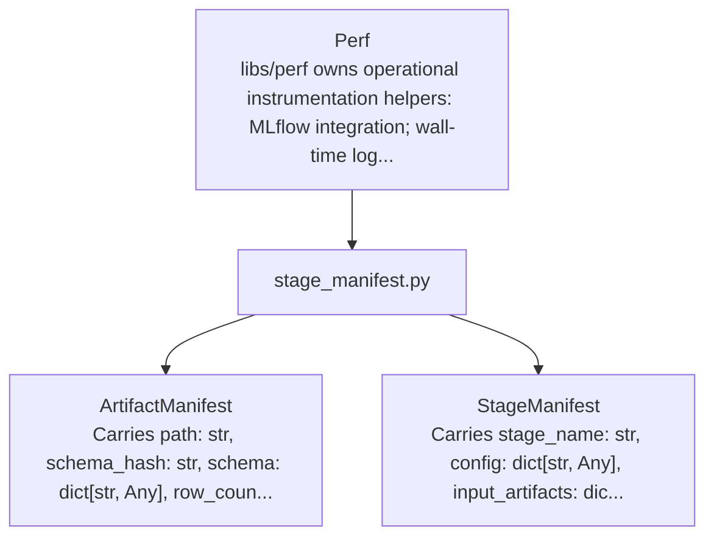

| Dataclass | Module | Semantic Kind | Represents | Payload Shape | Fields | LOC |
| --- | --- | --- | --- | --- | ---: | ---: |
| ArtifactManifest | `libs.perf.stage_manifest` | Domain Dataclass | Artifact Manifest within stage artifact manifest helpers for replayable v2 pipeline stages | Carries path: str, schema_hash: str, schema: dict[str, Any], row_count: int | None = None, +2 more. | 6 | 40 |
| StageManifest | `libs.perf.stage_manifest` | Domain Dataclass | Stage Manifest within stage artifact manifest helpers for replayable v2 pipeline stages | Carries stage_name: str, config: dict[str, Any], input_artifacts: dict[str, dict[str, Any]], output_artifacts: dict[str, dict[str, Any]], +6 more. | 10 | 29 |

### Dataclass Fields

#### ArtifactManifest

- Module: `libs.perf.stage_manifest`
- Semantic kind: Domain Dataclass
- Represents: Artifact Manifest within stage artifact manifest helpers for replayable v2 pipeline stages
- Payload shape: Carries path: str, schema_hash: str, schema: dict[str, Any], row_count: int | None = None, +2 more.

| Field | Type | Default | Role |
| --- | --- | --- | --- |
| path | str |  | artifact path or location |
| schema_hash | str |  | descriptive or categorical value |
| schema | dict[str, Any] |  | lookup or grouped mapping |
| row_count | int | None | None | domain payload field |
| artifact_version | str | None | None | domain payload field |
| extra | dict[str, Any] | field(default_factory=dict) | lookup or grouped mapping |

#### StageManifest

- Module: `libs.perf.stage_manifest`
- Semantic kind: Domain Dataclass
- Represents: Stage Manifest within stage artifact manifest helpers for replayable v2 pipeline stages
- Payload shape: Carries stage_name: str, config: dict[str, Any], input_artifacts: dict[str, dict[str, Any]], output_artifacts: dict[str, dict[str, Any]], +6 more.

| Field | Type | Default | Role |
| --- | --- | --- | --- |
| stage_name | str |  | descriptive or categorical value |
| config | dict[str, Any] |  | lookup or grouped mapping |
| input_artifacts | dict[str, dict[str, Any]] |  | artifact or table reference |
| output_artifacts | dict[str, dict[str, Any]] |  | artifact or table reference |
| stage_version | str | 'v2' | descriptive or categorical value |
| run_id | str | None | None | identity / key |
| created_at_utc | str | field(default_factory=lambda: datetime.now(timezone.utc).isoformat()) | descriptive or categorical value |
| replayable_from | list[str] | field(default_factory=list) | ordered or grouped values |
| cache_artifacts | dict[str, dict[str, Any]] | field(default_factory=dict) | artifact or table reference |
| timing | dict[str, Any] | field(default_factory=dict) | lookup or grouped mapping |

## Phase

libs/phase owns phase feature selection, phase detection, phase analysis, and phase validation.

Dataclasses detected: `16`

```mermaid
flowchart TB
    core_libraries_phase["Phase\nlibs/phase owns phase feature selection, phase detection, phase analysis, and phase v..."]
    core_libraries_phase_libs_phase_decode["decode.py"]
    core_libraries_phase --> core_libraries_phase_libs_phase_decode
    core_libraries_phase_libs_phase_decode_phasesequencestate["PhaseSequenceState\nCarries score_column: str = 'phase_scores', path_column: str = 'phase..."]
    core_libraries_phase_libs_phase_decode --> core_libraries_phase_libs_phase_decode_phasesequencestate
    core_libraries_phase_libs_phase_feature_config["feature_config.py"]
    core_libraries_phase --> core_libraries_phase_libs_phase_feature_config
    core_libraries_phase_libs_phase_feature_config_phasefeatureconfig["PhaseFeatureConfig\nCarries backbone_model: BackboneModel, phase_selected_sensors: list[s..."]
    core_libraries_phase_libs_phase_feature_config --> core_libraries_phase_libs_phase_feature_config_phasefeatureconfig
    core_libraries_phase_libs_phase_frames["frames.py"]
    core_libraries_phase --> core_libraries_phase_libs_phase_frames
    core_libraries_phase_libs_phase_frames_phasefeatureframe["PhaseFeatureFrame\nCarries feature_names: list[str]."]
    core_libraries_phase_libs_phase_frames --> core_libraries_phase_libs_phase_frames_phasefeatureframe
    core_libraries_phase_libs_phase_frames_phaseobservationframe["PhaseObservationFrame\nNo extracted dataclass fields."]
    core_libraries_phase_libs_phase_frames --> core_libraries_phase_libs_phase_frames_phaseobservationframe
    core_libraries_phase_libs_phase_pipeline["pipeline.py"]
    core_libraries_phase --> core_libraries_phase_libs_phase_pipeline
    core_libraries_phase_libs_phase_pipeline_phasedetectionplan["PhaseDetectionPlan\nNo extracted dataclass fields."]
    core_libraries_phase_libs_phase_pipeline --> core_libraries_phase_libs_phase_pipeline_phasedetectionplan
    core_libraries_phase_libs_phase_tables["tables.py"]
    core_libraries_phase --> core_libraries_phase_libs_phase_tables
    core_libraries_phase_libs_phase_tables_phasewindowstable["PhaseWindowsTable\nCarries partition_by: tuple[str, ...] = ('tail_id',)."]
    core_libraries_phase_libs_phase_tables --> core_libraries_phase_libs_phase_tables_phasewindowstable
    core_libraries_phase_libs_phase_tables_phasebaselinestable["PhaseBaselinesTable\nCarries partition_by: tuple[str, ...] = ('tail_id',)."]
    core_libraries_phase_libs_phase_tables --> core_libraries_phase_libs_phase_tables_phasebaselinestable
    core_libraries_phase_libs_phase_tables_phaselabelcentroidstable["PhaseLabelCentroidsTable\nCarries partition_by: tuple[str, ...] = ('tail_id',)."]
    core_libraries_phase_libs_phase_tables --> core_libraries_phase_libs_phase_tables_phaselabelcentroidstable
    core_libraries_phase_libs_phase_types["types.py"]
    core_libraries_phase --> core_libraries_phase_libs_phase_types
    core_libraries_phase_libs_phase_types_phasetransitionmodel["PhaseTransitionModel\nCarries support_df: 'DataFrame', policy_name: str = 'monotone_progres..."]
    core_libraries_phase_libs_phase_types --> core_libraries_phase_libs_phase_types_phasetransitionmodel
    core_libraries_phase_libs_phase_types_phaseclustermodel["PhaseClusterModel\nCarries feature_stats_df: 'DataFrame', centroids_df: 'DataFrame', dis..."]
    core_libraries_phase_libs_phase_types --> core_libraries_phase_libs_phase_types_phaseclustermodel
    core_libraries_phase_libs_phase_types_phaseartifactset["PhaseArtifactSet\nCarries phase_windows: PhaseWindowsTable, phase_baselines: PhaseBasel..."]
    core_libraries_phase_libs_phase_types --> core_libraries_phase_libs_phase_types_phaseartifactset
    core_libraries_phase_libs_phase_types_phasedetectionrun["PhaseDetectionRun\nCarries phase_config: 'PhaseFeatureConfig', feature_frame: 'PhaseFeat..."]
    core_libraries_phase_libs_phase_types --> core_libraries_phase_libs_phase_types_phasedetectionrun
    core_libraries_phase_libs_phase_types_phasefeatureselectionpolicy["PhaseFeatureSelectionPolicy\nCarries sensor_count: int = 8, event_type_count: int = 6, categorical..."]
    core_libraries_phase_libs_phase_types --> core_libraries_phase_libs_phase_types_phasefeatureselectionpolicy
    core_libraries_phase_libs_phase_types_phaseselectordiagnostics["PhaseSelectorDiagnostics\nCarries selector_name: str, selected_count: int, timing_ms: float, ca..."]
    core_libraries_phase_libs_phase_types --> core_libraries_phase_libs_phase_types_phaseselectordiagnostics
    core_libraries_phase_libs_phase_types_phasefeatureselectiondiagnostics["PhaseFeatureSelectionDiagnostics\nCarries sensors: PhaseSelectorDiagnostics, event_types: PhaseSelector..."]
    core_libraries_phase_libs_phase_types --> core_libraries_phase_libs_phase_types_phasefeatureselectiondiagnostics
    core_libraries_phase_libs_phase_types_phaseplanconfig["PhasePlanConfig\nCarries phase_count: int, phase_stable_drift_quantile: float = 0.35,..."]
    core_libraries_phase_libs_phase_types --> core_libraries_phase_libs_phase_types_phaseplanconfig
```

| Dataclass | Module | Semantic Kind | Represents | Payload Shape | Fields | LOC |
| --- | --- | --- | --- | --- | ---: | ---: |
| PhaseSequenceState | `libs.phase.decode` | Runtime State | runtime state for Phase Sequence within libs/phase owns phase feature selection, phase detection, phase analysis, and phase validation | Carries score_column: str = 'phase_scores', path_column: str = 'phase_paths', initialized_column: str = 'initialized'. | 3 | 72 |
| PhaseFeatureConfig | `libs.phase.feature_config` | Configuration | configuration for Phase Feature within libs/phase owns phase feature selection, phase detection, phase analysis, and phase validation | Carries backbone_model: BackboneModel, phase_selected_sensors: list[str], phase_selected_event_types: list[str], phase_selected_categorical_state_pairs: list[tuple[str, str]], +1 more. | 5 | 210 |
| PhaseFeatureFrame | `libs.phase.frames` | Frame Artifact | frame artifact for Phase Feature within libs/phase owns phase feature selection, phase detection, phase analysis, and phase validation | Carries feature_names: list[str]. | 1 | 725 |
| PhaseObservationFrame | `libs.phase.frames` | Frame Artifact | frame artifact for Phase Observation within libs/phase owns phase feature selection, phase detection, phase analysis, and phase validation | No extracted dataclass fields. | 0 | 24 |
| PhaseDetectionPlan | `libs.phase.pipeline` | Execution Plan | execution plan for Phase Detection within libs/phase owns phase feature selection, phase detection, phase analysis, and phase validation | No extracted dataclass fields. | 0 | 154 |
| PhaseWindowsTable | `libs.phase.tables` | Table Artifact | table artifact for Phase Windows within libs/phase owns phase feature selection, phase detection, phase analysis, and phase validation | Carries partition_by: tuple[str, ...] = ('tail_id',). | 1 | 23 |
| PhaseBaselinesTable | `libs.phase.tables` | Table Artifact | table artifact for Phase Baselines within libs/phase owns phase feature selection, phase detection, phase analysis, and phase validation | Carries partition_by: tuple[str, ...] = ('tail_id',). | 1 | 121 |
| PhaseLabelCentroidsTable | `libs.phase.tables` | Table Artifact | table artifact for Phase Label Centroids within libs/phase owns phase feature selection, phase detection, phase analysis, and phase validation | Carries partition_by: tuple[str, ...] = ('tail_id',). | 1 | 87 |
| PhaseTransitionModel | `libs.phase.types` | Model | model for Phase Transition within libs/phase owns phase feature selection, phase detection, phase analysis, and phase validation | Carries support_df: 'DataFrame', policy_name: str = 'monotone_progress_band', canonical_order_source: str = 'seed_bucket', progress_support_source: str = 'seed_progress_mass_position_span', +1 more. | 5 | 12 |
| PhaseClusterModel | `libs.phase.types` | Model | model for Phase Cluster within libs/phase owns phase feature selection, phase detection, phase analysis, and phase validation | Carries feature_stats_df: 'DataFrame', centroids_df: 'DataFrame', distance_scales_df: 'DataFrame', transition_model: PhaseTransitionModel, +2 more. | 6 | 7 |
| PhaseArtifactSet | `libs.phase.types` | Artifact Bundle | artifact bundle for Phase within libs/phase owns phase feature selection, phase detection, phase analysis, and phase validation | Carries phase_windows: PhaseWindowsTable, phase_baselines: PhaseBaselinesTable, phase_config: 'PhaseFeatureConfig', feature_frame: 'PhaseFeatureFrame | None' = None, +1 more. | 5 | 6 |
| PhaseDetectionRun | `libs.phase.types` | Domain Dataclass | Phase Detection Run within phase artifact and plan dataclasses | Carries phase_config: 'PhaseFeatureConfig', feature_frame: 'PhaseFeatureFrame', cluster_model: PhaseClusterModel, phase_windows: PhaseWindowsTable, +1 more. | 5 | 6 |
| PhaseFeatureSelectionPolicy | `libs.phase.types` | Policy | policy for Phase Feature Selection within libs/phase owns phase feature selection, phase detection, phase analysis, and phase validation | Carries sensor_count: int = 8, event_type_count: int = 6, categorical_state_count: int = 6. | 3 | 4 |
| PhaseSelectorDiagnostics | `libs.phase.types` | Domain Dataclass | Phase Selector Diagnostics within phase artifact and plan dataclasses | Carries selector_name: str, selected_count: int, timing_ms: float, candidate_count: int | None = None, +1 more. | 5 | 6 |
| PhaseFeatureSelectionDiagnostics | `libs.phase.types` | Domain Dataclass | Phase Feature Selection Diagnostics within phase artifact and plan dataclasses | Carries sensors: PhaseSelectorDiagnostics, event_types: PhaseSelectorDiagnostics, categorical_state_pairs: PhaseSelectorDiagnostics, selected_event_types: list[str], +1 more. | 5 | 39 |
| PhasePlanConfig | `libs.phase.types` | Configuration | configuration for Phase Plan within libs/phase owns phase feature selection, phase detection, phase analysis, and phase validation | Carries phase_count: int, phase_stable_drift_quantile: float = 0.35, phase_transition_penalty: float = 1.5, phase_min_dwell_windows: int = 8, +5 more. | 9 | 10 |

### Dataclass Fields

#### PhaseSequenceState

- Module: `libs.phase.decode`
- Semantic kind: Runtime State
- Represents: runtime state for Phase Sequence within libs/phase owns phase feature selection, phase detection, phase analysis, and phase validation
- Payload shape: Carries score_column: str = 'phase_scores', path_column: str = 'phase_paths', initialized_column: str = 'initialized'.

| Field | Type | Default | Role |
| --- | --- | --- | --- |
| score_column | str | 'phase_scores' | quantitative measure |
| path_column | str | 'phase_paths' | artifact path or location |
| initialized_column | str | 'initialized' | descriptive or categorical value |

#### PhaseFeatureConfig

- Module: `libs.phase.feature_config`
- Semantic kind: Configuration
- Represents: configuration for Phase Feature within libs/phase owns phase feature selection, phase detection, phase analysis, and phase validation
- Payload shape: Carries backbone_model: BackboneModel, phase_selected_sensors: list[str], phase_selected_event_types: list[str], phase_selected_categorical_state_pairs: list[tuple[str, str]], +1 more.

| Field | Type | Default | Role |
| --- | --- | --- | --- |
| backbone_model | BackboneModel |  | domain model or execution contract |
| phase_selected_sensors | list[str] |  | selected sensor set |
| phase_selected_event_types | list[str] |  | selected event feature set |
| phase_selected_categorical_state_pairs | list[tuple[str, str]] |  | selected pair-feature set |
| phase_selected_window_cooccurrence_pairs | list[tuple[str, str]] |  | selected pair-feature set |

#### PhaseFeatureFrame

- Module: `libs.phase.frames`
- Semantic kind: Frame Artifact
- Represents: frame artifact for Phase Feature within libs/phase owns phase feature selection, phase detection, phase analysis, and phase validation
- Payload shape: Carries feature_names: list[str].

| Field | Type | Default | Role |
| --- | --- | --- | --- |
| feature_names | list[str] |  | domain feature set |

#### PhaseObservationFrame

- Module: `libs.phase.frames`
- Semantic kind: Frame Artifact
- Represents: frame artifact for Phase Observation within libs/phase owns phase feature selection, phase detection, phase analysis, and phase validation
- Payload shape: No extracted dataclass fields.

No extracted dataclass fields.

#### PhaseDetectionPlan

- Module: `libs.phase.pipeline`
- Semantic kind: Execution Plan
- Represents: execution plan for Phase Detection within libs/phase owns phase feature selection, phase detection, phase analysis, and phase validation
- Payload shape: No extracted dataclass fields.

No extracted dataclass fields.

#### PhaseWindowsTable

- Module: `libs.phase.tables`
- Semantic kind: Table Artifact
- Represents: table artifact for Phase Windows within libs/phase owns phase feature selection, phase detection, phase analysis, and phase validation
- Payload shape: Carries partition_by: tuple[str, ...] = ('tail_id',).

| Field | Type | Default | Role |
| --- | --- | --- | --- |
| partition_by | tuple[str, ...] | ('tail_id',) | partitioning contract |

#### PhaseBaselinesTable

- Module: `libs.phase.tables`
- Semantic kind: Table Artifact
- Represents: table artifact for Phase Baselines within libs/phase owns phase feature selection, phase detection, phase analysis, and phase validation
- Payload shape: Carries partition_by: tuple[str, ...] = ('tail_id',).

| Field | Type | Default | Role |
| --- | --- | --- | --- |
| partition_by | tuple[str, ...] | ('tail_id',) | partitioning contract |

#### PhaseLabelCentroidsTable

- Module: `libs.phase.tables`
- Semantic kind: Table Artifact
- Represents: table artifact for Phase Label Centroids within libs/phase owns phase feature selection, phase detection, phase analysis, and phase validation
- Payload shape: Carries partition_by: tuple[str, ...] = ('tail_id',).

| Field | Type | Default | Role |
| --- | --- | --- | --- |
| partition_by | tuple[str, ...] | ('tail_id',) | partitioning contract |

#### PhaseTransitionModel

- Module: `libs.phase.types`
- Semantic kind: Model
- Represents: model for Phase Transition within libs/phase owns phase feature selection, phase detection, phase analysis, and phase validation
- Payload shape: Carries support_df: 'DataFrame', policy_name: str = 'monotone_progress_band', canonical_order_source: str = 'seed_bucket', progress_support_source: str = 'seed_progress_mass_position_span', +1 more.

| Field | Type | Default | Role |
| --- | --- | --- | --- |
| support_df | 'DataFrame' |  | domain payload field |
| policy_name | str | 'monotone_progress_band' | descriptive or categorical value |
| canonical_order_source | str | 'seed_bucket' | descriptive or categorical value |
| progress_support_source | str | 'seed_progress_mass_position_span' | descriptive or categorical value |
| allowed_transition_offsets | tuple[int, ...] | (0, 1) | ordered or grouped values |

#### PhaseClusterModel

- Module: `libs.phase.types`
- Semantic kind: Model
- Represents: model for Phase Cluster within libs/phase owns phase feature selection, phase detection, phase analysis, and phase validation
- Payload shape: Carries feature_stats_df: 'DataFrame', centroids_df: 'DataFrame', distance_scales_df: 'DataFrame', transition_model: PhaseTransitionModel, +2 more.

| Field | Type | Default | Role |
| --- | --- | --- | --- |
| feature_stats_df | 'DataFrame' |  | domain payload field |
| centroids_df | 'DataFrame' |  | domain payload field |
| distance_scales_df | 'DataFrame' |  | domain payload field |
| transition_model | PhaseTransitionModel |  | domain model or execution contract |
| fit_source_stats_df | 'DataFrame | None' | None | domain payload field |
| seed_bucket_counts_df | 'DataFrame | None' | None | domain payload field |

#### PhaseArtifactSet

- Module: `libs.phase.types`
- Semantic kind: Artifact Bundle
- Represents: artifact bundle for Phase within libs/phase owns phase feature selection, phase detection, phase analysis, and phase validation
- Payload shape: Carries phase_windows: PhaseWindowsTable, phase_baselines: PhaseBaselinesTable, phase_config: 'PhaseFeatureConfig', feature_frame: 'PhaseFeatureFrame | None' = None, +1 more.

| Field | Type | Default | Role |
| --- | --- | --- | --- |
| phase_windows | PhaseWindowsTable |  | artifact or table reference |
| phase_baselines | PhaseBaselinesTable |  | artifact or table reference |
| phase_config | 'PhaseFeatureConfig' |  | domain payload field |
| feature_frame | 'PhaseFeatureFrame | None' | None | artifact or table reference |
| cluster_model | PhaseClusterModel | None | None | domain model or execution contract |

#### PhaseDetectionRun

- Module: `libs.phase.types`
- Semantic kind: Domain Dataclass
- Represents: Phase Detection Run within phase artifact and plan dataclasses
- Payload shape: Carries phase_config: 'PhaseFeatureConfig', feature_frame: 'PhaseFeatureFrame', cluster_model: PhaseClusterModel, phase_windows: PhaseWindowsTable, +1 more.

| Field | Type | Default | Role |
| --- | --- | --- | --- |
| phase_config | 'PhaseFeatureConfig' |  | domain payload field |
| feature_frame | 'PhaseFeatureFrame' |  | artifact or table reference |
| cluster_model | PhaseClusterModel |  | domain model or execution contract |
| phase_windows | PhaseWindowsTable |  | artifact or table reference |
| diagnostics | dict[str, Any] | None | None | lookup or grouped mapping |

#### PhaseFeatureSelectionPolicy

- Module: `libs.phase.types`
- Semantic kind: Policy
- Represents: policy for Phase Feature Selection within libs/phase owns phase feature selection, phase detection, phase analysis, and phase validation
- Payload shape: Carries sensor_count: int = 8, event_type_count: int = 6, categorical_state_count: int = 6.

| Field | Type | Default | Role |
| --- | --- | --- | --- |
| sensor_count | int | 8 | numeric value |
| event_type_count | int | 6 | numeric value |
| categorical_state_count | int | 6 | numeric value |

#### PhaseSelectorDiagnostics

- Module: `libs.phase.types`
- Semantic kind: Domain Dataclass
- Represents: Phase Selector Diagnostics within phase artifact and plan dataclasses
- Payload shape: Carries selector_name: str, selected_count: int, timing_ms: float, candidate_count: int | None = None, +1 more.

| Field | Type | Default | Role |
| --- | --- | --- | --- |
| selector_name | str |  | descriptive or categorical value |
| selected_count | int |  | selected feature set |
| timing_ms | float |  | numeric value |
| candidate_count | int | None | None | domain payload field |
| fallback_used | bool | False | domain payload field |

#### PhaseFeatureSelectionDiagnostics

- Module: `libs.phase.types`
- Semantic kind: Domain Dataclass
- Represents: Phase Feature Selection Diagnostics within phase artifact and plan dataclasses
- Payload shape: Carries sensors: PhaseSelectorDiagnostics, event_types: PhaseSelectorDiagnostics, categorical_state_pairs: PhaseSelectorDiagnostics, selected_event_types: list[str], +1 more.

| Field | Type | Default | Role |
| --- | --- | --- | --- |
| sensors | PhaseSelectorDiagnostics |  | domain payload field |
| event_types | PhaseSelectorDiagnostics |  | domain payload field |
| categorical_state_pairs | PhaseSelectorDiagnostics |  | domain payload field |
| selected_event_types | list[str] |  | selected event feature set |
| selected_categorical_state_pairs | list[tuple[str, str]] |  | selected pair-feature set |

#### PhasePlanConfig

- Module: `libs.phase.types`
- Semantic kind: Configuration
- Represents: configuration for Phase Plan within libs/phase owns phase feature selection, phase detection, phase analysis, and phase validation
- Payload shape: Carries phase_count: int, phase_stable_drift_quantile: float = 0.35, phase_transition_penalty: float = 1.5, phase_min_dwell_windows: int = 8, +5 more.

| Field | Type | Default | Role |
| --- | --- | --- | --- |
| phase_count | int |  | numeric value |
| phase_stable_drift_quantile | float | 0.35 | numeric value |
| phase_transition_penalty | float | 1.5 | numeric value |
| phase_min_dwell_windows | int | 8 | artifact or table reference |
| phase_detect_sensor_count | int | 8 | numeric value |
| phase_detect_event_type_count | int | 6 | numeric value |
| phase_detect_categorical_state_count | int | 6 | numeric value |
| max_iter | int | 12 | numeric value |
| segment_policy | SequenceSegmentPolicy | field(default_factory=default_phase_segment_policy) | domain model or execution contract |

## Profiling

libs/profiling owns parameter profiling over canonical telemetry: datatype profiling; continuous scaling/profile statistics; behavior-family profiling.

Dataclasses detected: `9`

```mermaid
flowchart TB
    core_libraries_profiling["Profiling\nlibs/profiling owns parameter profiling over canonical telemetry: datatype profiling;..."]
    core_libraries_profiling_libs_profiling_pipeline["pipeline.py"]
    core_libraries_profiling --> core_libraries_profiling_libs_profiling_pipeline
    core_libraries_profiling_libs_profiling_pipeline_telemetryprofilingartifacts["TelemetryProfilingArtifacts\nCarries datatype_profile: ParameterDatatypeProfile, scaling_profile:..."]
    core_libraries_profiling_libs_profiling_pipeline --> core_libraries_profiling_libs_profiling_pipeline_telemetryprofilingartifacts
    core_libraries_profiling_libs_profiling_pipeline_telemetryprofilingplan["TelemetryProfilingPlan\nCarries source: TelemetryProfileSource, numeric_ratio_threshold: floa..."]
    core_libraries_profiling_libs_profiling_pipeline --> core_libraries_profiling_libs_profiling_pipeline_telemetryprofilingplan
    core_libraries_profiling_libs_profiling_profiles["profiles.py"]
    core_libraries_profiling --> core_libraries_profiling_libs_profiling_profiles
    core_libraries_profiling_libs_profiling_profiles_telemetryprofilesource["TelemetryProfileSource\nCarries raw_input_df: 'DataFrame'."]
    core_libraries_profiling_libs_profiling_profiles --> core_libraries_profiling_libs_profiling_profiles_telemetryprofilesource
    core_libraries_profiling_libs_profiling_profiles_parameterprofile["ParameterProfile\nNo extracted dataclass fields."]
    core_libraries_profiling_libs_profiling_profiles --> core_libraries_profiling_libs_profiling_profiles_parameterprofile
    core_libraries_profiling_libs_profiling_profiles_categoricaldistribution["CategoricalDistribution\nNo extracted dataclass fields."]
    core_libraries_profiling_libs_profiling_profiles --> core_libraries_profiling_libs_profiling_profiles_categoricaldistribution
    core_libraries_profiling_libs_profiling_profiles_parameterdatatypeprofile["ParameterDatatypeProfile\nNo extracted dataclass fields."]
    core_libraries_profiling_libs_profiling_profiles --> core_libraries_profiling_libs_profiling_profiles_parameterdatatypeprofile
    core_libraries_profiling_libs_profiling_profiles_continuousscalingprofile["ContinuousScalingProfile\nNo extracted dataclass fields."]
    core_libraries_profiling_libs_profiling_profiles --> core_libraries_profiling_libs_profiling_profiles_continuousscalingprofile
    core_libraries_profiling_libs_profiling_profiles_parameterbehaviorprimitiveprofile["ParameterBehaviorPrimitiveProfile\nNo extracted dataclass fields."]
    core_libraries_profiling_libs_profiling_profiles --> core_libraries_profiling_libs_profiling_profiles_parameterbehaviorprimitiveprofile
    core_libraries_profiling_libs_profiling_profiles_parameterbehaviorprofile["ParameterBehaviorProfile\nNo extracted dataclass fields."]
    core_libraries_profiling_libs_profiling_profiles --> core_libraries_profiling_libs_profiling_profiles_parameterbehaviorprofile
```

| Dataclass | Module | Semantic Kind | Represents | Payload Shape | Fields | LOC |
| --- | --- | --- | --- | --- | ---: | ---: |
| TelemetryProfilingArtifacts | `libs.profiling.pipeline` | Artifact Bundle | Telemetry Profiling Artifacts within class-oriented profiling artifact builders for the active spark path | Carries datatype_profile: ParameterDatatypeProfile, scaling_profile: ContinuousScalingProfile, primitive_profile: ParameterBehaviorPrimitiveProfile, behavior_profile: ParameterBehaviorProfile. | 4 | 5 |
| TelemetryProfilingPlan | `libs.profiling.pipeline` | Execution Plan | execution plan for Telemetry Profiling within libs/profiling owns parameter profiling over canonical telemetry: datatype profiling; continuous scaling/profile statistics; behavior-family profiling | Carries source: TelemetryProfileSource, numeric_ratio_threshold: float = 0.8, categorical_cardinality_max: int = 200, behavior_significant_diff_threshold: float = ParameterBehaviorPrimitiveProfile.NUMERIC_SIGNIFICANT_DIFF_THRESHOLD, +6 more. | 10 | 104 |
| TelemetryProfileSource | `libs.profiling.profiles` | Domain Dataclass | Canonical raw-telemetry view used by production profiling builders | Carries raw_input_df: 'DataFrame'. | 1 | 32 |
| ParameterProfile | `libs.profiling.profiles` | Profile | Observed telemetry statistics used to derive profiling artifacts | No extracted dataclass fields. | 0 | 105 |
| CategoricalDistribution | `libs.profiling.profiles` | Domain Dataclass | Top observed categorical values per parameter | No extracted dataclass fields. | 0 | 24 |
| ParameterDatatypeProfile | `libs.profiling.profiles` | Profile | Canonical datatype profile artifact | No extracted dataclass fields. | 0 | 31 |
| ContinuousScalingProfile | `libs.profiling.profiles` | Profile | Robust scaling metadata for continuous parameters | No extracted dataclass fields. | 0 | 45 |
| ParameterBehaviorPrimitiveProfile | `libs.profiling.profiles` | Profile | Shared primitive evidence profile derived directly from raw telemetry | No extracted dataclass fields. | 0 | 597 |
| ParameterBehaviorProfile | `libs.profiling.profiles` | Profile | Canonical behavior-family profile artifact | No extracted dataclass fields. | 0 | 79 |

### Dataclass Fields

#### TelemetryProfilingArtifacts

- Module: `libs.profiling.pipeline`
- Semantic kind: Artifact Bundle
- Represents: Telemetry Profiling Artifacts within class-oriented profiling artifact builders for the active spark path
- Payload shape: Carries datatype_profile: ParameterDatatypeProfile, scaling_profile: ContinuousScalingProfile, primitive_profile: ParameterBehaviorPrimitiveProfile, behavior_profile: ParameterBehaviorProfile.

| Field | Type | Default | Role |
| --- | --- | --- | --- |
| datatype_profile | ParameterDatatypeProfile |  | artifact or table reference |
| scaling_profile | ContinuousScalingProfile |  | artifact or table reference |
| primitive_profile | ParameterBehaviorPrimitiveProfile |  | artifact or table reference |
| behavior_profile | ParameterBehaviorProfile |  | artifact or table reference |

#### TelemetryProfilingPlan

- Module: `libs.profiling.pipeline`
- Semantic kind: Execution Plan
- Represents: execution plan for Telemetry Profiling within libs/profiling owns parameter profiling over canonical telemetry: datatype profiling; continuous scaling/profile statistics; behavior-family profiling
- Payload shape: Carries source: TelemetryProfileSource, numeric_ratio_threshold: float = 0.8, categorical_cardinality_max: int = 200, behavior_significant_diff_threshold: float = ParameterBehaviorPrimitiveProfile.NUMERIC_SIGNIFICANT_DIFF_THRESHOLD, +6 more.

| Field | Type | Default | Role |
| --- | --- | --- | --- |
| source | TelemetryProfileSource |  | domain payload field |
| numeric_ratio_threshold | float | 0.8 | model parameter or coefficient |
| categorical_cardinality_max | int | 200 | numeric value |
| behavior_significant_diff_threshold | float | ParameterBehaviorPrimitiveProfile.NUMERIC_SIGNIFICANT_DIFF_THRESHOLD | model parameter or coefficient |
| behavior_center_band_width | float | ParameterBehaviorPrimitiveProfile.CENTER_BAND_WIDTH | numeric value |
| behavior_soft_bound_width | float | ParameterBehaviorPrimitiveProfile.SOFT_BOUND_WIDTH | numeric value |
| behavior_hard_bound_width | float | ParameterBehaviorPrimitiveProfile.HARD_BOUND_WIDTH | numeric value |
| behavior_mixed_unknown_low_score_threshold | float | 0.38 | model parameter or coefficient |
| behavior_mixed_unknown_ambiguous_score_threshold | float | 0.55 | model parameter or coefficient |
| behavior_mixed_unknown_ambiguous_margin_threshold | float | 0.03 | model parameter or coefficient |

#### TelemetryProfileSource

- Module: `libs.profiling.profiles`
- Semantic kind: Domain Dataclass
- Represents: Canonical raw-telemetry view used by production profiling builders
- Payload shape: Carries raw_input_df: 'DataFrame'.

| Field | Type | Default | Role |
| --- | --- | --- | --- |
| raw_input_df | 'DataFrame' |  | domain payload field |

#### ParameterProfile

- Module: `libs.profiling.profiles`
- Semantic kind: Profile
- Represents: Observed telemetry statistics used to derive profiling artifacts
- Payload shape: No extracted dataclass fields.

No extracted dataclass fields.

#### CategoricalDistribution

- Module: `libs.profiling.profiles`
- Semantic kind: Domain Dataclass
- Represents: Top observed categorical values per parameter
- Payload shape: No extracted dataclass fields.

No extracted dataclass fields.

#### ParameterDatatypeProfile

- Module: `libs.profiling.profiles`
- Semantic kind: Profile
- Represents: Canonical datatype profile artifact
- Payload shape: No extracted dataclass fields.

No extracted dataclass fields.

#### ContinuousScalingProfile

- Module: `libs.profiling.profiles`
- Semantic kind: Profile
- Represents: Robust scaling metadata for continuous parameters
- Payload shape: No extracted dataclass fields.

No extracted dataclass fields.

#### ParameterBehaviorPrimitiveProfile

- Module: `libs.profiling.profiles`
- Semantic kind: Profile
- Represents: Shared primitive evidence profile derived directly from raw telemetry
- Payload shape: No extracted dataclass fields.

No extracted dataclass fields.

#### ParameterBehaviorProfile

- Module: `libs.profiling.profiles`
- Semantic kind: Profile
- Represents: Canonical behavior-family profile artifact
- Payload shape: No extracted dataclass fields.

No extracted dataclass fields.

## Pyspark

Modules grouped under libs.pyspark.

Dataclasses detected: `2`

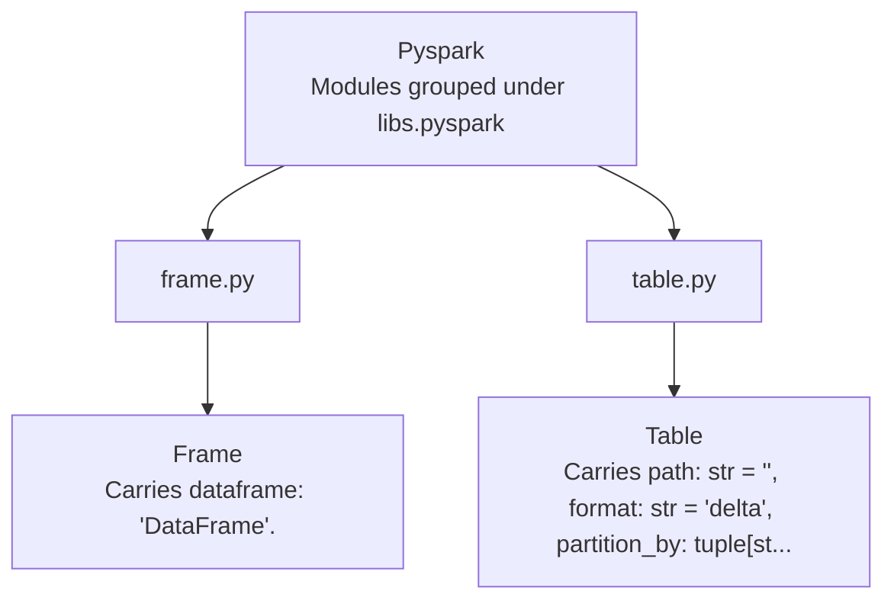

| Dataclass | Module | Semantic Kind | Represents | Payload Shape | Fields | LOC |
| --- | --- | --- | --- | --- | ---: | ---: |
| Frame | `libs.pyspark.frame` | Frame Artifact | frame artifact for Frame within modules grouped under libs.pyspark | Carries dataframe: 'DataFrame'. | 1 | 54 |
| Table | `libs.pyspark.table` | Table Artifact | table artifact for Table within modules grouped under libs.pyspark | Carries path: str = '', format: str = 'delta', partition_by: tuple[str, ...] = (). | 3 | 76 |

### Dataclass Fields

#### Frame

- Module: `libs.pyspark.frame`
- Semantic kind: Frame Artifact
- Represents: frame artifact for Frame within modules grouped under libs.pyspark
- Payload shape: Carries dataframe: 'DataFrame'.

| Field | Type | Default | Role |
| --- | --- | --- | --- |
| dataframe | 'DataFrame' |  | domain payload field |

#### Table

- Module: `libs.pyspark.table`
- Semantic kind: Table Artifact
- Represents: table artifact for Table within modules grouped under libs.pyspark
- Payload shape: Carries path: str = '', format: str = 'delta', partition_by: tuple[str, ...] = ().

| Field | Type | Default | Role |
| --- | --- | --- | --- |
| path | str | '' | artifact path or location |
| format | str | 'delta' | descriptive or categorical value |
| partition_by | tuple[str, ...] | () | partitioning contract |

## Reporting

Modules grouped under libs.reporting.

Dataclasses detected: `1`

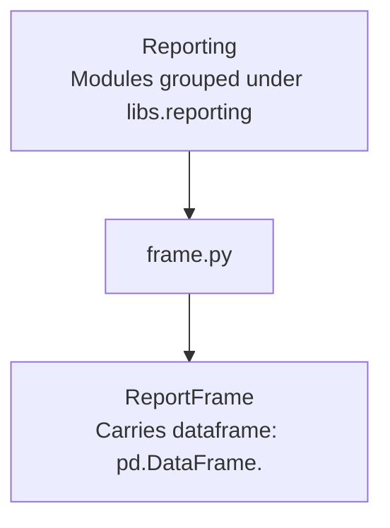

| Dataclass | Module | Semantic Kind | Represents | Payload Shape | Fields | LOC |
| --- | --- | --- | --- | --- | ---: | ---: |
| ReportFrame | `libs.reporting.frame` | Frame Artifact | frame artifact for Report within modules grouped under libs.reporting | Carries dataframe: pd.DataFrame. | 1 | 35 |

### Dataclass Fields

#### ReportFrame

- Module: `libs.reporting.frame`
- Semantic kind: Frame Artifact
- Represents: frame artifact for Report within modules grouped under libs.reporting
- Payload shape: Carries dataframe: pd.DataFrame.

| Field | Type | Default | Role |
| --- | --- | --- | --- |
| dataframe | pd.DataFrame |  | domain model or execution contract |

## Scoring

libs/scoring owns raw and calibrated anomaly scoring over fitted phase and structural artifacts.

Dataclasses detected: `3`

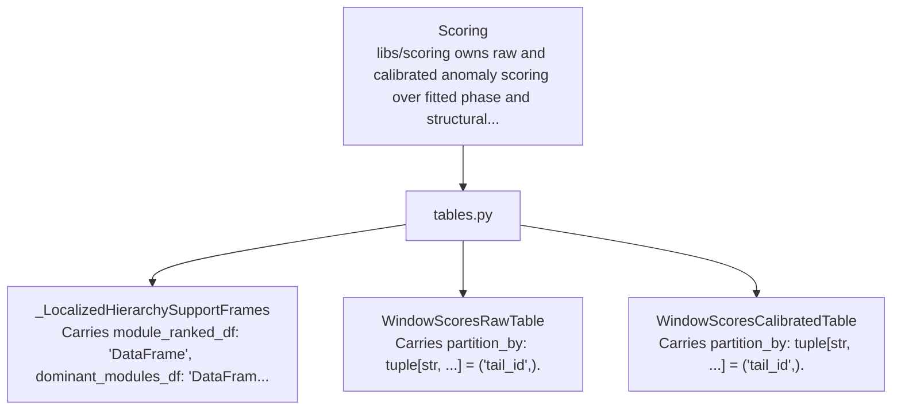

| Dataclass | Module | Semantic Kind | Represents | Payload Shape | Fields | LOC |
| --- | --- | --- | --- | --- | ---: | ---: |
| _LocalizedHierarchySupportFrames | `libs.scoring.tables` | Domain Dataclass | Localized Hierarchy Support Frames within typed spark tables for scoring artifacts | Carries module_ranked_df: 'DataFrame', dominant_modules_df: 'DataFrame', subsystem_ranked_df: 'DataFrame', dominant_subsystems_df: 'DataFrame'. | 4 | 5 |
| WindowScoresRawTable | `libs.scoring.tables` | Table Artifact | table artifact for Window Scores Raw within libs/scoring owns raw and calibrated anomaly scoring over fitted phase and structural artifacts | Carries partition_by: tuple[str, ...] = ('tail_id',). | 1 | 612 |
| WindowScoresCalibratedTable | `libs.scoring.tables` | Table Artifact | table artifact for Window Scores Calibrated within libs/scoring owns raw and calibrated anomaly scoring over fitted phase and structural artifacts | Carries partition_by: tuple[str, ...] = ('tail_id',). | 1 | 72 |

### Dataclass Fields

#### _LocalizedHierarchySupportFrames

- Module: `libs.scoring.tables`
- Semantic kind: Domain Dataclass
- Represents: Localized Hierarchy Support Frames within typed spark tables for scoring artifacts
- Payload shape: Carries module_ranked_df: 'DataFrame', dominant_modules_df: 'DataFrame', subsystem_ranked_df: 'DataFrame', dominant_subsystems_df: 'DataFrame'.

| Field | Type | Default | Role |
| --- | --- | --- | --- |
| module_ranked_df | 'DataFrame' |  | domain payload field |
| dominant_modules_df | 'DataFrame' |  | domain payload field |
| subsystem_ranked_df | 'DataFrame' |  | domain payload field |
| dominant_subsystems_df | 'DataFrame' |  | domain payload field |

#### WindowScoresRawTable

- Module: `libs.scoring.tables`
- Semantic kind: Table Artifact
- Represents: table artifact for Window Scores Raw within libs/scoring owns raw and calibrated anomaly scoring over fitted phase and structural artifacts
- Payload shape: Carries partition_by: tuple[str, ...] = ('tail_id',).

| Field | Type | Default | Role |
| --- | --- | --- | --- |
| partition_by | tuple[str, ...] | ('tail_id',) | partitioning contract |

#### WindowScoresCalibratedTable

- Module: `libs.scoring.tables`
- Semantic kind: Table Artifact
- Represents: table artifact for Window Scores Calibrated within libs/scoring owns raw and calibrated anomaly scoring over fitted phase and structural artifacts
- Payload shape: Carries partition_by: tuple[str, ...] = ('tail_id',).

| Field | Type | Default | Role |
| --- | --- | --- | --- |
| partition_by | tuple[str, ...] | ('tail_id',) | partitioning contract |

## Simulation

This package contains the simulation domain model only. It does not own.

Dataclasses detected: `62`

```mermaid
flowchart TB
    core_libraries_simulation["Simulation\nThis package contains the simulation domain model only. It does not own"]
    core_libraries_simulation_libs_simulation_aircraft_runtime["runtime.py"]
    core_libraries_simulation --> core_libraries_simulation_libs_simulation_aircraft_runtime
    core_libraries_simulation_libs_simulation_aircraft_runtime_aircraftindex["AircraftIndex\nCarries systems_by_id: Mapping[str, System], subsystems_by_id: Mappin..."]
    core_libraries_simulation_libs_simulation_aircraft_runtime --> core_libraries_simulation_libs_simulation_aircraft_runtime_aircraftindex
    core_libraries_simulation_libs_simulation_aircraft_runtime_aircraft["Aircraft\nCarries id: str, systems: tuple[System, ...], _index: AircraftIndex =..."]
    core_libraries_simulation_libs_simulation_aircraft_runtime --> core_libraries_simulation_libs_simulation_aircraft_runtime_aircraft
    core_libraries_simulation_libs_simulation_aircraft_spec["spec.py"]
    core_libraries_simulation --> core_libraries_simulation_libs_simulation_aircraft_spec
    core_libraries_simulation_libs_simulation_aircraft_spec_aircraftspec["AircraftSpec\nCarries aircraft_id: str, systems: tuple[SystemSpec, ...], couplings:..."]
    core_libraries_simulation_libs_simulation_aircraft_spec --> core_libraries_simulation_libs_simulation_aircraft_spec_aircraftspec
    core_libraries_simulation_libs_simulation_coupling_runtime["runtime.py"]
    core_libraries_simulation --> core_libraries_simulation_libs_simulation_coupling_runtime
    core_libraries_simulation_libs_simulation_coupling_runtime_delayedtransfer["DelayedTransfer\nCarries effective_timestamp_utc: datetime, value: object | None, meta..."]
    core_libraries_simulation_libs_simulation_coupling_runtime --> core_libraries_simulation_libs_simulation_coupling_runtime_delayedtransfer
    core_libraries_simulation_libs_simulation_coupling_runtime_delayedtransferkey["DelayedTransferKey\nCarries source_module_id: str, source_port_name: str, target_module_i..."]
    core_libraries_simulation_libs_simulation_coupling_runtime --> core_libraries_simulation_libs_simulation_coupling_runtime_delayedtransferkey
    core_libraries_simulation_libs_simulation_coupling_runtime_delayedtransferqueue["DelayedTransferQueue\nCarries transfers: list[DelayedTransfer] = field(default_factory=list)."]
    core_libraries_simulation_libs_simulation_coupling_runtime --> core_libraries_simulation_libs_simulation_coupling_runtime_delayedtransferqueue
    core_libraries_simulation_libs_simulation_coupling_runtime_coupling["Coupling\nCarries source_module_id: str, source_port_name: str, target_module_i..."]
    core_libraries_simulation_libs_simulation_coupling_runtime --> core_libraries_simulation_libs_simulation_coupling_runtime_coupling
    core_libraries_simulation_libs_simulation_coupling_spec["spec.py"]
    core_libraries_simulation --> core_libraries_simulation_libs_simulation_coupling_spec
    core_libraries_simulation_libs_simulation_coupling_spec_couplingspec["CouplingSpec\nCarries source_module_id: str, source_port_name: str, target_module_i..."]
    core_libraries_simulation_libs_simulation_coupling_spec --> core_libraries_simulation_libs_simulation_coupling_spec_couplingspec
    core_libraries_simulation_libs_simulation_event_truth["event_truth.py"]
    core_libraries_simulation --> core_libraries_simulation_libs_simulation_event_truth
    core_libraries_simulation_libs_simulation_event_truth__continuousrunstate["_ContinuousRunState\nCarries sign: int = 0, length: int = 0, peak_abs_delta: float = 0.0."]
    core_libraries_simulation_libs_simulation_event_truth --> core_libraries_simulation_libs_simulation_event_truth__continuousrunstate
    core_libraries_simulation_libs_simulation_fault_runtime["runtime.py"]
    core_libraries_simulation --> core_libraries_simulation_libs_simulation_fault_runtime
    core_libraries_simulation_libs_simulation_fault_runtime_misbehaviorstepcontext["MisbehaviorStepContext\nCarries parameter_context_by_module: dict[str, dict[str, dict[str, An..."]
    core_libraries_simulation_libs_simulation_fault_runtime --> core_libraries_simulation_libs_simulation_fault_runtime_misbehaviorstepcontext
    core_libraries_simulation_libs_simulation_fault_runtime_misbehaviorprogram["MisbehaviorProgram\nCarries spec: MisbehaviorProgramSpec."]
    core_libraries_simulation_libs_simulation_fault_runtime --> core_libraries_simulation_libs_simulation_fault_runtime_misbehaviorprogram
    core_libraries_simulation_libs_simulation_fault_spec["spec.py"]
    core_libraries_simulation --> core_libraries_simulation_libs_simulation_fault_spec
    core_libraries_simulation_libs_simulation_fault_spec_misbehaviorwindowspec["MisbehaviorWindowSpec\nCarries start_step: int, end_step_exclusive: int, context: dict[str,..."]
    core_libraries_simulation_libs_simulation_fault_spec --> core_libraries_simulation_libs_simulation_fault_spec_misbehaviorwindowspec
    core_libraries_simulation_libs_simulation_fault_spec_misbehaviorprogramspec["MisbehaviorProgramSpec\nCarries windows: tuple[MisbehaviorWindowSpec, ...] = (), metadata: di..."]
    core_libraries_simulation_libs_simulation_fault_spec --> core_libraries_simulation_libs_simulation_fault_spec_misbehaviorprogramspec
    core_libraries_simulation_libs_simulation_fleet_runtime["runtime.py"]
    core_libraries_simulation --> core_libraries_simulation_libs_simulation_fleet_runtime
    core_libraries_simulation_libs_simulation_fleet_runtime_fleet["Fleet\nCarries id: str, tails: tuple[Tail, ...], metadata: dict[str, Any] =..."]
    core_libraries_simulation_libs_simulation_fleet_runtime --> core_libraries_simulation_libs_simulation_fleet_runtime_fleet
    core_libraries_simulation_libs_simulation_flight_runtime["runtime.py"]
    core_libraries_simulation --> core_libraries_simulation_libs_simulation_flight_runtime
    core_libraries_simulation_libs_simulation_flight_runtime_flighttick["FlightTick\nCarries tail_id: str, flight_id: str, step_index: int, timestamp_utc:..."]
    core_libraries_simulation_libs_simulation_flight_runtime --> core_libraries_simulation_libs_simulation_flight_runtime_flighttick
    core_libraries_simulation_libs_simulation_flight_runtime_inputprogram["InputProgram\nCarries spec: InputProgramSpec."]
    core_libraries_simulation_libs_simulation_flight_runtime --> core_libraries_simulation_libs_simulation_flight_runtime_inputprogram
    core_libraries_simulation_libs_simulation_flight_runtime_flight["Flight\nCarries spec: FlightSpec, tail: Tail, flight_id: str, start_timestamp..."]
    core_libraries_simulation_libs_simulation_flight_runtime --> core_libraries_simulation_libs_simulation_flight_runtime_flight
    core_libraries_simulation_libs_simulation_flight_spec["spec.py"]
    core_libraries_simulation --> core_libraries_simulation_libs_simulation_flight_spec
    core_libraries_simulation_libs_simulation_flight_spec_stepinputspec["StepInputSpec\nCarries context: dict[str, Any] = field(default_factory=dict), latent..."]
    core_libraries_simulation_libs_simulation_flight_spec --> core_libraries_simulation_libs_simulation_flight_spec_stepinputspec
    core_libraries_simulation_libs_simulation_flight_spec_inputprogramspec["InputProgramSpec\nCarries steps: tuple[dict[str, dict[str, StepInputSpec]], ...], hold_..."]
    core_libraries_simulation_libs_simulation_flight_spec --> core_libraries_simulation_libs_simulation_flight_spec_inputprogramspec
    core_libraries_simulation_libs_simulation_flight_spec_initialstatespec["InitialStateSpec\nCarries values_by_module: dict[str, dict[str, object]] = field(defaul..."]
    core_libraries_simulation_libs_simulation_flight_spec --> core_libraries_simulation_libs_simulation_flight_spec_initialstatespec
    core_libraries_simulation_libs_simulation_flight_spec_flightspec["FlightSpec\nCarries aircraft_spec: AircraftSpec, input_program_spec: InputProgram..."]
    core_libraries_simulation_libs_simulation_flight_spec --> core_libraries_simulation_libs_simulation_flight_spec_flightspec
    core_libraries_simulation_libs_simulation_full_run_report["full_run_report.py"]
    core_libraries_simulation --> core_libraries_simulation_libs_simulation_full_run_report
    core_libraries_simulation_libs_simulation_full_run_report_stagemodelingsection["StageModelingSection\nCarries stage_script: str, report_keys: tuple[str, ...]."]
    core_libraries_simulation_libs_simulation_full_run_report --> core_libraries_simulation_libs_simulation_full_run_report_stagemodelingsection
    core_libraries_simulation_libs_simulation_full_run_report_stagerunreport["StageRunReport\nCarries stage_script: str, status: str | None, engineering_performanc..."]
    core_libraries_simulation_libs_simulation_full_run_report --> core_libraries_simulation_libs_simulation_full_run_report_stagerunreport
    core_libraries_simulation_libs_simulation_full_run_report_engineeringperformancereport["EngineeringPerformanceReport\nCarries overall: dict[str, Any], stages: tuple[StageRunReport, ...],..."]
    core_libraries_simulation_libs_simulation_full_run_report --> core_libraries_simulation_libs_simulation_full_run_report_engineeringperformancereport
    core_libraries_simulation_libs_simulation_full_run_report_fullrunreport["FullRunReport\nCarries report_version: str, status: str | None, run_dir: str, modeli..."]
    core_libraries_simulation_libs_simulation_full_run_report --> core_libraries_simulation_libs_simulation_full_run_report_fullrunreport
    core_libraries_simulation_libs_simulation_module_runtime["runtime.py"]
    core_libraries_simulation --> core_libraries_simulation_libs_simulation_module_runtime
    core_libraries_simulation_libs_simulation_module_runtime_latentupdate["LatentUpdate\nCarries latent_name: str, source_name: str, source_kind: str = 'input..."]
    core_libraries_simulation_libs_simulation_module_runtime --> core_libraries_simulation_libs_simulation_module_runtime_latentupdate
    core_libraries_simulation_libs_simulation_module_runtime_module["Module\nCarries id: str, system_id: str, subsystem_id: str, family: str | Non..."]
    core_libraries_simulation_libs_simulation_module_runtime --> core_libraries_simulation_libs_simulation_module_runtime_module
    core_libraries_simulation_libs_simulation_module_spec["spec.py"]
    core_libraries_simulation --> core_libraries_simulation_libs_simulation_module_spec
    core_libraries_simulation_libs_simulation_module_spec_latentupdatespec["LatentUpdateSpec\nCarries latent_name: str, source_name: str, source_kind: LatentSource..."]
    core_libraries_simulation_libs_simulation_module_spec --> core_libraries_simulation_libs_simulation_module_spec_latentupdatespec
    core_libraries_simulation_libs_simulation_module_spec_modulespec["ModuleSpec\nCarries module_id: str, subsystem_id: str, system_id: str, module_fam..."]
    core_libraries_simulation_libs_simulation_module_spec --> core_libraries_simulation_libs_simulation_module_spec_modulespec
    core_libraries_simulation_libs_simulation_parameter_runtime["runtime.py"]
    core_libraries_simulation --> core_libraries_simulation_libs_simulation_parameter_runtime
    core_libraries_simulation_libs_simulation_parameter_runtime_parameter["Parameter\nCarries name: str, system_id: str, subsystem_id: str, module_id: str,..."]
    core_libraries_simulation_libs_simulation_parameter_runtime --> core_libraries_simulation_libs_simulation_parameter_runtime_parameter
    core_libraries_simulation_libs_simulation_parameter_spec["spec.py"]
    core_libraries_simulation --> core_libraries_simulation_libs_simulation_parameter_spec
    core_libraries_simulation_libs_simulation_parameter_spec_parameterspec["ParameterSpec\nCarries parameter_name: str, system_id: str, subsystem_id: str, modul..."]
    core_libraries_simulation_libs_simulation_parameter_spec --> core_libraries_simulation_libs_simulation_parameter_spec_parameterspec
    core_libraries_simulation_libs_simulation_phase_runtime["runtime.py"]
    core_libraries_simulation --> core_libraries_simulation_libs_simulation_phase_runtime
    core_libraries_simulation_libs_simulation_phase_runtime_phaseprogram["PhaseProgram\nCarries explicit_labels_by_step: tuple[str | None, ...], schedule: Ph..."]
    core_libraries_simulation_libs_simulation_phase_runtime --> core_libraries_simulation_libs_simulation_phase_runtime_phaseprogram
    core_libraries_simulation_libs_simulation_phase_spec["spec.py"]
    core_libraries_simulation --> core_libraries_simulation_libs_simulation_phase_spec
    core_libraries_simulation_libs_simulation_phase_spec_phasesegmentspec["PhaseSegmentSpec\nCarries phase_label: str, duration_steps: int, metadata: dict[str, An..."]
    core_libraries_simulation_libs_simulation_phase_spec --> core_libraries_simulation_libs_simulation_phase_spec_phasesegmentspec
    core_libraries_simulation_libs_simulation_phase_spec_phaseschedulespec["PhaseScheduleSpec\nCarries segments: tuple[PhaseSegmentSpec, ...], repeat: bool = False."]
    core_libraries_simulation_libs_simulation_phase_spec --> core_libraries_simulation_libs_simulation_phase_spec_phaseschedulespec
    core_libraries_simulation_libs_simulation_phase_spec_phaseenvelopespec["PhaseEnvelopeSpec\nCarries phase_label: str, step_input_context_by_module: dict[str, dic..."]
    core_libraries_simulation_libs_simulation_phase_spec --> core_libraries_simulation_libs_simulation_phase_spec_phaseenvelopespec
    core_libraries_simulation_libs_simulation_phase_spec_phaseprogramspec["PhaseProgramSpec\nCarries explicit_labels_by_step: tuple[str | None, ...] = (), schedul..."]
    core_libraries_simulation_libs_simulation_phase_spec --> core_libraries_simulation_libs_simulation_phase_spec_phaseprogramspec
    core_libraries_simulation_libs_simulation_port_runtime["runtime.py"]
    core_libraries_simulation --> core_libraries_simulation_libs_simulation_port_runtime
    core_libraries_simulation_libs_simulation_port_runtime_port["Port\nCarries name: str, direction: str, value_datatype_label: str, unit: s..."]
    core_libraries_simulation_libs_simulation_port_runtime --> core_libraries_simulation_libs_simulation_port_runtime_port
    core_libraries_simulation_libs_simulation_port_spec["spec.py"]
    core_libraries_simulation --> core_libraries_simulation_libs_simulation_port_spec
    core_libraries_simulation_libs_simulation_port_spec_portspec["PortSpec\nCarries port_name: str, direction: PortDirection, value_datatype_labe..."]
    core_libraries_simulation_libs_simulation_port_spec --> core_libraries_simulation_libs_simulation_port_spec_portspec
    core_libraries_simulation_libs_simulation_replay_report["replay_report.py"]
    core_libraries_simulation --> core_libraries_simulation_libs_simulation_replay_report
    core_libraries_simulation_libs_simulation_replay_report_replayableinputstatus["ReplayableInputStatus\nCarries artifact_name: str, path: str, exists: bool."]
    core_libraries_simulation_libs_simulation_replay_report --> core_libraries_simulation_libs_simulation_replay_report_replayableinputstatus
    core_libraries_simulation_libs_simulation_replay_report_stagereplayreport["StageReplayReport\nCarries stage_script: str, manifest_path: str, replayable_from: tuple..."]
    core_libraries_simulation_libs_simulation_replay_report --> core_libraries_simulation_libs_simulation_replay_report_stagereplayreport
    core_libraries_simulation_libs_simulation_replay_report_simulationreplayreport["SimulationReplayReport\nCarries run_dir: str, flight_name: str | None, tail_id: str | None, f..."]
    core_libraries_simulation_libs_simulation_replay_report --> core_libraries_simulation_libs_simulation_replay_report_simulationreplayreport
    core_libraries_simulation_libs_simulation_replay_report_replayresumeplan["ReplayResumePlan\nCarries target_stage_script: str, selected_start_stage_script: str, s..."]
    core_libraries_simulation_libs_simulation_replay_report --> core_libraries_simulation_libs_simulation_replay_report_replayresumeplan
    core_libraries_simulation_libs_simulation_report_tables["report_tables.py"]
    core_libraries_simulation --> core_libraries_simulation_libs_simulation_report_tables
    core_libraries_simulation_libs_simulation_report_tables_artifactview["ArtifactView\nCarries artifact_name: str, columns: tuple[str, ...] = (), order_by:..."]
    core_libraries_simulation_libs_simulation_report_tables --> core_libraries_simulation_libs_simulation_report_tables_artifactview
    core_libraries_simulation_libs_simulation_report_tables_runartifactbundle["RunArtifactBundle\nCarries tables: dict[str, Any | None]."]
    core_libraries_simulation_libs_simulation_report_tables --> core_libraries_simulation_libs_simulation_report_tables_runartifactbundle
    core_libraries_simulation_libs_simulation_reporting["reporting.py"]
    core_libraries_simulation --> core_libraries_simulation_libs_simulation_reporting
    core_libraries_simulation_libs_simulation_reporting_validationreportset["ValidationReportSet\nCarries payloads: dict[str, dict[str, Any]]."]
    core_libraries_simulation_libs_simulation_reporting --> core_libraries_simulation_libs_simulation_reporting_validationreportset
    core_libraries_simulation_libs_simulation_run_context["run_context.py"]
    core_libraries_simulation --> core_libraries_simulation_libs_simulation_run_context
    core_libraries_simulation_libs_simulation_run_context_pipelinerunconfig["PipelineRunConfig\nCarries flight_name: str, tail_id: str, flight_id: str, n_steps: int,..."]
    core_libraries_simulation_libs_simulation_run_context --> core_libraries_simulation_libs_simulation_run_context_pipelinerunconfig
    core_libraries_simulation_libs_simulation_run_context_runpaths["RunPaths\nCarries run_dir: Path."]
    core_libraries_simulation_libs_simulation_run_context --> core_libraries_simulation_libs_simulation_run_context_runpaths
    core_libraries_simulation_libs_simulation_run_context_pipelinerunresult["PipelineRunResult\nCarries paths: RunPaths, status: str, seed_counts: dict[str, int]."]
    core_libraries_simulation_libs_simulation_run_context --> core_libraries_simulation_libs_simulation_run_context_pipelinerunresult
    core_libraries_simulation_libs_simulation_scenarios_power_pressurization["power_pressurization.py"]
    core_libraries_simulation --> core_libraries_simulation_libs_simulation_scenarios_power_pressurization
    core_libraries_simulation_libs_simulation_scenarios_power_pressurization_structuralrolespec["StructuralRoleSpec\nCarries role_name: str, role_kind: str, system_id: str, subsystem_id:..."]
    core_libraries_simulation_libs_simulation_scenarios_power_pressurization --> core_libraries_simulation_libs_simulation_scenarios_power_pressurization_structuralrolespec
    core_libraries_simulation_libs_simulation_scenarios_power_pressurization_missionprofilespec["MissionProfileSpec\nCarries dt_seconds: float, phase_segments: tuple[tuple[str, int], ......"]
    core_libraries_simulation_libs_simulation_scenarios_power_pressurization --> core_libraries_simulation_libs_simulation_scenarios_power_pressurization_missionprofilespec
    core_libraries_simulation_libs_simulation_scenarios_power_pressurization_scenariostochasticspec["ScenarioStochasticSpec\nCarries seed: int, profile_name: str = 'seeded_nominal_v1', profile_v..."]
    core_libraries_simulation_libs_simulation_scenarios_power_pressurization --> core_libraries_simulation_libs_simulation_scenarios_power_pressurization_scenariostochasticspec
    core_libraries_simulation_libs_simulation_scenarios_power_pressurization_powerpressurizationscenariospec["PowerPressurizationScenarioSpec\nCarries scale: ScenarioScale, flight_name: str, aircraft_id: str, mis..."]
    core_libraries_simulation_libs_simulation_scenarios_power_pressurization --> core_libraries_simulation_libs_simulation_scenarios_power_pressurization_powerpressurizationscenariospec
    core_libraries_simulation_libs_simulation_scenarios_power_pressurization__roleinstance["_RoleInstance\nCarries spec: StructuralRoleSpec, module_ids_by_kind: dict[str, str],..."]
    core_libraries_simulation_libs_simulation_scenarios_power_pressurization --> core_libraries_simulation_libs_simulation_scenarios_power_pressurization__roleinstance
    core_libraries_simulation_libs_simulation_subsystem_runtime["runtime.py"]
    core_libraries_simulation --> core_libraries_simulation_libs_simulation_subsystem_runtime
    core_libraries_simulation_libs_simulation_subsystem_runtime_subsystem["Subsystem\nCarries id: str, system_id: str, modules: tuple[Module, ...]."]
    core_libraries_simulation_libs_simulation_subsystem_runtime --> core_libraries_simulation_libs_simulation_subsystem_runtime_subsystem
    core_libraries_simulation_libs_simulation_subsystem_spec["spec.py"]
    core_libraries_simulation --> core_libraries_simulation_libs_simulation_subsystem_spec
    core_libraries_simulation_libs_simulation_subsystem_spec_subsystemspec["SubsystemSpec\nCarries subsystem_id: str, system_id: str, modules: tuple[ModuleSpec,..."]
    core_libraries_simulation_libs_simulation_subsystem_spec --> core_libraries_simulation_libs_simulation_subsystem_spec_subsystemspec
    core_libraries_simulation_libs_simulation_system_runtime["runtime.py"]
    core_libraries_simulation --> core_libraries_simulation_libs_simulation_system_runtime
    core_libraries_simulation_libs_simulation_system_runtime_system["System\nCarries id: str, subsystems: tuple[Subsystem, ...]."]
    core_libraries_simulation_libs_simulation_system_runtime --> core_libraries_simulation_libs_simulation_system_runtime_system
    core_libraries_simulation_libs_simulation_system_spec["spec.py"]
    core_libraries_simulation --> core_libraries_simulation_libs_simulation_system_spec
    core_libraries_simulation_libs_simulation_system_spec_systemspec["SystemSpec\nCarries system_id: str, subsystems: tuple[SubsystemSpec, ...] = (), m..."]
    core_libraries_simulation_libs_simulation_system_spec --> core_libraries_simulation_libs_simulation_system_spec_systemspec
    core_libraries_simulation_libs_simulation_tail_runtime["runtime.py"]
    core_libraries_simulation --> core_libraries_simulation_libs_simulation_tail_runtime
    core_libraries_simulation_libs_simulation_tail_runtime_tail["Tail\nCarries id: str, aircraft: Aircraft, metadata: dict[str, Any] = field..."]
    core_libraries_simulation_libs_simulation_tail_runtime --> core_libraries_simulation_libs_simulation_tail_runtime_tail
    core_libraries_simulation_libs_simulation_validation_harness["validation_harness.py"]
    core_libraries_simulation --> core_libraries_simulation_libs_simulation_validation_harness
    core_libraries_simulation_libs_simulation_validation_harness_harnessparameterrecord["HarnessParameterRecord\nCarries scope_name: str, parameter_path: str, value: Any, source_path..."]
    core_libraries_simulation_libs_simulation_validation_harness --> core_libraries_simulation_libs_simulation_validation_harness_harnessparameterrecord
    core_libraries_simulation_libs_simulation_validation_harness_harnessmetricrecord["HarnessMetricRecord\nCarries category: str, scope_name: str, subscope_name: str, metric_pa..."]
    core_libraries_simulation_libs_simulation_validation_harness --> core_libraries_simulation_libs_simulation_validation_harness_harnessmetricrecord
    core_libraries_simulation_libs_simulation_validation_harness_stagevalidationharness["StageValidationHarness\nCarries stage_script: str, stage_manifest_path: str | None, fit_param..."]
    core_libraries_simulation_libs_simulation_validation_harness --> core_libraries_simulation_libs_simulation_validation_harness_stagevalidationharness
    core_libraries_simulation_libs_simulation_validation_harness_validationharnessreport["ValidationHarnessReport\nCarries report_version: str, status: str | None, run_dir: str, source..."]
    core_libraries_simulation_libs_simulation_validation_harness --> core_libraries_simulation_libs_simulation_validation_harness_validationharnessreport
```

| Dataclass | Module | Semantic Kind | Represents | Payload Shape | Fields | LOC |
| --- | --- | --- | --- | --- | ---: | ---: |
| AircraftIndex | `libs.simulation.aircraft.runtime` | Domain Dataclass | Aircraft Index within live aircraft runtime objects | Carries systems_by_id: Mapping[str, System], subsystems_by_id: Mapping[str, object], modules_by_id: Mapping[str, Module]. | 3 | 4 |
| Aircraft | `libs.simulation.aircraft.runtime` | Domain Dataclass | Aircraft within live aircraft runtime objects | Carries id: str, systems: tuple[System, ...], _index: AircraftIndex = field(repr=False), _outgoing_couplings_by_source_module: Mapping[str, tuple[Coupling, ...]] = field(repr=False). | 4 | 103 |
| AircraftSpec | `libs.simulation.aircraft.spec` | Specification | specification for Aircraft within this package contains the simulation domain model only. it does not own | Carries aircraft_id: str, systems: tuple[SystemSpec, ...], couplings: tuple[CouplingSpec, ...] = (), metadata: dict[str, Any] = field(default_factory=dict). | 4 | 47 |
| DelayedTransfer | `libs.simulation.coupling.runtime` | Domain Dataclass | Delayed Transfer within live coupling runtime objects | Carries effective_timestamp_utc: datetime, value: object | None, metadata: dict[str, Any] = field(default_factory=dict). | 3 | 4 |
| DelayedTransferKey | `libs.simulation.coupling.runtime` | Domain Dataclass | Delayed Transfer Key within live coupling runtime objects | Carries source_module_id: str, source_port_name: str, target_module_id: str, target_port_name: str, +9 more. | 13 | 14 |
| DelayedTransferQueue | `libs.simulation.coupling.runtime` | Domain Dataclass | Delayed Transfer Queue within live coupling runtime objects | Carries transfers: list[DelayedTransfer] = field(default_factory=list). | 1 | 21 |
| Coupling | `libs.simulation.coupling.runtime` | Domain Dataclass | Coupling within live coupling runtime objects | Carries source_module_id: str, source_port_name: str, target_module_id: str, target_port_name: str, +14 more. | 18 | 338 |
| CouplingSpec | `libs.simulation.coupling.spec` | Specification | specification for Coupling within this package contains the simulation domain model only. it does not own | Carries source_module_id: str, source_port_name: str, target_module_id: str, target_port_name: str, +14 more. | 18 | 107 |
| _ContinuousRunState | `libs.simulation.event_truth` | Runtime State | runtime state for Continuous Run within this package contains the simulation domain model only. it does not own | Carries sign: int = 0, length: int = 0, peak_abs_delta: float = 0.0. | 3 | 4 |
| MisbehaviorStepContext | `libs.simulation.fault.runtime` | Domain Dataclass | Misbehavior Step Context within misbehavior program runtime helpers with deprecated fault aliases | Carries parameter_context_by_module: dict[str, dict[str, dict[str, Any]]], coupling_context_by_id: dict[str, dict[str, Any]]. | 2 | 3 |
| MisbehaviorProgram | `libs.simulation.fault.runtime` | Domain Dataclass | Misbehavior Program within misbehavior program runtime helpers with deprecated fault aliases | Carries spec: MisbehaviorProgramSpec. | 1 | 28 |
| MisbehaviorWindowSpec | `libs.simulation.fault.spec` | Specification | specification for Misbehavior Window within this package contains the simulation domain model only. it does not own | Carries start_step: int, end_step_exclusive: int, context: dict[str, Any], subject_kind: Literal['parameter', 'coupling'] = 'parameter', +4 more. | 8 | 20 |
| MisbehaviorProgramSpec | `libs.simulation.fault.spec` | Specification | specification for Misbehavior Program within this package contains the simulation domain model only. it does not own | Carries windows: tuple[MisbehaviorWindowSpec, ...] = (), metadata: dict[str, Any] = field(default_factory=dict). | 2 | 3 |
| Fleet | `libs.simulation.fleet.runtime` | Domain Dataclass | Fleet within live fleet runtime objects | Carries id: str, tails: tuple[Tail, ...], metadata: dict[str, Any] = field(default_factory=dict), _tails_by_id: dict[str, Tail] = field(init=False, repr=False). | 4 | 46 |
| FlightTick | `libs.simulation.flight.runtime` | Domain Dataclass | Flight Tick within live flight runtime objects | Carries tail_id: str, flight_id: str, step_index: int, timestamp_utc: datetime, +4 more. | 8 | 90 |
| InputProgram | `libs.simulation.flight.runtime` | Domain Dataclass | Input Program within live flight runtime objects | Carries spec: InputProgramSpec. | 1 | 34 |
| Flight | `libs.simulation.flight.runtime` | Domain Dataclass | Flight within live flight runtime objects | Carries spec: FlightSpec, tail: Tail, flight_id: str, start_timestamp_utc: datetime, +7 more. | 11 | 149 |
| StepInputSpec | `libs.simulation.flight.spec` | Specification | specification for Step Input within this package contains the simulation domain model only. it does not own | Carries context: dict[str, Any] = field(default_factory=dict), latent_state: dict[str, float] = field(default_factory=dict). | 2 | 3 |
| InputProgramSpec | `libs.simulation.flight.spec` | Specification | specification for Input Program within this package contains the simulation domain model only. it does not own | Carries steps: tuple[dict[str, dict[str, StepInputSpec]], ...], hold_last_step: bool = True, metadata: dict[str, Any] = field(default_factory=dict). | 3 | 4 |
| InitialStateSpec | `libs.simulation.flight.spec` | Specification | specification for Initial State within this package contains the simulation domain model only. it does not own | Carries values_by_module: dict[str, dict[str, object]] = field(default_factory=dict), metadata: dict[str, Any] = field(default_factory=dict). | 2 | 3 |
| FlightSpec | `libs.simulation.flight.spec` | Specification | specification for Flight within this package contains the simulation domain model only. it does not own | Carries aircraft_spec: AircraftSpec, input_program_spec: InputProgramSpec, initial_state_spec: InitialStateSpec = field(default_factory=InitialStateSpec), phase_program_spec: PhaseProgramSpec | None = None, +3 more. | 7 | 20 |
| StageModelingSection | `libs.simulation.full_run_report` | Domain Dataclass | Stage Modeling Section within full-run engineering and modeling report rendering for simulation bundles | Carries stage_script: str, report_keys: tuple[str, ...]. | 2 | 3 |
| StageRunReport | `libs.simulation.full_run_report` | Domain Dataclass | Stage Run Report within full-run engineering and modeling report rendering for simulation bundles | Carries stage_script: str, status: str | None, engineering_performance: dict[str, Any], modeling_performance: dict[str, Any]. | 4 | 13 |
| EngineeringPerformanceReport | `libs.simulation.full_run_report` | Domain Dataclass | Engineering Performance Report within full-run engineering and modeling report rendering for simulation bundles | Carries overall: dict[str, Any], stages: tuple[StageRunReport, ...], scale_signature: dict[str, Any]. | 3 | 11 |
| FullRunReport | `libs.simulation.full_run_report` | Domain Dataclass | Full Run Report within full-run engineering and modeling report rendering for simulation bundles | Carries report_version: str, status: str | None, run_dir: str, modeling_performance: dict[str, Any], +2 more. | 6 | 17 |
| LatentUpdate | `libs.simulation.module.runtime` | Domain Dataclass | Latent Update within live module runtime objects | Carries latent_name: str, source_name: str, source_kind: str = 'input_port', gain: float = 1.0, +6 more. | 10 | 65 |
| Module | `libs.simulation.module.runtime` | Domain Dataclass | Module within live module runtime objects | Carries id: str, system_id: str, subsystem_id: str, family: str | None, +8 more. | 12 | 337 |
| LatentUpdateSpec | `libs.simulation.module.spec` | Specification | specification for Latent Update within this package contains the simulation domain model only. it does not own | Carries latent_name: str, source_name: str, source_kind: LatentSourceKind = 'input_port', gain: float = 1.0, +6 more. | 10 | 38 |
| ModuleSpec | `libs.simulation.module.spec` | Specification | specification for Module within this package contains the simulation domain model only. it does not own | Carries module_id: str, subsystem_id: str, system_id: str, module_family: str | None = None, +8 more. | 12 | 13 |
| Parameter | `libs.simulation.parameter.runtime` | Domain Dataclass | Parameter within live parameter runtime objects | Carries name: str, system_id: str, subsystem_id: str, module_id: str, +12 more. | 16 | 61 |
| ParameterSpec | `libs.simulation.parameter.spec` | Specification | specification for Parameter within this package contains the simulation domain model only. it does not own | Carries parameter_name: str, system_id: str, subsystem_id: str, module_id: str, +13 more. | 17 | 18 |
| PhaseProgram | `libs.simulation.phase.runtime` | Domain Dataclass | Phase Program within phase program runtime and helpers | Carries explicit_labels_by_step: tuple[str | None, ...], schedule: PhaseScheduleSpec | None, envelopes_by_label: dict[str, PhaseEnvelopeSpec]. | 3 | 94 |
| PhaseSegmentSpec | `libs.simulation.phase.spec` | Specification | specification for Phase Segment within this package contains the simulation domain model only. it does not own | Carries phase_label: str, duration_steps: int, metadata: dict[str, Any] = field(default_factory=dict). | 3 | 4 |
| PhaseScheduleSpec | `libs.simulation.phase.spec` | Specification | specification for Phase Schedule within this package contains the simulation domain model only. it does not own | Carries segments: tuple[PhaseSegmentSpec, ...], repeat: bool = False. | 2 | 3 |
| PhaseEnvelopeSpec | `libs.simulation.phase.spec` | Specification | specification for Phase Envelope within this package contains the simulation domain model only. it does not own | Carries phase_label: str, step_input_context_by_module: dict[str, dict[str, dict[str, Any]]] = field(default_factory=dict), mode_state_by_module: dict[str, dict[str, Any]] = field(default_factory=dict), latent_state_by_module: dict[str, dict[str, float]] = field(default_factory=dict), +1 more. | 5 | 6 |
| PhaseProgramSpec | `libs.simulation.phase.spec` | Specification | specification for Phase Program within this package contains the simulation domain model only. it does not own | Carries explicit_labels_by_step: tuple[str | None, ...] = (), schedule: PhaseScheduleSpec | None = None, envelopes: tuple[PhaseEnvelopeSpec, ...] = (), metadata: dict[str, Any] = field(default_factory=dict). | 4 | 5 |
| Port | `libs.simulation.port.runtime` | Domain Dataclass | Port within live port runtime objects | Carries name: str, direction: str, value_datatype_label: str, unit: str = '', +4 more. | 8 | 20 |
| PortSpec | `libs.simulation.port.spec` | Specification | specification for Port within this package contains the simulation domain model only. it does not own | Carries port_name: str, direction: PortDirection, value_datatype_label: str, unit: str = '', +2 more. | 6 | 45 |
| ReplayableInputStatus | `libs.simulation.replay_report` | Domain Dataclass | Replayable Input Status within replay inspection helpers for persisted simulation run bundles | Carries artifact_name: str, path: str, exists: bool. | 3 | 11 |
| StageReplayReport | `libs.simulation.replay_report` | Domain Dataclass | Stage Replay Report within replay inspection helpers for persisted simulation run bundles | Carries stage_script: str, manifest_path: str, replayable_from: tuple[str, ...], inputs: tuple[ReplayableInputStatus, ...], +2 more. | 6 | 17 |
| SimulationReplayReport | `libs.simulation.replay_report` | Domain Dataclass | Simulation Replay Report within replay inspection helpers for persisted simulation run bundles | Carries run_dir: str, flight_name: str | None, tail_id: str | None, flight_id: str | None, +4 more. | 8 | 21 |
| ReplayResumePlan | `libs.simulation.replay_report` | Execution Plan | execution plan for Replay Resume within this package contains the simulation domain model only. it does not own | Carries target_stage_script: str, selected_start_stage_script: str, selected_end_stage_script: str, selected_stage_count: int, +1 more. | 5 | 15 |
| ArtifactView | `libs.simulation.report_tables` | Domain Dataclass | Artifact View within reusable spark table projections for simulation run reporting | Carries artifact_name: str, columns: tuple[str, ...] = (), order_by: tuple[str, ...] = (). | 3 | 16 |
| RunArtifactBundle | `libs.simulation.report_tables` | Bundle | bundle for Run Artifact within this package contains the simulation domain model only. it does not own | Carries tables: dict[str, Any | None]. | 1 | 43 |
| ValidationReportSet | `libs.simulation.reporting` | Domain Dataclass | Validation Report Set within validation report generation for simulation pipeline runs | Carries payloads: dict[str, dict[str, Any]]. | 1 | 9 |
| PipelineRunConfig | `libs.simulation.run_context` | Configuration | configuration for Pipeline Run within this package contains the simulation domain model only. it does not own | Carries flight_name: str, tail_id: str, flight_id: str, n_steps: int, +43 more. | 47 | 144 |
| RunPaths | `libs.simulation.run_context` | Domain Dataclass | Run Paths within runtime context objects and manifest helpers for simulation pipeline runs | Carries run_dir: Path. | 1 | 16 |
| PipelineRunResult | `libs.simulation.run_context` | Domain Dataclass | Pipeline Run Result within runtime context objects and manifest helpers for simulation pipeline runs | Carries paths: RunPaths, status: str, seed_counts: dict[str, int]. | 3 | 4 |
| StructuralRoleSpec | `libs.simulation.scenarios.power_pressurization` | Specification | specification for Structural Role within this package contains the simulation domain model only. it does not own | Carries role_name: str, role_kind: str, system_id: str, subsystem_id: str, +5 more. | 9 | 10 |
| MissionProfileSpec | `libs.simulation.scenarios.power_pressurization` | Specification | specification for Mission Profile within this package contains the simulation domain model only. it does not own | Carries dt_seconds: float, phase_segments: tuple[tuple[str, int], ...], metadata: dict[str, Any] = field(default_factory=dict). | 3 | 8 |
| ScenarioStochasticSpec | `libs.simulation.scenarios.power_pressurization` | Specification | specification for Scenario Stochastic within this package contains the simulation domain model only. it does not own | Carries seed: int, profile_name: str = 'seeded_nominal_v1', profile_version: str = 'v1', enabled_channels: tuple[str, ...] = ('nominal_observation_noise', 'role_profile_offsets', 'probabilistic_parameter_misbehavior', 'coupling_lag_jitter'), +4 more. | 8 | 36 |
| PowerPressurizationScenarioSpec | `libs.simulation.scenarios.power_pressurization` | Specification | specification for Power Pressurization Scenario within this package contains the simulation domain model only. it does not own | Carries scale: ScenarioScale, flight_name: str, aircraft_id: str, mission_profile: MissionProfileSpec, +2 more. | 6 | 33 |
| _RoleInstance | `libs.simulation.scenarios.power_pressurization` | Domain Dataclass | Role Instance within authored realistic power/pressurization scenario family | Carries spec: StructuralRoleSpec, module_ids_by_kind: dict[str, str], parameter_suffix: str. | 3 | 4 |
| Subsystem | `libs.simulation.subsystem.runtime` | Domain Dataclass | Subsystem within live subsystem runtime objects | Carries id: str, system_id: str, modules: tuple[Module, ...]. | 3 | 43 |
| SubsystemSpec | `libs.simulation.subsystem.spec` | Specification | specification for Subsystem within this package contains the simulation domain model only. it does not own | Carries subsystem_id: str, system_id: str, modules: tuple[ModuleSpec, ...] = (), metadata: dict[str, Any] = field(default_factory=dict). | 4 | 5 |
| System | `libs.simulation.system.runtime` | Domain Dataclass | System within live system runtime objects | Carries id: str, subsystems: tuple[Subsystem, ...]. | 2 | 46 |
| SystemSpec | `libs.simulation.system.spec` | Specification | specification for System within this package contains the simulation domain model only. it does not own | Carries system_id: str, subsystems: tuple[SubsystemSpec, ...] = (), metadata: dict[str, Any] = field(default_factory=dict). | 3 | 4 |
| Tail | `libs.simulation.tail.runtime` | Domain Dataclass | Tail within live tail runtime objects | Carries id: str, aircraft: Aircraft, metadata: dict[str, Any] = field(default_factory=dict), _flight_history: list['Flight'] = field(default_factory=list, repr=False), +1 more. | 5 | 54 |
| HarnessParameterRecord | `libs.simulation.validation_harness` | Domain Dataclass | Harness Parameter Record within unified validation harness report for iterative simulation tuning runs | Carries scope_name: str, parameter_path: str, value: Any, source_path: str | None = None. | 4 | 15 |
| HarnessMetricRecord | `libs.simulation.validation_harness` | Domain Dataclass | Harness Metric Record within unified validation harness report for iterative simulation tuning runs | Carries category: str, scope_name: str, subscope_name: str, metric_path: str, +1 more. | 5 | 15 |
| StageValidationHarness | `libs.simulation.validation_harness` | Domain Dataclass | Stage Validation Harness within unified validation harness report for iterative simulation tuning runs | Carries stage_script: str, stage_manifest_path: str | None, fit_parameters: dict[str, Any], validation_metrics: dict[str, Any], +1 more. | 5 | 17 |
| ValidationHarnessReport | `libs.simulation.validation_harness` | Domain Dataclass | Validation Harness Report within unified validation harness report for iterative simulation tuning runs | Carries report_version: str, status: str | None, run_dir: str, source_artifacts: dict[str, str], +7 more. | 11 | 27 |

### Dataclass Fields

#### AircraftIndex

- Module: `libs.simulation.aircraft.runtime`
- Semantic kind: Domain Dataclass
- Represents: Aircraft Index within live aircraft runtime objects
- Payload shape: Carries systems_by_id: Mapping[str, System], subsystems_by_id: Mapping[str, object], modules_by_id: Mapping[str, Module].

| Field | Type | Default | Role |
| --- | --- | --- | --- |
| systems_by_id | Mapping[str, System] |  | identity / key |
| subsystems_by_id | Mapping[str, object] |  | identity / key |
| modules_by_id | Mapping[str, Module] |  | identity / key |

#### Aircraft

- Module: `libs.simulation.aircraft.runtime`
- Semantic kind: Domain Dataclass
- Represents: Aircraft within live aircraft runtime objects
- Payload shape: Carries id: str, systems: tuple[System, ...], _index: AircraftIndex = field(repr=False), _outgoing_couplings_by_source_module: Mapping[str, tuple[Coupling, ...]] = field(repr=False).

| Field | Type | Default | Role |
| --- | --- | --- | --- |
| id | str |  | identity / key |
| systems | tuple[System, ...] |  | ordered or grouped values |
| _index | AircraftIndex | field(repr=False) | domain payload field |
| _outgoing_couplings_by_source_module | Mapping[str, tuple[Coupling, ...]] | field(repr=False) | domain payload field |

#### AircraftSpec

- Module: `libs.simulation.aircraft.spec`
- Semantic kind: Specification
- Represents: specification for Aircraft within this package contains the simulation domain model only. it does not own
- Payload shape: Carries aircraft_id: str, systems: tuple[SystemSpec, ...], couplings: tuple[CouplingSpec, ...] = (), metadata: dict[str, Any] = field(default_factory=dict).

| Field | Type | Default | Role |
| --- | --- | --- | --- |
| aircraft_id | str |  | identity / key |
| systems | tuple[SystemSpec, ...] |  | ordered or grouped values |
| couplings | tuple[CouplingSpec, ...] | () | ordered or grouped values |
| metadata | dict[str, Any] | field(default_factory=dict) | lookup or grouped mapping |

#### DelayedTransfer

- Module: `libs.simulation.coupling.runtime`
- Semantic kind: Domain Dataclass
- Represents: Delayed Transfer within live coupling runtime objects
- Payload shape: Carries effective_timestamp_utc: datetime, value: object | None, metadata: dict[str, Any] = field(default_factory=dict).

| Field | Type | Default | Role |
| --- | --- | --- | --- |
| effective_timestamp_utc | datetime |  | temporal marker |
| value | object | None |  | domain payload field |
| metadata | dict[str, Any] | field(default_factory=dict) | lookup or grouped mapping |

#### DelayedTransferKey

- Module: `libs.simulation.coupling.runtime`
- Semantic kind: Domain Dataclass
- Represents: Delayed Transfer Key within live coupling runtime objects
- Payload shape: Carries source_module_id: str, source_port_name: str, target_module_id: str, target_port_name: str, +9 more.

| Field | Type | Default | Role |
| --- | --- | --- | --- |
| source_module_id | str |  | identity / key |
| source_port_name | str |  | descriptive or categorical value |
| target_module_id | str |  | identity / key |
| target_port_name | str |  | descriptive or categorical value |
| relation_type | str |  | descriptive or categorical value |
| gain | float |  | numeric value |
| sign | int |  | numeric value |
| lag_seconds | float |  | numeric value |
| phase_gate | tuple[str, ...] | () | domain feature set |
| source_mode_name | str | None | None | domain payload field |
| source_mode_gate | tuple[str, ...] | () | ordered or grouped values |
| target_mode_name | str | None | None | domain payload field |
| target_mode_gate | tuple[str, ...] | () | ordered or grouped values |

#### DelayedTransferQueue

- Module: `libs.simulation.coupling.runtime`
- Semantic kind: Domain Dataclass
- Represents: Delayed Transfer Queue within live coupling runtime objects
- Payload shape: Carries transfers: list[DelayedTransfer] = field(default_factory=list).

| Field | Type | Default | Role |
| --- | --- | --- | --- |
| transfers | list[DelayedTransfer] | field(default_factory=list) | ordered or grouped values |

#### Coupling

- Module: `libs.simulation.coupling.runtime`
- Semantic kind: Domain Dataclass
- Represents: Coupling within live coupling runtime objects
- Payload shape: Carries source_module_id: str, source_port_name: str, target_module_id: str, target_port_name: str, +14 more.

| Field | Type | Default | Role |
| --- | --- | --- | --- |
| source_module_id | str |  | identity / key |
| source_port_name | str |  | descriptive or categorical value |
| target_module_id | str |  | identity / key |
| target_port_name | str |  | descriptive or categorical value |
| relation_type | str |  | descriptive or categorical value |
| gain | float | 1.0 | numeric value |
| sign | int | 1 | numeric value |
| lag_seconds | float | 0.0 | numeric value |
| time_constant_seconds | float | None | None | temporal marker |
| phase_gate | tuple[str, ...] | () | domain feature set |
| mode_gate | tuple[str, ...] | () | ordered or grouped values |
| source_mode_name | str | None | None | domain payload field |
| source_mode_gate | tuple[str, ...] | () | ordered or grouped values |
| target_mode_name | str | None | None | domain payload field |
| target_mode_gate | tuple[str, ...] | () | ordered or grouped values |
| shared_noise_group | str | None | None | domain payload field |
| allowed_misbehavior_families | tuple[str, ...] | () | ordered or grouped values |
| metadata | dict[str, Any] | field(default_factory=dict) | lookup or grouped mapping |

#### CouplingSpec

- Module: `libs.simulation.coupling.spec`
- Semantic kind: Specification
- Represents: specification for Coupling within this package contains the simulation domain model only. it does not own
- Payload shape: Carries source_module_id: str, source_port_name: str, target_module_id: str, target_port_name: str, +14 more.

| Field | Type | Default | Role |
| --- | --- | --- | --- |
| source_module_id | str |  | identity / key |
| source_port_name | str |  | descriptive or categorical value |
| target_module_id | str |  | identity / key |
| target_port_name | str |  | descriptive or categorical value |
| relation_type | str |  | descriptive or categorical value |
| gain | float | 1.0 | numeric value |
| sign | int | 1 | numeric value |
| lag_seconds | float | 0.0 | numeric value |
| time_constant_seconds | float | None | None | temporal marker |
| phase_gate | tuple[str, ...] | () | domain feature set |
| mode_gate | tuple[str, ...] | () | ordered or grouped values |
| source_mode_name | str | None | None | domain payload field |
| source_mode_gate | tuple[str, ...] | () | ordered or grouped values |
| target_mode_name | str | None | None | domain payload field |
| target_mode_gate | tuple[str, ...] | () | ordered or grouped values |
| shared_noise_group | str | None | None | domain payload field |
| allowed_misbehavior_families | tuple[str, ...] | () | ordered or grouped values |
| metadata | dict[str, Any] | field(default_factory=dict) | lookup or grouped mapping |

#### _ContinuousRunState

- Module: `libs.simulation.event_truth`
- Semantic kind: Runtime State
- Represents: runtime state for Continuous Run within this package contains the simulation domain model only. it does not own
- Payload shape: Carries sign: int = 0, length: int = 0, peak_abs_delta: float = 0.0.

| Field | Type | Default | Role |
| --- | --- | --- | --- |
| sign | int | 0 | numeric value |
| length | int | 0 | numeric value |
| peak_abs_delta | float | 0.0 | numeric value |

#### MisbehaviorStepContext

- Module: `libs.simulation.fault.runtime`
- Semantic kind: Domain Dataclass
- Represents: Misbehavior Step Context within misbehavior program runtime helpers with deprecated fault aliases
- Payload shape: Carries parameter_context_by_module: dict[str, dict[str, dict[str, Any]]], coupling_context_by_id: dict[str, dict[str, Any]].

| Field | Type | Default | Role |
| --- | --- | --- | --- |
| parameter_context_by_module | dict[str, dict[str, dict[str, Any]]] |  | lookup or grouped mapping |
| coupling_context_by_id | dict[str, dict[str, Any]] |  | identity / key |

#### MisbehaviorProgram

- Module: `libs.simulation.fault.runtime`
- Semantic kind: Domain Dataclass
- Represents: Misbehavior Program within misbehavior program runtime helpers with deprecated fault aliases
- Payload shape: Carries spec: MisbehaviorProgramSpec.

| Field | Type | Default | Role |
| --- | --- | --- | --- |
| spec | MisbehaviorProgramSpec |  | domain model or execution contract |

#### MisbehaviorWindowSpec

- Module: `libs.simulation.fault.spec`
- Semantic kind: Specification
- Represents: specification for Misbehavior Window within this package contains the simulation domain model only. it does not own
- Payload shape: Carries start_step: int, end_step_exclusive: int, context: dict[str, Any], subject_kind: Literal['parameter', 'coupling'] = 'parameter', +4 more.

| Field | Type | Default | Role |
| --- | --- | --- | --- |
| start_step | int |  | numeric value |
| end_step_exclusive | int |  | numeric value |
| context | dict[str, Any] |  | lookup or grouped mapping |
| subject_kind | Literal['parameter', 'coupling'] | 'parameter' | domain payload field |
| module_id | str | None | None | identity / key |
| parameter_name | str | None | None | domain payload field |
| coupling_id | str | None | None | identity / key |
| metadata | dict[str, Any] | field(default_factory=dict) | lookup or grouped mapping |

#### MisbehaviorProgramSpec

- Module: `libs.simulation.fault.spec`
- Semantic kind: Specification
- Represents: specification for Misbehavior Program within this package contains the simulation domain model only. it does not own
- Payload shape: Carries windows: tuple[MisbehaviorWindowSpec, ...] = (), metadata: dict[str, Any] = field(default_factory=dict).

| Field | Type | Default | Role |
| --- | --- | --- | --- |
| windows | tuple[MisbehaviorWindowSpec, ...] | () | ordered or grouped values |
| metadata | dict[str, Any] | field(default_factory=dict) | lookup or grouped mapping |

#### Fleet

- Module: `libs.simulation.fleet.runtime`
- Semantic kind: Domain Dataclass
- Represents: Fleet within live fleet runtime objects
- Payload shape: Carries id: str, tails: tuple[Tail, ...], metadata: dict[str, Any] = field(default_factory=dict), _tails_by_id: dict[str, Tail] = field(init=False, repr=False).

| Field | Type | Default | Role |
| --- | --- | --- | --- |
| id | str |  | identity / key |
| tails | tuple[Tail, ...] |  | ordered or grouped values |
| metadata | dict[str, Any] | field(default_factory=dict) | lookup or grouped mapping |
| _tails_by_id | dict[str, Tail] | field(init=False, repr=False) | identity / key |

#### FlightTick

- Module: `libs.simulation.flight.runtime`
- Semantic kind: Domain Dataclass
- Represents: Flight Tick within live flight runtime objects
- Payload shape: Carries tail_id: str, flight_id: str, step_index: int, timestamp_utc: datetime, +4 more.

| Field | Type | Default | Role |
| --- | --- | --- | --- |
| tail_id | str |  | identity / key |
| flight_id | str |  | identity / key |
| step_index | int |  | numeric value |
| timestamp_utc | datetime |  | temporal marker |
| dt_seconds | float |  | numeric value |
| phase_label | str | None |  | domain payload field |
| samples_by_module_id | dict[str, list[BehaviorSample]] |  | identity / key |
| step_misbehavior_context | MisbehaviorStepContext |  | domain payload field |

#### InputProgram

- Module: `libs.simulation.flight.runtime`
- Semantic kind: Domain Dataclass
- Represents: Input Program within live flight runtime objects
- Payload shape: Carries spec: InputProgramSpec.

| Field | Type | Default | Role |
| --- | --- | --- | --- |
| spec | InputProgramSpec |  | domain model or execution contract |

#### Flight

- Module: `libs.simulation.flight.runtime`
- Semantic kind: Domain Dataclass
- Represents: Flight within live flight runtime objects
- Payload shape: Carries spec: FlightSpec, tail: Tail, flight_id: str, start_timestamp_utc: datetime, +7 more.

| Field | Type | Default | Role |
| --- | --- | --- | --- |
| spec | FlightSpec |  | domain model or execution contract |
| tail | Tail |  | domain payload field |
| flight_id | str |  | identity / key |
| start_timestamp_utc | datetime |  | temporal marker |
| input_program | InputProgram |  | domain payload field |
| phase_program | PhaseProgram |  | domain payload field |
| misbehavior_program | MisbehaviorProgram |  | domain payload field |
| step_index | int | 0 | numeric value |
| current_timestamp_utc | datetime | None | None | temporal marker |
| current_phase_label | str | None | None | domain payload field |
| _initial_state_applied | bool | field(default=False, repr=False) | domain payload field |

#### StepInputSpec

- Module: `libs.simulation.flight.spec`
- Semantic kind: Specification
- Represents: specification for Step Input within this package contains the simulation domain model only. it does not own
- Payload shape: Carries context: dict[str, Any] = field(default_factory=dict), latent_state: dict[str, float] = field(default_factory=dict).

| Field | Type | Default | Role |
| --- | --- | --- | --- |
| context | dict[str, Any] | field(default_factory=dict) | lookup or grouped mapping |
| latent_state | dict[str, float] | field(default_factory=dict) | lookup or grouped mapping |

#### InputProgramSpec

- Module: `libs.simulation.flight.spec`
- Semantic kind: Specification
- Represents: specification for Input Program within this package contains the simulation domain model only. it does not own
- Payload shape: Carries steps: tuple[dict[str, dict[str, StepInputSpec]], ...], hold_last_step: bool = True, metadata: dict[str, Any] = field(default_factory=dict).

| Field | Type | Default | Role |
| --- | --- | --- | --- |
| steps | tuple[dict[str, dict[str, StepInputSpec]], ...] |  | ordered or grouped values |
| hold_last_step | bool | True | domain payload field |
| metadata | dict[str, Any] | field(default_factory=dict) | lookup or grouped mapping |

#### InitialStateSpec

- Module: `libs.simulation.flight.spec`
- Semantic kind: Specification
- Represents: specification for Initial State within this package contains the simulation domain model only. it does not own
- Payload shape: Carries values_by_module: dict[str, dict[str, object]] = field(default_factory=dict), metadata: dict[str, Any] = field(default_factory=dict).

| Field | Type | Default | Role |
| --- | --- | --- | --- |
| values_by_module | dict[str, dict[str, object]] | field(default_factory=dict) | lookup or grouped mapping |
| metadata | dict[str, Any] | field(default_factory=dict) | lookup or grouped mapping |

#### FlightSpec

- Module: `libs.simulation.flight.spec`
- Semantic kind: Specification
- Represents: specification for Flight within this package contains the simulation domain model only. it does not own
- Payload shape: Carries aircraft_spec: AircraftSpec, input_program_spec: InputProgramSpec, initial_state_spec: InitialStateSpec = field(default_factory=InitialStateSpec), phase_program_spec: PhaseProgramSpec | None = None, +3 more.

| Field | Type | Default | Role |
| --- | --- | --- | --- |
| aircraft_spec | AircraftSpec |  | domain model or execution contract |
| input_program_spec | InputProgramSpec |  | domain model or execution contract |
| initial_state_spec | InitialStateSpec | field(default_factory=InitialStateSpec) | domain model or execution contract |
| phase_program_spec | PhaseProgramSpec | None | None | domain model or execution contract |
| misbehavior_program_spec | MisbehaviorProgramSpec | None | None | domain model or execution contract |
| fault_program_spec | FaultProgramSpec | None | None | domain model or execution contract |
| metadata | dict[str, Any] | field(default_factory=dict) | lookup or grouped mapping |

#### StageModelingSection

- Module: `libs.simulation.full_run_report`
- Semantic kind: Domain Dataclass
- Represents: Stage Modeling Section within full-run engineering and modeling report rendering for simulation bundles
- Payload shape: Carries stage_script: str, report_keys: tuple[str, ...].

| Field | Type | Default | Role |
| --- | --- | --- | --- |
| stage_script | str |  | descriptive or categorical value |
| report_keys | tuple[str, ...] |  | ordered or grouped values |

#### StageRunReport

- Module: `libs.simulation.full_run_report`
- Semantic kind: Domain Dataclass
- Represents: Stage Run Report within full-run engineering and modeling report rendering for simulation bundles
- Payload shape: Carries stage_script: str, status: str | None, engineering_performance: dict[str, Any], modeling_performance: dict[str, Any].

| Field | Type | Default | Role |
| --- | --- | --- | --- |
| stage_script | str |  | descriptive or categorical value |
| status | str | None |  | domain payload field |
| engineering_performance | dict[str, Any] |  | lookup or grouped mapping |
| modeling_performance | dict[str, Any] |  | domain model or execution contract |

#### EngineeringPerformanceReport

- Module: `libs.simulation.full_run_report`
- Semantic kind: Domain Dataclass
- Represents: Engineering Performance Report within full-run engineering and modeling report rendering for simulation bundles
- Payload shape: Carries overall: dict[str, Any], stages: tuple[StageRunReport, ...], scale_signature: dict[str, Any].

| Field | Type | Default | Role |
| --- | --- | --- | --- |
| overall | dict[str, Any] |  | lookup or grouped mapping |
| stages | tuple[StageRunReport, ...] |  | ordered or grouped values |
| scale_signature | dict[str, Any] |  | lookup or grouped mapping |

#### FullRunReport

- Module: `libs.simulation.full_run_report`
- Semantic kind: Domain Dataclass
- Represents: Full Run Report within full-run engineering and modeling report rendering for simulation bundles
- Payload shape: Carries report_version: str, status: str | None, run_dir: str, modeling_performance: dict[str, Any], +2 more.

| Field | Type | Default | Role |
| --- | --- | --- | --- |
| report_version | str |  | descriptive or categorical value |
| status | str | None |  | domain payload field |
| run_dir | str |  | descriptive or categorical value |
| modeling_performance | dict[str, Any] |  | domain model or execution contract |
| window_policy_profile | dict[str, Any] |  | artifact or table reference |
| engineering_performance | EngineeringPerformanceReport |  | domain payload field |

#### LatentUpdate

- Module: `libs.simulation.module.runtime`
- Semantic kind: Domain Dataclass
- Represents: Latent Update within live module runtime objects
- Payload shape: Carries latent_name: str, source_name: str, source_kind: str = 'input_port', gain: float = 1.0, +6 more.

| Field | Type | Default | Role |
| --- | --- | --- | --- |
| latent_name | str |  | descriptive or categorical value |
| source_name | str |  | descriptive or categorical value |
| source_kind | str | 'input_port' | descriptive or categorical value |
| gain | float | 1.0 | numeric value |
| sign | int | 1 | numeric value |
| offset | float | 0.0 | numeric value |
| default_value | float | 0.0 | numeric value |
| clamp_min | float | None | None | domain payload field |
| clamp_max | float | None | None | domain payload field |
| metadata | Mapping[str, Any] | field(default_factory=dict) | domain payload field |

#### Module

- Module: `libs.simulation.module.runtime`
- Semantic kind: Domain Dataclass
- Represents: Module within live module runtime objects
- Payload shape: Carries id: str, system_id: str, subsystem_id: str, family: str | None, +8 more.

| Field | Type | Default | Role |
| --- | --- | --- | --- |
| id | str |  | identity / key |
| system_id | str |  | identity / key |
| subsystem_id | str |  | identity / key |
| family | str | None |  | domain payload field |
| latent_updates | tuple[LatentUpdate, ...] |  | ordered or grouped values |
| parameters | dict[str, Parameter] |  | lookup or grouped mapping |
| input_ports | dict[str, Port] |  | lookup or grouped mapping |
| output_ports | dict[str, Port] |  | lookup or grouped mapping |
| latent_state_by_name | dict[str, float] |  | lookup or grouped mapping |
| controller_state_by_name | dict[str, Any] |  | lookup or grouped mapping |
| mode_state_by_name | dict[str, str] |  | lookup or grouped mapping |
| delayed_input_transfers_by_key | dict[DelayedTransferKey, DelayedTransferQueue] |  | lookup or grouped mapping |

#### LatentUpdateSpec

- Module: `libs.simulation.module.spec`
- Semantic kind: Specification
- Represents: specification for Latent Update within this package contains the simulation domain model only. it does not own
- Payload shape: Carries latent_name: str, source_name: str, source_kind: LatentSourceKind = 'input_port', gain: float = 1.0, +6 more.

| Field | Type | Default | Role |
| --- | --- | --- | --- |
| latent_name | str |  | descriptive or categorical value |
| source_name | str |  | descriptive or categorical value |
| source_kind | LatentSourceKind | 'input_port' | domain payload field |
| gain | float | 1.0 | numeric value |
| sign | int | 1 | numeric value |
| offset | float | 0.0 | numeric value |
| default_value | float | 0.0 | numeric value |
| clamp_min | float | None | None | domain payload field |
| clamp_max | float | None | None | domain payload field |
| metadata | dict[str, Any] | field(default_factory=dict) | lookup or grouped mapping |

#### ModuleSpec

- Module: `libs.simulation.module.spec`
- Semantic kind: Specification
- Represents: specification for Module within this package contains the simulation domain model only. it does not own
- Payload shape: Carries module_id: str, subsystem_id: str, system_id: str, module_family: str | None = None, +8 more.

| Field | Type | Default | Role |
| --- | --- | --- | --- |
| module_id | str |  | identity / key |
| subsystem_id | str |  | identity / key |
| system_id | str |  | identity / key |
| module_family | str | None | None | domain payload field |
| parameters | tuple[ParameterSpec, ...] | () | ordered or grouped values |
| input_ports | tuple[PortSpec, ...] | () | ordered or grouped values |
| output_ports | tuple[PortSpec, ...] | () | ordered or grouped values |
| latent_variables | tuple[str, ...] | () | ordered or grouped values |
| latent_update_specs | tuple[LatentUpdateSpec, ...] | () | domain model or execution contract |
| controllers | tuple[str, ...] | () | ordered or grouped values |
| state_machines | tuple[str, ...] | () | ordered or grouped values |
| metadata | dict[str, Any] | field(default_factory=dict) | lookup or grouped mapping |

#### Parameter

- Module: `libs.simulation.parameter.runtime`
- Semantic kind: Domain Dataclass
- Represents: Parameter within live parameter runtime objects
- Payload shape: Carries name: str, system_id: str, subsystem_id: str, module_id: str, +12 more.

| Field | Type | Default | Role |
| --- | --- | --- | --- |
| name | str |  | descriptive or categorical value |
| system_id | str |  | identity / key |
| subsystem_id | str |  | identity / key |
| module_id | str |  | identity / key |
| datatype_label | str |  | descriptive or categorical value |
| unit | str | '' | descriptive or categorical value |
| sampling_rate_hz | float | None | None | domain payload field |
| behavior_family_label | str | None | None | domain payload field |
| allowed_fault_families | tuple[str, ...] | () | ordered or grouped values |
| input_port_names | tuple[str, ...] | () | ordered or grouped values |
| output_port_name | str | None | None | domain payload field |
| metadata | dict[str, Any] | field(default_factory=dict) | lookup or grouped mapping |
| behavior | Behavior | None | None | domain payload field |
| parameter_value | object | None | None | domain payload field |
| parameter_value_clean | object | None | None | domain payload field |
| timestamp_utc | datetime | None | None | temporal marker |

#### ParameterSpec

- Module: `libs.simulation.parameter.spec`
- Semantic kind: Specification
- Represents: specification for Parameter within this package contains the simulation domain model only. it does not own
- Payload shape: Carries parameter_name: str, system_id: str, subsystem_id: str, module_id: str, +13 more.

| Field | Type | Default | Role |
| --- | --- | --- | --- |
| parameter_name | str |  | descriptive or categorical value |
| system_id | str |  | identity / key |
| subsystem_id | str |  | identity / key |
| module_id | str |  | identity / key |
| parameter_datatype_label | str |  | descriptive or categorical value |
| unit | str | '' | descriptive or categorical value |
| behavior_family_label | str | None | None | domain payload field |
| latent_group | str | None | None | domain payload field |
| sampling_rate_hz | float | None | None | domain payload field |
| noise_scale | float | 0.0 | numeric value |
| quantization | float | None | None | domain payload field |
| delay_class | str | None | None | domain payload field |
| phase_envelope_id | str | None | None | identity / key |
| allowed_fault_families | tuple[str, ...] | () | ordered or grouped values |
| input_port_names | tuple[str, ...] | () | ordered or grouped values |
| output_port_name | str | None | None | domain payload field |
| metadata | dict[str, Any] | field(default_factory=dict) | lookup or grouped mapping |

#### PhaseProgram

- Module: `libs.simulation.phase.runtime`
- Semantic kind: Domain Dataclass
- Represents: Phase Program within phase program runtime and helpers
- Payload shape: Carries explicit_labels_by_step: tuple[str | None, ...], schedule: PhaseScheduleSpec | None, envelopes_by_label: dict[str, PhaseEnvelopeSpec].

| Field | Type | Default | Role |
| --- | --- | --- | --- |
| explicit_labels_by_step | tuple[str | None, ...] |  | ordered or grouped values |
| schedule | PhaseScheduleSpec | None |  | domain payload field |
| envelopes_by_label | dict[str, PhaseEnvelopeSpec] |  | lookup or grouped mapping |

#### PhaseSegmentSpec

- Module: `libs.simulation.phase.spec`
- Semantic kind: Specification
- Represents: specification for Phase Segment within this package contains the simulation domain model only. it does not own
- Payload shape: Carries phase_label: str, duration_steps: int, metadata: dict[str, Any] = field(default_factory=dict).

| Field | Type | Default | Role |
| --- | --- | --- | --- |
| phase_label | str |  | descriptive or categorical value |
| duration_steps | int |  | numeric value |
| metadata | dict[str, Any] | field(default_factory=dict) | lookup or grouped mapping |

#### PhaseScheduleSpec

- Module: `libs.simulation.phase.spec`
- Semantic kind: Specification
- Represents: specification for Phase Schedule within this package contains the simulation domain model only. it does not own
- Payload shape: Carries segments: tuple[PhaseSegmentSpec, ...], repeat: bool = False.

| Field | Type | Default | Role |
| --- | --- | --- | --- |
| segments | tuple[PhaseSegmentSpec, ...] |  | ordered or grouped values |
| repeat | bool | False | domain payload field |

#### PhaseEnvelopeSpec

- Module: `libs.simulation.phase.spec`
- Semantic kind: Specification
- Represents: specification for Phase Envelope within this package contains the simulation domain model only. it does not own
- Payload shape: Carries phase_label: str, step_input_context_by_module: dict[str, dict[str, dict[str, Any]]] = field(default_factory=dict), mode_state_by_module: dict[str, dict[str, Any]] = field(default_factory=dict), latent_state_by_module: dict[str, dict[str, float]] = field(default_factory=dict), +1 more.

| Field | Type | Default | Role |
| --- | --- | --- | --- |
| phase_label | str |  | descriptive or categorical value |
| step_input_context_by_module | dict[str, dict[str, dict[str, Any]]] | field(default_factory=dict) | lookup or grouped mapping |
| mode_state_by_module | dict[str, dict[str, Any]] | field(default_factory=dict) | lookup or grouped mapping |
| latent_state_by_module | dict[str, dict[str, float]] | field(default_factory=dict) | lookup or grouped mapping |
| metadata | dict[str, Any] | field(default_factory=dict) | lookup or grouped mapping |

#### PhaseProgramSpec

- Module: `libs.simulation.phase.spec`
- Semantic kind: Specification
- Represents: specification for Phase Program within this package contains the simulation domain model only. it does not own
- Payload shape: Carries explicit_labels_by_step: tuple[str | None, ...] = (), schedule: PhaseScheduleSpec | None = None, envelopes: tuple[PhaseEnvelopeSpec, ...] = (), metadata: dict[str, Any] = field(default_factory=dict).

| Field | Type | Default | Role |
| --- | --- | --- | --- |
| explicit_labels_by_step | tuple[str | None, ...] | () | ordered or grouped values |
| schedule | PhaseScheduleSpec | None | None | domain payload field |
| envelopes | tuple[PhaseEnvelopeSpec, ...] | () | ordered or grouped values |
| metadata | dict[str, Any] | field(default_factory=dict) | lookup or grouped mapping |

#### Port

- Module: `libs.simulation.port.runtime`
- Semantic kind: Domain Dataclass
- Represents: Port within live port runtime objects
- Payload shape: Carries name: str, direction: str, value_datatype_label: str, unit: str = '', +4 more.

| Field | Type | Default | Role |
| --- | --- | --- | --- |
| name | str |  | descriptive or categorical value |
| direction | str |  | descriptive or categorical value |
| value_datatype_label | str |  | descriptive or categorical value |
| unit | str | '' | descriptive or categorical value |
| description | str | '' | descriptive or categorical value |
| current_value | object | None | None | domain payload field |
| timestamp_utc | datetime | None | None | temporal marker |
| metadata | dict[str, Any] | field(default_factory=dict) | lookup or grouped mapping |

#### PortSpec

- Module: `libs.simulation.port.spec`
- Semantic kind: Specification
- Represents: specification for Port within this package contains the simulation domain model only. it does not own
- Payload shape: Carries port_name: str, direction: PortDirection, value_datatype_label: str, unit: str = '', +2 more.

| Field | Type | Default | Role |
| --- | --- | --- | --- |
| port_name | str |  | descriptive or categorical value |
| direction | PortDirection |  | domain payload field |
| value_datatype_label | str |  | descriptive or categorical value |
| unit | str | '' | descriptive or categorical value |
| description | str | '' | descriptive or categorical value |
| metadata | dict[str, Any] | field(default_factory=dict) | lookup or grouped mapping |

#### ReplayableInputStatus

- Module: `libs.simulation.replay_report`
- Semantic kind: Domain Dataclass
- Represents: Replayable Input Status within replay inspection helpers for persisted simulation run bundles
- Payload shape: Carries artifact_name: str, path: str, exists: bool.

| Field | Type | Default | Role |
| --- | --- | --- | --- |
| artifact_name | str |  | descriptive or categorical value |
| path | str |  | artifact path or location |
| exists | bool |  | domain payload field |

#### StageReplayReport

- Module: `libs.simulation.replay_report`
- Semantic kind: Domain Dataclass
- Represents: Stage Replay Report within replay inspection helpers for persisted simulation run bundles
- Payload shape: Carries stage_script: str, manifest_path: str, replayable_from: tuple[str, ...], inputs: tuple[ReplayableInputStatus, ...], +2 more.

| Field | Type | Default | Role |
| --- | --- | --- | --- |
| stage_script | str |  | descriptive or categorical value |
| manifest_path | str |  | artifact path or location |
| replayable_from | tuple[str, ...] |  | ordered or grouped values |
| inputs | tuple[ReplayableInputStatus, ...] |  | ordered or grouped values |
| ready | bool |  | domain payload field |
| suggested_resume_command | str | None |  | domain payload field |

#### SimulationReplayReport

- Module: `libs.simulation.replay_report`
- Semantic kind: Domain Dataclass
- Represents: Simulation Replay Report within replay inspection helpers for persisted simulation run bundles
- Payload shape: Carries run_dir: str, flight_name: str | None, tail_id: str | None, flight_id: str | None, +4 more.

| Field | Type | Default | Role |
| --- | --- | --- | --- |
| run_dir | str |  | descriptive or categorical value |
| flight_name | str | None |  | domain payload field |
| tail_id | str | None |  | identity / key |
| flight_id | str | None |  | identity / key |
| mode | str | None |  | domain payload field |
| summary_artifact_path | str | None |  | artifact path or location |
| ordered_stage_scripts | tuple[str, ...] |  | ordered or grouped values |
| stage_replays | tuple[StageReplayReport, ...] |  | ordered or grouped values |

#### ReplayResumePlan

- Module: `libs.simulation.replay_report`
- Semantic kind: Execution Plan
- Represents: execution plan for Replay Resume within this package contains the simulation domain model only. it does not own
- Payload shape: Carries target_stage_script: str, selected_start_stage_script: str, selected_end_stage_script: str, selected_stage_count: int, +1 more.

| Field | Type | Default | Role |
| --- | --- | --- | --- |
| target_stage_script | str |  | descriptive or categorical value |
| selected_start_stage_script | str |  | selected feature set |
| selected_end_stage_script | str |  | selected feature set |
| selected_stage_count | int |  | selected feature set |
| resume_command | str |  | descriptive or categorical value |

#### ArtifactView

- Module: `libs.simulation.report_tables`
- Semantic kind: Domain Dataclass
- Represents: Artifact View within reusable spark table projections for simulation run reporting
- Payload shape: Carries artifact_name: str, columns: tuple[str, ...] = (), order_by: tuple[str, ...] = ().

| Field | Type | Default | Role |
| --- | --- | --- | --- |
| artifact_name | str |  | descriptive or categorical value |
| columns | tuple[str, ...] | () | ordered or grouped values |
| order_by | tuple[str, ...] | () | ordered or grouped values |

#### RunArtifactBundle

- Module: `libs.simulation.report_tables`
- Semantic kind: Bundle
- Represents: bundle for Run Artifact within this package contains the simulation domain model only. it does not own
- Payload shape: Carries tables: dict[str, Any | None].

| Field | Type | Default | Role |
| --- | --- | --- | --- |
| tables | dict[str, Any | None] |  | lookup or grouped mapping |

#### ValidationReportSet

- Module: `libs.simulation.reporting`
- Semantic kind: Domain Dataclass
- Represents: Validation Report Set within validation report generation for simulation pipeline runs
- Payload shape: Carries payloads: dict[str, dict[str, Any]].

| Field | Type | Default | Role |
| --- | --- | --- | --- |
| payloads | dict[str, dict[str, Any]] |  | lookup or grouped mapping |

#### PipelineRunConfig

- Module: `libs.simulation.run_context`
- Semantic kind: Configuration
- Represents: configuration for Pipeline Run within this package contains the simulation domain model only. it does not own
- Payload shape: Carries flight_name: str, tail_id: str, flight_id: str, n_steps: int, +43 more.

| Field | Type | Default | Role |
| --- | --- | --- | --- |
| flight_name | str |  | descriptive or categorical value |
| tail_id | str |  | identity / key |
| flight_id | str |  | identity / key |
| n_steps | int |  | numeric value |
| dt_seconds | float |  | numeric value |
| base_dir | str |  | descriptive or categorical value |
| mode | str |  | descriptive or categorical value |
| table_format | str |  | descriptive or categorical value |
| write_mode | str |  | descriptive or categorical value |
| min_warm | int |  | numeric value |
| delta_threshold | float |  | model parameter or coefficient |
| slope_source | str |  | descriptive or categorical value |
| ema_alpha | float |  | model parameter or coefficient |
| slope_threshold_mode | str |  | model parameter or coefficient |
| slope_threshold_quantile | float |  | model parameter or coefficient |
| slope_threshold_scale | float |  | model parameter or coefficient |
| slope_threshold_min | float |  | model parameter or coefficient |
| window_max_ms | int |  | numeric value |
| window_event_threshold | int |  | model parameter or coefficient |
| window_min_ms | int |  | numeric value |
| window_inactivity_timeout_ms | int |  | temporal marker |
| window_strategy | str |  | descriptive or categorical value |
| phase_count | int |  | numeric value |
| backbone_parameter_count | int |  | numeric value |
| backbone_ridge_lambda | float |  | model parameter or coefficient |
| backbone_event_prior_alpha | float | 0.35 | model parameter or coefficient |
| slope_abs_threshold | float | 2.0 | model parameter or coefficient |
| slope_min_persistence_samples | int | 2 | numeric value |
| slope_reemit_ratio | float | 1.5 | numeric value |
| event_warmup_points | int | 4 | numeric value |
| event_low_scale_responsiveness | float | 1.0 | numeric value |
| event_repeatability_aggressiveness | float | 1.0 | numeric value |
| event_drift_conservatism | float | 1.0 | numeric value |
| event_chatter_suppression | float | 1.0 | numeric value |
| profile_numeric_ratio_threshold | float | 0.8 | model parameter or coefficient |
| profile_categorical_cardinality_max | int | 200 | numeric value |
| profile_behavior_significant_diff_threshold | float | 0.05 | model parameter or coefficient |
| profile_behavior_center_band_width | float | 1.0 | numeric value |
| profile_behavior_soft_bound_width | float | 2.5 | numeric value |
| profile_behavior_hard_bound_width | float | 2.0 | numeric value |
| profile_behavior_mixed_unknown_low_score_threshold | float | 0.38 | model parameter or coefficient |
| profile_behavior_mixed_unknown_ambiguous_score_threshold | float | 0.55 | model parameter or coefficient |
| profile_behavior_mixed_unknown_ambiguous_margin_threshold | float | 0.03 | model parameter or coefficient |
| sim_seed | int | None | None | domain payload field |
| start_stage | str | None | None | domain payload field |
| end_stage | str | None | None | domain payload field |
| replay_run_dir | str | None | None | domain payload field |

#### RunPaths

- Module: `libs.simulation.run_context`
- Semantic kind: Domain Dataclass
- Represents: Run Paths within runtime context objects and manifest helpers for simulation pipeline runs
- Payload shape: Carries run_dir: Path.

| Field | Type | Default | Role |
| --- | --- | --- | --- |
| run_dir | Path |  | domain payload field |

#### PipelineRunResult

- Module: `libs.simulation.run_context`
- Semantic kind: Domain Dataclass
- Represents: Pipeline Run Result within runtime context objects and manifest helpers for simulation pipeline runs
- Payload shape: Carries paths: RunPaths, status: str, seed_counts: dict[str, int].

| Field | Type | Default | Role |
| --- | --- | --- | --- |
| paths | RunPaths |  | artifact path or location |
| status | str |  | descriptive or categorical value |
| seed_counts | dict[str, int] |  | lookup or grouped mapping |

#### StructuralRoleSpec

- Module: `libs.simulation.scenarios.power_pressurization`
- Semantic kind: Specification
- Represents: specification for Structural Role within this package contains the simulation domain model only. it does not own
- Payload shape: Carries role_name: str, role_kind: str, system_id: str, subsystem_id: str, +5 more.

| Field | Type | Default | Role |
| --- | --- | --- | --- |
| role_name | str |  | descriptive or categorical value |
| role_kind | str |  | descriptive or categorical value |
| system_id | str |  | identity / key |
| subsystem_id | str |  | identity / key |
| module_kinds | tuple[str, ...] |  | ordered or grouped values |
| module_suffix | str | '' | descriptive or categorical value |
| parameter_suffix | str | '' | descriptive or categorical value |
| shared | bool | False | domain payload field |
| metadata | dict[str, Any] | field(default_factory=dict) | lookup or grouped mapping |

#### MissionProfileSpec

- Module: `libs.simulation.scenarios.power_pressurization`
- Semantic kind: Specification
- Represents: specification for Mission Profile within this package contains the simulation domain model only. it does not own
- Payload shape: Carries dt_seconds: float, phase_segments: tuple[tuple[str, int], ...], metadata: dict[str, Any] = field(default_factory=dict).

| Field | Type | Default | Role |
| --- | --- | --- | --- |
| dt_seconds | float |  | numeric value |
| phase_segments | tuple[tuple[str, int], ...] |  | domain feature set |
| metadata | dict[str, Any] | field(default_factory=dict) | lookup or grouped mapping |

#### ScenarioStochasticSpec

- Module: `libs.simulation.scenarios.power_pressurization`
- Semantic kind: Specification
- Represents: specification for Scenario Stochastic within this package contains the simulation domain model only. it does not own
- Payload shape: Carries seed: int, profile_name: str = 'seeded_nominal_v1', profile_version: str = 'v1', enabled_channels: tuple[str, ...] = ('nominal_observation_noise', 'role_profile_offsets', 'probabilistic_parameter_misbehavior', 'coupling_lag_jitter'), +4 more.

| Field | Type | Default | Role |
| --- | --- | --- | --- |
| seed | int |  | numeric value |
| profile_name | str | 'seeded_nominal_v1' | descriptive or categorical value |
| profile_version | str | 'v1' | descriptive or categorical value |
| enabled_channels | tuple[str, ...] | ('nominal_observation_noise', 'role_profile_offsets', 'probabilistic_parameter_misbehavior', 'coupling_lag_jitter') | ordered or grouped values |
| nominal_noise_scale_by_behavior | dict[str, float] | field(default_factory=lambda: {'regulated': 0.08, 'tracking': 0.05, 'inertial': 0.06, 'accumulative': 0.02, 'discrete_state': 0.0}) | lookup or grouped mapping |
| role_offset_scale | float | 0.06 | numeric value |
| coupling_lag_jitter_seconds | float | 0.4 | numeric value |
| misbehavior_activation_probability_by_detail | dict[str, float] | field(default_factory=lambda: dict(_PARTIAL_ACTIVATION_BY_DETAIL)) | quantitative measure |

#### PowerPressurizationScenarioSpec

- Module: `libs.simulation.scenarios.power_pressurization`
- Semantic kind: Specification
- Represents: specification for Power Pressurization Scenario within this package contains the simulation domain model only. it does not own
- Payload shape: Carries scale: ScenarioScale, flight_name: str, aircraft_id: str, mission_profile: MissionProfileSpec, +2 more.

| Field | Type | Default | Role |
| --- | --- | --- | --- |
| scale | ScenarioScale |  | domain payload field |
| flight_name | str |  | descriptive or categorical value |
| aircraft_id | str |  | identity / key |
| mission_profile | MissionProfileSpec |  | artifact or table reference |
| stochasticity | ScenarioStochasticSpec |  | domain model or execution contract |
| structural_roles | tuple[StructuralRoleSpec, ...] |  | ordered or grouped values |

#### _RoleInstance

- Module: `libs.simulation.scenarios.power_pressurization`
- Semantic kind: Domain Dataclass
- Represents: Role Instance within authored realistic power/pressurization scenario family
- Payload shape: Carries spec: StructuralRoleSpec, module_ids_by_kind: dict[str, str], parameter_suffix: str.

| Field | Type | Default | Role |
| --- | --- | --- | --- |
| spec | StructuralRoleSpec |  | domain model or execution contract |
| module_ids_by_kind | dict[str, str] |  | lookup or grouped mapping |
| parameter_suffix | str |  | descriptive or categorical value |

#### Subsystem

- Module: `libs.simulation.subsystem.runtime`
- Semantic kind: Domain Dataclass
- Represents: Subsystem within live subsystem runtime objects
- Payload shape: Carries id: str, system_id: str, modules: tuple[Module, ...].

| Field | Type | Default | Role |
| --- | --- | --- | --- |
| id | str |  | identity / key |
| system_id | str |  | identity / key |
| modules | tuple[Module, ...] |  | ordered or grouped values |

#### SubsystemSpec

- Module: `libs.simulation.subsystem.spec`
- Semantic kind: Specification
- Represents: specification for Subsystem within this package contains the simulation domain model only. it does not own
- Payload shape: Carries subsystem_id: str, system_id: str, modules: tuple[ModuleSpec, ...] = (), metadata: dict[str, Any] = field(default_factory=dict).

| Field | Type | Default | Role |
| --- | --- | --- | --- |
| subsystem_id | str |  | identity / key |
| system_id | str |  | identity / key |
| modules | tuple[ModuleSpec, ...] | () | ordered or grouped values |
| metadata | dict[str, Any] | field(default_factory=dict) | lookup or grouped mapping |

#### System

- Module: `libs.simulation.system.runtime`
- Semantic kind: Domain Dataclass
- Represents: System within live system runtime objects
- Payload shape: Carries id: str, subsystems: tuple[Subsystem, ...].

| Field | Type | Default | Role |
| --- | --- | --- | --- |
| id | str |  | identity / key |
| subsystems | tuple[Subsystem, ...] |  | ordered or grouped values |

#### SystemSpec

- Module: `libs.simulation.system.spec`
- Semantic kind: Specification
- Represents: specification for System within this package contains the simulation domain model only. it does not own
- Payload shape: Carries system_id: str, subsystems: tuple[SubsystemSpec, ...] = (), metadata: dict[str, Any] = field(default_factory=dict).

| Field | Type | Default | Role |
| --- | --- | --- | --- |
| system_id | str |  | identity / key |
| subsystems | tuple[SubsystemSpec, ...] | () | ordered or grouped values |
| metadata | dict[str, Any] | field(default_factory=dict) | lookup or grouped mapping |

#### Tail

- Module: `libs.simulation.tail.runtime`
- Semantic kind: Domain Dataclass
- Represents: Tail within live tail runtime objects
- Payload shape: Carries id: str, aircraft: Aircraft, metadata: dict[str, Any] = field(default_factory=dict), _flight_history: list['Flight'] = field(default_factory=list, repr=False), +1 more.

| Field | Type | Default | Role |
| --- | --- | --- | --- |
| id | str |  | identity / key |
| aircraft | Aircraft |  | domain payload field |
| metadata | dict[str, Any] | field(default_factory=dict) | lookup or grouped mapping |
| _flight_history | list['Flight'] | field(default_factory=list, repr=False) | ordered or grouped values |
| _active_flight | 'Flight | None' | field(default=None, repr=False) | domain payload field |

#### HarnessParameterRecord

- Module: `libs.simulation.validation_harness`
- Semantic kind: Domain Dataclass
- Represents: Harness Parameter Record within unified validation harness report for iterative simulation tuning runs
- Payload shape: Carries scope_name: str, parameter_path: str, value: Any, source_path: str | None = None.

| Field | Type | Default | Role |
| --- | --- | --- | --- |
| scope_name | str |  | descriptive or categorical value |
| parameter_path | str |  | artifact path or location |
| value | Any |  | domain payload field |
| source_path | str | None | None | artifact path or location |

#### HarnessMetricRecord

- Module: `libs.simulation.validation_harness`
- Semantic kind: Domain Dataclass
- Represents: Harness Metric Record within unified validation harness report for iterative simulation tuning runs
- Payload shape: Carries category: str, scope_name: str, subscope_name: str, metric_path: str, +1 more.

| Field | Type | Default | Role |
| --- | --- | --- | --- |
| category | str |  | descriptive or categorical value |
| scope_name | str |  | descriptive or categorical value |
| subscope_name | str |  | descriptive or categorical value |
| metric_path | str |  | artifact path or location |
| value | float | int |  | domain payload field |

#### StageValidationHarness

- Module: `libs.simulation.validation_harness`
- Semantic kind: Domain Dataclass
- Represents: Stage Validation Harness within unified validation harness report for iterative simulation tuning runs
- Payload shape: Carries stage_script: str, stage_manifest_path: str | None, fit_parameters: dict[str, Any], validation_metrics: dict[str, Any], +1 more.

| Field | Type | Default | Role |
| --- | --- | --- | --- |
| stage_script | str |  | descriptive or categorical value |
| stage_manifest_path | str | None |  | artifact path or location |
| fit_parameters | dict[str, Any] |  | lookup or grouped mapping |
| validation_metrics | dict[str, Any] |  | lookup or grouped mapping |
| compute_performance | dict[str, Any] |  | lookup or grouped mapping |

#### ValidationHarnessReport

- Module: `libs.simulation.validation_harness`
- Semantic kind: Domain Dataclass
- Represents: Validation Harness Report within unified validation harness report for iterative simulation tuning runs
- Payload shape: Carries report_version: str, status: str | None, run_dir: str, source_artifacts: dict[str, str], +7 more.

| Field | Type | Default | Role |
| --- | --- | --- | --- |
| report_version | str |  | descriptive or categorical value |
| status | str | None |  | domain payload field |
| run_dir | str |  | descriptive or categorical value |
| source_artifacts | dict[str, str] |  | artifact or table reference |
| workload_signature | dict[str, Any] |  | lookup or grouped mapping |
| simulation_context | dict[str, Any] |  | lookup or grouped mapping |
| fit_parameters | dict[str, Any] |  | lookup or grouped mapping |
| validation_metrics | dict[str, Any] |  | lookup or grouped mapping |
| compute_performance | dict[str, Any] |  | lookup or grouped mapping |
| stage_harness | tuple[StageValidationHarness, ...] |  | ordered or grouped values |
| methodology | dict[str, Any] |  | lookup or grouped mapping |

## Spark Sequence

Modules grouped under libs.spark_sequence.

Dataclasses detected: `7`

```mermaid
flowchart TB
    core_libraries_spark_sequence["Spark Sequence\nModules grouped under libs.spark_sequence"]
    core_libraries_spark_sequence_libs_spark_sequence_plan["plan.py"]
    core_libraries_spark_sequence --> core_libraries_spark_sequence_libs_spark_sequence_plan
    core_libraries_spark_sequence_libs_spark_sequence_plan_sequenceorderingpolicy["SequenceOrderingPolicy\nCarries key_columns: tuple[str, ...], order_columns: tuple[str, ...],..."]
    core_libraries_spark_sequence_libs_spark_sequence_plan --> core_libraries_spark_sequence_libs_spark_sequence_plan_sequenceorderingpolicy
    core_libraries_spark_sequence_libs_spark_sequence_plan_sequencesegmentpolicy["SequenceSegmentPolicy\nCarries max_rows_per_segment: int = 50000, max_span_ms: int = 0."]
    core_libraries_spark_sequence_libs_spark_sequence_plan --> core_libraries_spark_sequence_libs_spark_sequence_plan_sequencesegmentpolicy
    core_libraries_spark_sequence_libs_spark_sequence_plan_sequencekey["SequenceKey\nCarries columns: tuple[str, ...], values: tuple[object, ...]."]
    core_libraries_spark_sequence_libs_spark_sequence_plan --> core_libraries_spark_sequence_libs_spark_sequence_plan_sequencekey
    core_libraries_spark_sequence_libs_spark_sequence_plan_sequencesegment["SequenceSegment\nCarries key: SequenceKey, flight_segment_id: int, segment_row_count:..."]
    core_libraries_spark_sequence_libs_spark_sequence_plan --> core_libraries_spark_sequence_libs_spark_sequence_plan_sequencesegment
    core_libraries_spark_sequence_libs_spark_sequence_plan_segmentedsequenceframe["SegmentedSequenceFrame\nCarries rows_df: 'DataFrame', segments_df: 'DataFrame', segment_steps..."]
    core_libraries_spark_sequence_libs_spark_sequence_plan --> core_libraries_spark_sequence_libs_spark_sequence_plan_segmentedsequenceframe
    core_libraries_spark_sequence_libs_spark_sequence_plan_sequencecarryframe["SequenceCarryFrame\nCarries dataframe: 'DataFrame', key_columns: tuple[str, ...], segment..."]
    core_libraries_spark_sequence_libs_spark_sequence_plan --> core_libraries_spark_sequence_libs_spark_sequence_plan_sequencecarryframe
    core_libraries_spark_sequence_libs_spark_sequence_plan_segmentedsequenceplan["SegmentedSequencePlan\nCarries ordering: SequenceOrderingPolicy = field(default_factory=lamb..."]
    core_libraries_spark_sequence_libs_spark_sequence_plan --> core_libraries_spark_sequence_libs_spark_sequence_plan_segmentedsequenceplan
```

| Dataclass | Module | Semantic Kind | Represents | Payload Shape | Fields | LOC |
| --- | --- | --- | --- | --- | ---: | ---: |
| SequenceOrderingPolicy | `libs.spark_sequence.plan` | Policy | Deterministic ordering contract for one logical sequence family | Carries key_columns: tuple[str, ...], order_columns: tuple[str, ...], timestamp_column: str | None = None, row_number_column: str = 'sequence_row_number', +2 more. | 6 | 19 |
| SequenceSegmentPolicy | `libs.spark_sequence.plan` | Policy | Deterministic physical segmentation policy for long ordered streams | Carries max_rows_per_segment: int = 50000, max_span_ms: int = 0. | 2 | 11 |
| SequenceKey | `libs.spark_sequence.plan` | Domain Dataclass | Sequence Key within modules grouped under libs.spark_sequence | Carries columns: tuple[str, ...], values: tuple[object, ...]. | 2 | 3 |
| SequenceSegment | `libs.spark_sequence.plan` | Domain Dataclass | Sequence Segment within modules grouped under libs.spark_sequence | Carries key: SequenceKey, flight_segment_id: int, segment_row_count: int, t_start: object | None = None, +1 more. | 5 | 6 |
| SegmentedSequenceFrame | `libs.spark_sequence.plan` | Frame Artifact | frame artifact for Segmented Sequence within modules grouped under libs.spark_sequence | Carries rows_df: 'DataFrame', segments_df: 'DataFrame', segment_steps_df: 'DataFrame | None' = None. | 3 | 4 |
| SequenceCarryFrame | `libs.spark_sequence.plan` | Frame Artifact | frame artifact for Sequence Carry within modules grouped under libs.spark_sequence | Carries dataframe: 'DataFrame', key_columns: tuple[str, ...], segment_id_column: str = 'flight_segment_id'. | 3 | 4 |
| SegmentedSequencePlan | `libs.spark_sequence.plan` | Execution Plan | Shared segmentation/orchestration utilities for bounded Spark sequence kernels | Carries ordering: SequenceOrderingPolicy = field(default_factory=lambda: SequenceOrderingPolicy(key_columns=('tail_id', 'flight_id'), order_columns=('timestamp_utc',), timestamp_column='timestamp_utc')), policy: SequenceSegmentPolicy = field(default_factory=SequenceSegmentPolicy). | 2 | 135 |

### Dataclass Fields

#### SequenceOrderingPolicy

- Module: `libs.spark_sequence.plan`
- Semantic kind: Policy
- Represents: Deterministic ordering contract for one logical sequence family
- Payload shape: Carries key_columns: tuple[str, ...], order_columns: tuple[str, ...], timestamp_column: str | None = None, row_number_column: str = 'sequence_row_number', +2 more.

| Field | Type | Default | Role |
| --- | --- | --- | --- |
| key_columns | tuple[str, ...] |  | ordered or grouped values |
| order_columns | tuple[str, ...] |  | ordered or grouped values |
| timestamp_column | str | None | None | temporal marker |
| row_number_column | str | 'sequence_row_number' | descriptive or categorical value |
| segment_id_column | str | 'flight_segment_id' | descriptive or categorical value |
| row_in_segment_column | str | 'sequence_row_in_segment' | descriptive or categorical value |

#### SequenceSegmentPolicy

- Module: `libs.spark_sequence.plan`
- Semantic kind: Policy
- Represents: Deterministic physical segmentation policy for long ordered streams
- Payload shape: Carries max_rows_per_segment: int = 50000, max_span_ms: int = 0.

| Field | Type | Default | Role |
| --- | --- | --- | --- |
| max_rows_per_segment | int | 50000 | numeric value |
| max_span_ms | int | 0 | numeric value |

#### SequenceKey

- Module: `libs.spark_sequence.plan`
- Semantic kind: Domain Dataclass
- Represents: Sequence Key within modules grouped under libs.spark_sequence
- Payload shape: Carries columns: tuple[str, ...], values: tuple[object, ...].

| Field | Type | Default | Role |
| --- | --- | --- | --- |
| columns | tuple[str, ...] |  | ordered or grouped values |
| values | tuple[object, ...] |  | ordered or grouped values |

#### SequenceSegment

- Module: `libs.spark_sequence.plan`
- Semantic kind: Domain Dataclass
- Represents: Sequence Segment within modules grouped under libs.spark_sequence
- Payload shape: Carries key: SequenceKey, flight_segment_id: int, segment_row_count: int, t_start: object | None = None, +1 more.

| Field | Type | Default | Role |
| --- | --- | --- | --- |
| key | SequenceKey |  | domain payload field |
| flight_segment_id | int |  | identity / key |
| segment_row_count | int |  | numeric value |
| t_start | object | None | None | domain payload field |
| t_end | object | None | None | domain payload field |

#### SegmentedSequenceFrame

- Module: `libs.spark_sequence.plan`
- Semantic kind: Frame Artifact
- Represents: frame artifact for Segmented Sequence within modules grouped under libs.spark_sequence
- Payload shape: Carries rows_df: 'DataFrame', segments_df: 'DataFrame', segment_steps_df: 'DataFrame | None' = None.

| Field | Type | Default | Role |
| --- | --- | --- | --- |
| rows_df | 'DataFrame' |  | domain payload field |
| segments_df | 'DataFrame' |  | domain payload field |
| segment_steps_df | 'DataFrame | None' | None | domain payload field |

#### SequenceCarryFrame

- Module: `libs.spark_sequence.plan`
- Semantic kind: Frame Artifact
- Represents: frame artifact for Sequence Carry within modules grouped under libs.spark_sequence
- Payload shape: Carries dataframe: 'DataFrame', key_columns: tuple[str, ...], segment_id_column: str = 'flight_segment_id'.

| Field | Type | Default | Role |
| --- | --- | --- | --- |
| dataframe | 'DataFrame' |  | domain payload field |
| key_columns | tuple[str, ...] |  | ordered or grouped values |
| segment_id_column | str | 'flight_segment_id' | descriptive or categorical value |

#### SegmentedSequencePlan

- Module: `libs.spark_sequence.plan`
- Semantic kind: Execution Plan
- Represents: Shared segmentation/orchestration utilities for bounded Spark sequence kernels
- Payload shape: Carries ordering: SequenceOrderingPolicy = field(default_factory=lambda: SequenceOrderingPolicy(key_columns=('tail_id', 'flight_id'), order_columns=('timestamp_utc',), timestamp_column='timestamp_utc')), policy: SequenceSegmentPolicy = field(default_factory=SequenceSegmentPolicy).

| Field | Type | Default | Role |
| --- | --- | --- | --- |
| ordering | SequenceOrderingPolicy | field(default_factory=lambda: SequenceOrderingPolicy(key_columns=('tail_id', 'flight_id'), order_columns=('timestamp_utc',), timestamp_column='timestamp_utc')) | domain model or execution contract |
| policy | SequenceSegmentPolicy | field(default_factory=SequenceSegmentPolicy) | domain model or execution contract |

## Tuning

This package answers: which metrics should go up; which metrics should go down; which metrics are hard constraints; whether a run is comparable enough to rank against other runs.

Dataclasses detected: `13`

```mermaid
flowchart TB
    core_libraries_tuning["Tuning\nThis package answers: which metrics should go up; which metrics should go down; which..."]
    core_libraries_tuning_libs_tuning_benchmark_reporting["benchmark_reporting.py"]
    core_libraries_tuning --> core_libraries_tuning_libs_tuning_benchmark_reporting
    core_libraries_tuning_libs_tuning_benchmark_reporting_benchmarkresult["BenchmarkResult\nCarries name: str, description: str, repeat_index: int, status: str,..."]
    core_libraries_tuning_libs_tuning_benchmark_reporting --> core_libraries_tuning_libs_tuning_benchmark_reporting_benchmarkresult
    core_libraries_tuning_libs_tuning_benchmark_search["benchmark_search.py"]
    core_libraries_tuning --> core_libraries_tuning_libs_tuning_benchmark_search
    core_libraries_tuning_libs_tuning_benchmark_search_benchmarksearchdimension["BenchmarkSearchDimension\nCarries name: str, values: tuple[Any, ...], kind: Literal['arg', 'env..."]
    core_libraries_tuning_libs_tuning_benchmark_search --> core_libraries_tuning_libs_tuning_benchmark_search_benchmarksearchdimension
    core_libraries_tuning_libs_tuning_benchmark_search_benchmarksearchspec["BenchmarkSearchSpec\nCarries stage: str, mode: str, description: str, dimensions: tuple[Be..."]
    core_libraries_tuning_libs_tuning_benchmark_search --> core_libraries_tuning_libs_tuning_benchmark_search_benchmarksearchspec
    core_libraries_tuning_libs_tuning_benchmark_variants["benchmark_variants.py"]
    core_libraries_tuning --> core_libraries_tuning_libs_tuning_benchmark_variants
    core_libraries_tuning_libs_tuning_benchmark_variants_benchmarkvariant["BenchmarkVariant\nCarries name: str, description: str, env_overrides: dict[str, str], a..."]
    core_libraries_tuning_libs_tuning_benchmark_variants --> core_libraries_tuning_libs_tuning_benchmark_variants_benchmarkvariant
    core_libraries_tuning_libs_tuning_objectives["objectives.py"]
    core_libraries_tuning --> core_libraries_tuning_libs_tuning_objectives
    core_libraries_tuning_libs_tuning_objectives_objectivemetricref["ObjectiveMetricRef\nCarries category: MetricCategory, scope_name: str, subscope_name: str..."]
    core_libraries_tuning_libs_tuning_objectives --> core_libraries_tuning_libs_tuning_objectives_objectivemetricref
    core_libraries_tuning_libs_tuning_objectives_objectiveterm["ObjectiveTerm\nCarries metric: ObjectiveMetricRef, direction: ObjectiveDirection, we..."]
    core_libraries_tuning_libs_tuning_objectives --> core_libraries_tuning_libs_tuning_objectives_objectiveterm
    core_libraries_tuning_libs_tuning_objectives_objectiveconstraint["ObjectiveConstraint\nCarries metric: ObjectiveMetricRef, op: ConstraintOperator, threshold..."]
    core_libraries_tuning_libs_tuning_objectives --> core_libraries_tuning_libs_tuning_objectives_objectiveconstraint
    core_libraries_tuning_libs_tuning_objectives_objectivespec["ObjectiveSpec\nCarries name: str, primary_terms: tuple[ObjectiveTerm, ...], constrai..."]
    core_libraries_tuning_libs_tuning_objectives --> core_libraries_tuning_libs_tuning_objectives_objectivespec
    core_libraries_tuning_libs_tuning_objectives_objectivetermevaluation["ObjectiveTermEvaluation\nCarries label: str, metric: ObjectiveMetricRef, direction: ObjectiveD..."]
    core_libraries_tuning_libs_tuning_objectives --> core_libraries_tuning_libs_tuning_objectives_objectivetermevaluation
    core_libraries_tuning_libs_tuning_objectives_objectiveconstraintevaluation["ObjectiveConstraintEvaluation\nCarries label: str, metric: ObjectiveMetricRef, op: ConstraintOperato..."]
    core_libraries_tuning_libs_tuning_objectives --> core_libraries_tuning_libs_tuning_objectives_objectiveconstraintevaluation
    core_libraries_tuning_libs_tuning_objectives_objectiveevaluation["ObjectiveEvaluation\nCarries spec: ObjectiveSpec, harness_status: str | None, comparison_s..."]
    core_libraries_tuning_libs_tuning_objectives --> core_libraries_tuning_libs_tuning_objectives_objectiveevaluation
    core_libraries_tuning_libs_tuning_presets["presets.py"]
    core_libraries_tuning --> core_libraries_tuning_libs_tuning_presets
    core_libraries_tuning_libs_tuning_presets_objectivepreset["ObjectivePreset\nCarries name: str, description: str, objective_name: str | None = Non..."]
    core_libraries_tuning_libs_tuning_presets --> core_libraries_tuning_libs_tuning_presets_objectivepreset
    core_libraries_tuning_libs_tuning_reporting["reporting.py"]
    core_libraries_tuning --> core_libraries_tuning_libs_tuning_reporting
    core_libraries_tuning_libs_tuning_reporting_objectiveevaluationreport["ObjectiveEvaluationReport\nCarries report_version: str, status: str, run_dir: str, source_artifa..."]
    core_libraries_tuning_libs_tuning_reporting --> core_libraries_tuning_libs_tuning_reporting_objectiveevaluationreport
```

| Dataclass | Module | Semantic Kind | Represents | Payload Shape | Fields | LOC |
| --- | --- | --- | --- | --- | ---: | ---: |
| BenchmarkResult | `libs.tuning.benchmark_reporting` | Domain Dataclass | Benchmark Result within benchmark reporting models and summary builders for tuning workflows | Carries name: str, description: str, repeat_index: int, status: str, +25 more. | 29 | 30 |
| BenchmarkSearchDimension | `libs.tuning.benchmark_search` | Domain Dataclass | Benchmark Search Dimension within stage-local benchmark search spaces and variant generation | Carries name: str, values: tuple[Any, ...], kind: Literal['arg', 'env'] = 'arg'. | 3 | 4 |
| BenchmarkSearchSpec | `libs.tuning.benchmark_search` | Specification | specification for Benchmark Search within this package answers: which metrics should go up; which metrics should go down; which metrics are hard constraints; whether a run is comparable enough to rank against other runs | Carries stage: str, mode: str, description: str, dimensions: tuple[BenchmarkSearchDimension, ...]. | 4 | 5 |
| BenchmarkVariant | `libs.tuning.benchmark_variants` | Domain Dataclass | Benchmark Variant within benchmark variant policy for pipeline performance profiling | Carries name: str, description: str, env_overrides: dict[str, str], arg_overrides: dict[str, Any] | None = None, +2 more. | 6 | 7 |
| ObjectiveMetricRef | `libs.tuning.objectives` | Domain Dataclass | Objective Metric Ref within objective specifications and evaluation over validation harness reports | Carries category: MetricCategory, scope_name: str, subscope_name: str, metric_path: str. | 4 | 19 |
| ObjectiveTerm | `libs.tuning.objectives` | Domain Dataclass | Objective Term within objective specifications and evaluation over validation harness reports | Carries metric: ObjectiveMetricRef, direction: ObjectiveDirection, weight: float = 1.0, required: bool = True, +3 more. | 7 | 26 |
| ObjectiveConstraint | `libs.tuning.objectives` | Domain Dataclass | Objective Constraint within objective specifications and evaluation over validation harness reports | Carries metric: ObjectiveMetricRef, op: ConstraintOperator, threshold: float, required: bool = True, +1 more. | 5 | 18 |
| ObjectiveSpec | `libs.tuning.objectives` | Specification | specification for Objective within this package answers: which metrics should go up; which metrics should go down; which metrics are hard constraints; whether a run is comparable enough to rank against other runs | Carries name: str, primary_terms: tuple[ObjectiveTerm, ...], constraints: tuple[ObjectiveConstraint, ...] = (), tie_break_terms: tuple[ObjectiveTerm, ...] = (), +4 more. | 8 | 21 |
| ObjectiveTermEvaluation | `libs.tuning.objectives` | Domain Dataclass | Objective Term Evaluation within objective specifications and evaluation over validation harness reports | Carries label: str, metric: ObjectiveMetricRef, direction: ObjectiveDirection, weight: float, +7 more. | 11 | 28 |
| ObjectiveConstraintEvaluation | `libs.tuning.objectives` | Domain Dataclass | Objective Constraint Evaluation within objective specifications and evaluation over validation harness reports | Carries label: str, metric: ObjectiveMetricRef, op: ConstraintOperator, threshold: float, +5 more. | 9 | 23 |
| ObjectiveEvaluation | `libs.tuning.objectives` | Domain Dataclass | Objective Evaluation within objective specifications and evaluation over validation harness reports | Carries spec: ObjectiveSpec, harness_status: str | None, comparison_signature: dict[str, Any], comparable: bool, +11 more. | 15 | 35 |
| ObjectivePreset | `libs.tuning.presets` | Domain Dataclass | Objective Preset within named objective presets for tuning workflows | Carries name: str, description: str, objective_name: str | None = None, objective_spec_path: str | None = None, +1 more. | 5 | 6 |
| ObjectiveEvaluationReport | `libs.tuning.reporting` | Domain Dataclass | Objective Evaluation Report within objective-evaluation report writing over validation harness payloads | Carries report_version: str, status: str, run_dir: str, source_artifacts: dict[str, str], +2 more. | 6 | 17 |

### Dataclass Fields

#### BenchmarkResult

- Module: `libs.tuning.benchmark_reporting`
- Semantic kind: Domain Dataclass
- Represents: Benchmark Result within benchmark reporting models and summary builders for tuning workflows
- Payload shape: Carries name: str, description: str, repeat_index: int, status: str, +25 more.

| Field | Type | Default | Role |
| --- | --- | --- | --- |
| name | str |  | descriptive or categorical value |
| description | str |  | descriptive or categorical value |
| repeat_index | int |  | numeric value |
| status | str |  | descriptive or categorical value |
| env_overrides | dict[str, str] |  | lookup or grouped mapping |
| run_dir | str | None |  | domain payload field |
| manifest_path | str | None |  | artifact path or location |
| elapsed_ms | float | None |  | domain payload field |
| stage_elapsed_ms | dict[str, float] |  | lookup or grouped mapping |
| return_code | int |  | numeric value |
| error | str | None | None | domain payload field |
| arg_overrides | dict[str, Any] | None | None | lookup or grouped mapping |
| replay_source_run_dir | str | None | None | domain payload field |
| replay_target_stage | str | None | None | domain payload field |
| planned_replay_start_stage | str | None | None | domain model or execution contract |
| planned_replay_stage_count | int | None | None | domain model or execution contract |
| replay_start_stage | str | None | None | domain payload field |
| replay_end_stage | str | None | None | domain payload field |
| replay_drift_status | str | None | None | domain payload field |
| evaluation_tier | str | None | None | domain payload field |
| objective_name | str | None | None | domain payload field |
| objective_preset | str | None | None | domain payload field |
| objective_spec_path | str | None | None | domain model or execution contract |
| objective_overrides | tuple[dict[str, Any], ...] | () | ordered or grouped values |
| objective_status | str | None | None | domain payload field |
| objective_ready_for_search | bool | None | None | domain payload field |
| objective_combined_score | float | None | None | quantitative measure |
| selected_validation_metrics | dict[str, float | int] | None | None | selected feature set |
| all_validation_metrics | dict[str, float | int] | None | None | lookup or grouped mapping |

#### BenchmarkSearchDimension

- Module: `libs.tuning.benchmark_search`
- Semantic kind: Domain Dataclass
- Represents: Benchmark Search Dimension within stage-local benchmark search spaces and variant generation
- Payload shape: Carries name: str, values: tuple[Any, ...], kind: Literal['arg', 'env'] = 'arg'.

| Field | Type | Default | Role |
| --- | --- | --- | --- |
| name | str |  | descriptive or categorical value |
| values | tuple[Any, ...] |  | ordered or grouped values |
| kind | Literal['arg', 'env'] | 'arg' | domain payload field |

#### BenchmarkSearchSpec

- Module: `libs.tuning.benchmark_search`
- Semantic kind: Specification
- Represents: specification for Benchmark Search within this package answers: which metrics should go up; which metrics should go down; which metrics are hard constraints; whether a run is comparable enough to rank against other runs
- Payload shape: Carries stage: str, mode: str, description: str, dimensions: tuple[BenchmarkSearchDimension, ...].

| Field | Type | Default | Role |
| --- | --- | --- | --- |
| stage | str |  | descriptive or categorical value |
| mode | str |  | descriptive or categorical value |
| description | str |  | descriptive or categorical value |
| dimensions | tuple[BenchmarkSearchDimension, ...] |  | ordered or grouped values |

#### BenchmarkVariant

- Module: `libs.tuning.benchmark_variants`
- Semantic kind: Domain Dataclass
- Represents: Benchmark Variant within benchmark variant policy for pipeline performance profiling
- Payload shape: Carries name: str, description: str, env_overrides: dict[str, str], arg_overrides: dict[str, Any] | None = None, +2 more.

| Field | Type | Default | Role |
| --- | --- | --- | --- |
| name | str |  | descriptive or categorical value |
| description | str |  | descriptive or categorical value |
| env_overrides | dict[str, str] |  | lookup or grouped mapping |
| arg_overrides | dict[str, Any] | None | None | lookup or grouped mapping |
| objective_preset | ObjectivePreset | None | None | domain payload field |
| objective_overrides | tuple[tuple[str, Any], ...] | () | ordered or grouped values |

#### ObjectiveMetricRef

- Module: `libs.tuning.objectives`
- Semantic kind: Domain Dataclass
- Represents: Objective Metric Ref within objective specifications and evaluation over validation harness reports
- Payload shape: Carries category: MetricCategory, scope_name: str, subscope_name: str, metric_path: str.

| Field | Type | Default | Role |
| --- | --- | --- | --- |
| category | MetricCategory |  | domain payload field |
| scope_name | str |  | descriptive or categorical value |
| subscope_name | str |  | descriptive or categorical value |
| metric_path | str |  | artifact path or location |

#### ObjectiveTerm

- Module: `libs.tuning.objectives`
- Semantic kind: Domain Dataclass
- Represents: Objective Term within objective specifications and evaluation over validation harness reports
- Payload shape: Carries metric: ObjectiveMetricRef, direction: ObjectiveDirection, weight: float = 1.0, required: bool = True, +3 more.

| Field | Type | Default | Role |
| --- | --- | --- | --- |
| metric | ObjectiveMetricRef |  | domain payload field |
| direction | ObjectiveDirection |  | domain payload field |
| weight | float | 1.0 | model parameter or coefficient |
| required | bool | True | domain payload field |
| lower_bound | float | None | None | domain payload field |
| upper_bound | float | None | None | domain payload field |
| label | str | None | None | domain payload field |

#### ObjectiveConstraint

- Module: `libs.tuning.objectives`
- Semantic kind: Domain Dataclass
- Represents: Objective Constraint within objective specifications and evaluation over validation harness reports
- Payload shape: Carries metric: ObjectiveMetricRef, op: ConstraintOperator, threshold: float, required: bool = True, +1 more.

| Field | Type | Default | Role |
| --- | --- | --- | --- |
| metric | ObjectiveMetricRef |  | domain payload field |
| op | ConstraintOperator |  | domain payload field |
| threshold | float |  | model parameter or coefficient |
| required | bool | True | domain payload field |
| label | str | None | None | domain payload field |

#### ObjectiveSpec

- Module: `libs.tuning.objectives`
- Semantic kind: Specification
- Represents: specification for Objective within this package answers: which metrics should go up; which metrics should go down; which metrics are hard constraints; whether a run is comparable enough to rank against other runs
- Payload shape: Carries name: str, primary_terms: tuple[ObjectiveTerm, ...], constraints: tuple[ObjectiveConstraint, ...] = (), tie_break_terms: tuple[ObjectiveTerm, ...] = (), +4 more.

| Field | Type | Default | Role |
| --- | --- | --- | --- |
| name | str |  | descriptive or categorical value |
| primary_terms | tuple[ObjectiveTerm, ...] |  | ordered or grouped values |
| constraints | tuple[ObjectiveConstraint, ...] | () | ordered or grouped values |
| tie_break_terms | tuple[ObjectiveTerm, ...] | () | ordered or grouped values |
| compare_by | tuple[str, ...] | DEFAULT_COMPARE_BY | ordered or grouped values |
| evaluation_tier | str | 'full' | descriptive or categorical value |
| required_end_stage_script | str | '95_emit_explorer_bundle.py' | descriptive or categorical value |
| description | str | '' | descriptive or categorical value |

#### ObjectiveTermEvaluation

- Module: `libs.tuning.objectives`
- Semantic kind: Domain Dataclass
- Represents: Objective Term Evaluation within objective specifications and evaluation over validation harness reports
- Payload shape: Carries label: str, metric: ObjectiveMetricRef, direction: ObjectiveDirection, weight: float, +7 more.

| Field | Type | Default | Role |
| --- | --- | --- | --- |
| label | str |  | descriptive or categorical value |
| metric | ObjectiveMetricRef |  | domain payload field |
| direction | ObjectiveDirection |  | domain payload field |
| weight | float |  | model parameter or coefficient |
| required | bool |  | domain payload field |
| status | str |  | descriptive or categorical value |
| actual_value | float | int | None |  | domain payload field |
| preference_value | float | None |  | domain payload field |
| normalized_score | float | None |  | quantitative measure |
| weighted_score | float | None |  | model parameter or coefficient |
| notes | tuple[str, ...] | () | ordered or grouped values |

#### ObjectiveConstraintEvaluation

- Module: `libs.tuning.objectives`
- Semantic kind: Domain Dataclass
- Represents: Objective Constraint Evaluation within objective specifications and evaluation over validation harness reports
- Payload shape: Carries label: str, metric: ObjectiveMetricRef, op: ConstraintOperator, threshold: float, +5 more.

| Field | Type | Default | Role |
| --- | --- | --- | --- |
| label | str |  | descriptive or categorical value |
| metric | ObjectiveMetricRef |  | domain payload field |
| op | ConstraintOperator |  | domain payload field |
| threshold | float |  | model parameter or coefficient |
| required | bool |  | domain payload field |
| status | str |  | descriptive or categorical value |
| actual_value | float | int | None |  | domain payload field |
| passed | bool | None |  | domain payload field |
| notes | tuple[str, ...] | () | ordered or grouped values |

#### ObjectiveEvaluation

- Module: `libs.tuning.objectives`
- Semantic kind: Domain Dataclass
- Represents: Objective Evaluation within objective specifications and evaluation over validation harness reports
- Payload shape: Carries spec: ObjectiveSpec, harness_status: str | None, comparison_signature: dict[str, Any], comparable: bool, +11 more.

| Field | Type | Default | Role |
| --- | --- | --- | --- |
| spec | ObjectiveSpec |  | domain model or execution contract |
| harness_status | str | None |  | domain payload field |
| comparison_signature | dict[str, Any] |  | lookup or grouped mapping |
| comparable | bool |  | domain payload field |
| constraint_results | tuple[ObjectiveConstraintEvaluation, ...] |  | ordered or grouped values |
| primary_term_results | tuple[ObjectiveTermEvaluation, ...] |  | ordered or grouped values |
| tie_break_term_results | tuple[ObjectiveTermEvaluation, ...] |  | ordered or grouped values |
| constraint_pass | bool |  | domain payload field |
| required_primary_term_coverage_pass | bool |  | domain payload field |
| objective_score | float | None |  | quantitative measure |
| tie_break_score | float | None |  | quantitative measure |
| combined_score | float | None |  | quantitative measure |
| ready_for_search | bool |  | domain payload field |
| overall_status | str |  | descriptive or categorical value |
| notes | tuple[str, ...] | () | ordered or grouped values |

#### ObjectivePreset

- Module: `libs.tuning.presets`
- Semantic kind: Domain Dataclass
- Represents: Objective Preset within named objective presets for tuning workflows
- Payload shape: Carries name: str, description: str, objective_name: str | None = None, objective_spec_path: str | None = None, +1 more.

| Field | Type | Default | Role |
| --- | --- | --- | --- |
| name | str |  | descriptive or categorical value |
| description | str |  | descriptive or categorical value |
| objective_name | str | None | None | domain payload field |
| objective_spec_path | str | None | None | domain model or execution contract |
| objective_overrides | tuple[tuple[str, Any], ...] | () | ordered or grouped values |

#### ObjectiveEvaluationReport

- Module: `libs.tuning.reporting`
- Semantic kind: Domain Dataclass
- Represents: Objective Evaluation Report within objective-evaluation report writing over validation harness payloads
- Payload shape: Carries report_version: str, status: str, run_dir: str, source_artifacts: dict[str, str], +2 more.

| Field | Type | Default | Role |
| --- | --- | --- | --- |
| report_version | str |  | descriptive or categorical value |
| status | str |  | descriptive or categorical value |
| run_dir | str |  | descriptive or categorical value |
| source_artifacts | dict[str, str] |  | artifact or table reference |
| workload_signature | dict[str, Any] |  | lookup or grouped mapping |
| evaluation | ObjectiveEvaluation |  | domain payload field |

## Windows

libs/windows owns: window lifecycle and closure semantics; window-policy profiling and selection; per-window signal buffering; the canonical segmented Spark window builder.

Dataclasses detected: `23`

```mermaid
flowchart TB
    core_libraries_windows["Windows\nlibs/windows owns: window lifecycle and closure semantics; window-policy profiling an..."]
    core_libraries_windows_libs_windows_buffer["buffer.py"]
    core_libraries_windows --> core_libraries_windows_libs_windows_buffer
    core_libraries_windows_libs_windows_buffer_windowsensorbuffer["WindowSensorBuffer\nCarries last_seen: dict[str, dict[str, Any]] = field(default_factory=..."]
    core_libraries_windows_libs_windows_buffer --> core_libraries_windows_libs_windows_buffer_windowsensorbuffer
    core_libraries_windows_libs_windows_coverage["coverage.py"]
    core_libraries_windows --> core_libraries_windows_libs_windows_coverage
    core_libraries_windows_libs_windows_coverage_windowcoveragesampler["WindowCoverageSampler\nCarries sample_size_per_flight: int = 32, bins_per_axis: int = 4."]
    core_libraries_windows_libs_windows_coverage --> core_libraries_windows_libs_windows_coverage_windowcoveragesampler
    core_libraries_windows_libs_windows_features["features.py"]
    core_libraries_windows --> core_libraries_windows_libs_windows_features
    core_libraries_windows_libs_windows_features_windowfeaturevectorspec["WindowFeatureVectorSpec\nCarries timestamp_column: str = 'timestamp_utc', parameter_name_colum..."]
    core_libraries_windows_libs_windows_features --> core_libraries_windows_libs_windows_features_windowfeaturevectorspec
    core_libraries_windows_libs_windows_features_windowfeaturestepdiagnostics["WindowFeatureStepDiagnostics\nCarries step_name: str, row_count: int, timing_ms: float."]
    core_libraries_windows_libs_windows_features --> core_libraries_windows_libs_windows_features_windowfeaturestepdiagnostics
    core_libraries_windows_libs_windows_features_windowfeaturesdiagnostics["WindowFeaturesDiagnostics\nCarries steps: list[WindowFeatureStepDiagnostics], output_row_count:..."]
    core_libraries_windows_libs_windows_features --> core_libraries_windows_libs_windows_features_windowfeaturesdiagnostics
    core_libraries_windows_libs_windows_features_windowfeaturesplan["WindowFeaturesPlan\nCarries vector_spec: WindowFeatureVectorSpec = field(default_factory=..."]
    core_libraries_windows_libs_windows_features --> core_libraries_windows_libs_windows_features_windowfeaturesplan
    core_libraries_windows_libs_windows_pipeline["pipeline.py"]
    core_libraries_windows --> core_libraries_windows_libs_windows_pipeline
    core_libraries_windows_libs_windows_pipeline_openwindowstate["OpenWindowState\nCarries win_id: str = 'open_win_id', t_start: str = 'open_t_start', t..."]
    core_libraries_windows_libs_windows_pipeline --> core_libraries_windows_libs_windows_pipeline_openwindowstate
    core_libraries_windows_libs_windows_pipeline_adaptivewindowsegmentstate["AdaptiveWindowSegmentState\nCarries next_win_id: str = 'next_win_id', has_open_window: str = 'has..."]
    core_libraries_windows_libs_windows_pipeline --> core_libraries_windows_libs_windows_pipeline_adaptivewindowsegmentstate
    core_libraries_windows_libs_windows_pipeline_adaptivewindowpolicy["AdaptiveWindowPolicy\nCarries max_ms: int, event_threshold: int, min_ms: int, inactivity_ti..."]
    core_libraries_windows_libs_windows_pipeline --> core_libraries_windows_libs_windows_pipeline_adaptivewindowpolicy
    core_libraries_windows_libs_windows_pipeline_adaptivewindowtransition["AdaptiveWindowTransition\nCarries policy: WindowPolicy, state: AdaptiveWindowSegmentState = fie..."]
    core_libraries_windows_libs_windows_pipeline --> core_libraries_windows_libs_windows_pipeline_adaptivewindowtransition
    core_libraries_windows_libs_windows_pipeline_adaptivewindowartifactset["AdaptiveWindowArtifactSet\nCarries windows_df: 'DataFrame', segments_df: 'DataFrame'."]
    core_libraries_windows_libs_windows_pipeline --> core_libraries_windows_libs_windows_pipeline_adaptivewindowartifactset
    core_libraries_windows_libs_windows_pipeline_adaptivewindowplan["AdaptiveWindowPlan\nCarries policy: AdaptiveWindowPolicy, sequence_plan: SegmentedSequenc..."]
    core_libraries_windows_libs_windows_pipeline --> core_libraries_windows_libs_windows_pipeline_adaptivewindowplan
    core_libraries_windows_libs_windows_policy_profile["policy_profile.py"]
    core_libraries_windows --> core_libraries_windows_libs_windows_policy_profile
    core_libraries_windows_libs_windows_policy_profile_windowpolicyprofilespec["WindowPolicyProfileSpec\nCarries min_sampling_rate_hz: float, configured_max_ms: int, configur..."]
    core_libraries_windows_libs_windows_policy_profile --> core_libraries_windows_libs_windows_policy_profile_windowpolicyprofilespec
    core_libraries_windows_libs_windows_policy_profile_windowpolicyevaluationspec["WindowPolicyEvaluationSpec\nCarries candidate_frontier_size: int = 5, stability_sample_fraction:..."]
    core_libraries_windows_libs_windows_policy_profile --> core_libraries_windows_libs_windows_policy_profile_windowpolicyevaluationspec
    core_libraries_windows_libs_windows_policy_profile_windowmetricssummary["WindowMetricsSummary\nCarries window_count: int = 0, event_threshold_rate: float = 0.0, bud..."]
    core_libraries_windows_libs_windows_policy_profile --> core_libraries_windows_libs_windows_policy_profile_windowmetricssummary
    core_libraries_windows_libs_windows_policy_profile_windowpolicyprofile["WindowPolicyProfile\nCarries spec: WindowPolicyProfileSpec."]
    core_libraries_windows_libs_windows_policy_profile --> core_libraries_windows_libs_windows_policy_profile_windowpolicyprofile
    core_libraries_windows_libs_windows_tables["tables.py"]
    core_libraries_windows --> core_libraries_windows_libs_windows_tables
    core_libraries_windows_libs_windows_tables_windowprofilerowsframe["WindowProfileRowsFrame\nNo extracted dataclass fields."]
    core_libraries_windows_libs_windows_tables --> core_libraries_windows_libs_windows_tables_windowprofilerowsframe
    core_libraries_windows_libs_windows_tables_windowstable["WindowsTable\nNo extracted dataclass fields."]
    core_libraries_windows_libs_windows_tables --> core_libraries_windows_libs_windows_tables_windowstable
    core_libraries_windows_libs_windows_tables_windowfeaturestable["WindowFeaturesTable\nNo extracted dataclass fields."]
    core_libraries_windows_libs_windows_tables --> core_libraries_windows_libs_windows_tables_windowfeaturestable
    core_libraries_windows_libs_windows_tables_windowpolicyprofiletable["WindowPolicyProfileTable\nNo extracted dataclass fields."]
    core_libraries_windows_libs_windows_tables --> core_libraries_windows_libs_windows_tables_windowpolicyprofiletable
    core_libraries_windows_libs_windows_window["window.py"]
    core_libraries_windows --> core_libraries_windows_libs_windows_window
    core_libraries_windows_libs_windows_window_windowclosurebudgetpolicy["WindowClosureBudgetPolicy\nCarries quiet_horizon_ms: int, event_threshold: int."]
    core_libraries_windows_libs_windows_window --> core_libraries_windows_libs_windows_window_windowclosurebudgetpolicy
    core_libraries_windows_libs_windows_window_windowpolicy["WindowPolicy\nCarries max_ms: int, event_threshold: int, min_ms: int = 50, inactivi..."]
    core_libraries_windows_libs_windows_window --> core_libraries_windows_libs_windows_window_windowpolicy
    core_libraries_windows_libs_windows_window_window["Window\nCarries t_start: datetime, t_end: datetime, event_count: int = 0, sen..."]
    core_libraries_windows_libs_windows_window --> core_libraries_windows_libs_windows_window_window
```

| Dataclass | Module | Semantic Kind | Represents | Payload Shape | Fields | LOC |
| --- | --- | --- | --- | --- | ---: | ---: |
| WindowSensorBuffer | `libs.windows.buffer` | Domain Dataclass | Window Sensor Buffer within libs/windows owns: window lifecycle and closure semantics; window-policy profiling and selection; per-window signal buffering; the canonical segmented spark window builder | Carries last_seen: dict[str, dict[str, Any]] = field(default_factory=dict). | 1 | 56 |
| WindowCoverageSampler | `libs.windows.coverage` | Domain Dataclass | Window Coverage Sampler within window coverage-sampling object | Carries sample_size_per_flight: int = 32, bins_per_axis: int = 4. | 2 | 122 |
| WindowFeatureVectorSpec | `libs.windows.features` | Specification | specification for Window Feature Vector within libs/windows owns: window lifecycle and closure semantics; window-policy profiling and selection; per-window signal buffering; the canonical segmented spark window builder | Carries timestamp_column: str = 'timestamp_utc', parameter_name_column: str = 'parameter_name', numeric_value_column: str = 'value_num', text_value_column: str = 'parameter_value'. | 4 | 5 |
| WindowFeatureStepDiagnostics | `libs.windows.features` | Domain Dataclass | Window Feature Step Diagnostics within class-oriented builders for the canonical window_features artifact | Carries step_name: str, row_count: int, timing_ms: float. | 3 | 4 |
| WindowFeaturesDiagnostics | `libs.windows.features` | Domain Dataclass | Window Features Diagnostics within class-oriented builders for the canonical window_features artifact | Carries steps: list[WindowFeatureStepDiagnostics], output_row_count: int, total_timing_ms: float. | 3 | 18 |
| WindowFeaturesPlan | `libs.windows.features` | Execution Plan | execution plan for Window Features within libs/windows owns: window lifecycle and closure semantics; window-policy profiling and selection; per-window signal buffering; the canonical segmented spark window builder | Carries vector_spec: WindowFeatureVectorSpec = field(default_factory=WindowFeatureVectorSpec). | 1 | 736 |
| OpenWindowState | `libs.windows.pipeline` | Runtime State | runtime state for Open Window within libs/windows owns: window lifecycle and closure semantics; window-policy profiling and selection; per-window signal buffering; the canonical segmented spark window builder | Carries win_id: str = 'open_win_id', t_start: str = 'open_t_start', t_end: str = 'open_t_end', start_event_seq_id: str = 'open_start_event_seq_id', +2 more. | 6 | 7 |
| AdaptiveWindowSegmentState | `libs.windows.pipeline` | Runtime State | runtime state for Adaptive Window Segment within libs/windows owns: window lifecycle and closure semantics; window-policy profiling and selection; per-window signal buffering; the canonical segmented spark window builder | Carries next_win_id: str = 'next_win_id', has_open_window: str = 'has_open_window', open_state: OpenWindowState = field(default_factory=OpenWindowState), closed_windows: str = 'closed_windows'. | 4 | 96 |
| AdaptiveWindowPolicy | `libs.windows.pipeline` | Policy | policy for Adaptive Window within libs/windows owns: window lifecycle and closure semantics; window-policy profiling and selection; per-window signal buffering; the canonical segmented spark window builder | Carries max_ms: int, event_threshold: int, min_ms: int, inactivity_timeout_ms: int = 0, +1 more. | 5 | 14 |
| AdaptiveWindowTransition | `libs.windows.pipeline` | Domain Dataclass | Adaptive Window Transition within class-oriented canonical windows-table builder | Carries policy: WindowPolicy, state: AdaptiveWindowSegmentState = field(default_factory=AdaptiveWindowSegmentState). | 2 | 197 |
| AdaptiveWindowArtifactSet | `libs.windows.pipeline` | Artifact Bundle | artifact bundle for Adaptive Window within libs/windows owns: window lifecycle and closure semantics; window-policy profiling and selection; per-window signal buffering; the canonical segmented spark window builder | Carries windows_df: 'DataFrame', segments_df: 'DataFrame'. | 2 | 3 |
| AdaptiveWindowPlan | `libs.windows.pipeline` | Execution Plan | execution plan for Adaptive Window within libs/windows owns: window lifecycle and closure semantics; window-policy profiling and selection; per-window signal buffering; the canonical segmented spark window builder | Carries policy: AdaptiveWindowPolicy, sequence_plan: SegmentedSequencePlan = field(default_factory=lambda: SegmentedSequencePlan(ordering=SequenceOrderingPolicy(key_columns=('tail_id', 'flight_id'), order_columns=('window_step_order',), timestamp_column='timestamp_utc'), policy=_default_window_segment_policy())). | 2 | 357 |
| WindowPolicyProfileSpec | `libs.windows.policy_profile` | Specification | specification for Window Policy Profile within libs/windows owns: window lifecycle and closure semantics; window-policy profiling and selection; per-window signal buffering; the canonical segmented spark window builder | Carries min_sampling_rate_hz: float, configured_max_ms: int, configured_event_threshold: int, min_ms: int, +5 more. | 9 | 51 |
| WindowPolicyEvaluationSpec | `libs.windows.policy_profile` | Specification | specification for Window Policy Evaluation within libs/windows owns: window lifecycle and closure semantics; window-policy profiling and selection; per-window signal buffering; the canonical segmented spark window builder | Carries candidate_frontier_size: int = 5, stability_sample_fraction: float = 0.8, stability_sample_count: int = 2, max_stability_flights: int = 64, +2 more. | 6 | 7 |
| WindowMetricsSummary | `libs.windows.policy_profile` | Domain Dataclass | Window Metrics Summary within libs/windows owns: window lifecycle and closure semantics; window-policy profiling and selection; per-window signal buffering; the canonical segmented spark window builder | Carries window_count: int = 0, event_threshold_rate: float = 0.0, budget_threshold_rate: float = 0.0, end_of_stream_rate: float = 0.0, +14 more. | 18 | 116 |
| WindowPolicyProfile | `libs.windows.policy_profile` | Profile | profile for Window Policy within libs/windows owns: window lifecycle and closure semantics; window-policy profiling and selection; per-window signal buffering; the canonical segmented spark window builder | Carries spec: WindowPolicyProfileSpec. | 1 | 734 |
| WindowProfileRowsFrame | `libs.windows.tables` | Frame Artifact | frame artifact for Window Profile Rows within libs/windows owns: window lifecycle and closure semantics; window-policy profiling and selection; per-window signal buffering; the canonical segmented spark window builder | No extracted dataclass fields. | 0 | 71 |
| WindowsTable | `libs.windows.tables` | Table Artifact | table artifact for Windows within libs/windows owns: window lifecycle and closure semantics; window-policy profiling and selection; per-window signal buffering; the canonical segmented spark window builder | No extracted dataclass fields. | 0 | 34 |
| WindowFeaturesTable | `libs.windows.tables` | Table Artifact | table artifact for Window Features within libs/windows owns: window lifecycle and closure semantics; window-policy profiling and selection; per-window signal buffering; the canonical segmented spark window builder | No extracted dataclass fields. | 0 | 41 |
| WindowPolicyProfileTable | `libs.windows.tables` | Table Artifact | table artifact for Window Policy Profile within libs/windows owns: window lifecycle and closure semantics; window-policy profiling and selection; per-window signal buffering; the canonical segmented spark window builder | No extracted dataclass fields. | 0 | 21 |
| WindowClosureBudgetPolicy | `libs.windows.window` | Policy | policy for Window Closure Budget within libs/windows owns: window lifecycle and closure semantics; window-policy profiling and selection; per-window signal buffering; the canonical segmented spark window builder | Carries quiet_horizon_ms: int, event_threshold: int. | 2 | 82 |
| WindowPolicy | `libs.windows.window` | Policy | policy for Window within libs/windows owns: window lifecycle and closure semantics; window-policy profiling and selection; per-window signal buffering; the canonical segmented spark window builder | Carries max_ms: int, event_threshold: int, min_ms: int = 50, inactivity_timeout_ms: int = 0. | 4 | 38 |
| Window | `libs.windows.window` | Domain Dataclass | Window within window domain objects and closure policy | Carries t_start: datetime, t_end: datetime, event_count: int = 0, sensor_buffer: WindowSensorBuffer = field(default_factory=WindowSensorBuffer), +2 more. | 6 | 83 |

### Dataclass Fields

#### WindowSensorBuffer

- Module: `libs.windows.buffer`
- Semantic kind: Domain Dataclass
- Represents: Window Sensor Buffer within libs/windows owns: window lifecycle and closure semantics; window-policy profiling and selection; per-window signal buffering; the canonical segmented spark window builder
- Payload shape: Carries last_seen: dict[str, dict[str, Any]] = field(default_factory=dict).

| Field | Type | Default | Role |
| --- | --- | --- | --- |
| last_seen | dict[str, dict[str, Any]] | field(default_factory=dict) | lookup or grouped mapping |

#### WindowCoverageSampler

- Module: `libs.windows.coverage`
- Semantic kind: Domain Dataclass
- Represents: Window Coverage Sampler within window coverage-sampling object
- Payload shape: Carries sample_size_per_flight: int = 32, bins_per_axis: int = 4.

| Field | Type | Default | Role |
| --- | --- | --- | --- |
| sample_size_per_flight | int | 32 | numeric value |
| bins_per_axis | int | 4 | numeric value |

#### WindowFeatureVectorSpec

- Module: `libs.windows.features`
- Semantic kind: Specification
- Represents: specification for Window Feature Vector within libs/windows owns: window lifecycle and closure semantics; window-policy profiling and selection; per-window signal buffering; the canonical segmented spark window builder
- Payload shape: Carries timestamp_column: str = 'timestamp_utc', parameter_name_column: str = 'parameter_name', numeric_value_column: str = 'value_num', text_value_column: str = 'parameter_value'.

| Field | Type | Default | Role |
| --- | --- | --- | --- |
| timestamp_column | str | 'timestamp_utc' | temporal marker |
| parameter_name_column | str | 'parameter_name' | descriptive or categorical value |
| numeric_value_column | str | 'value_num' | descriptive or categorical value |
| text_value_column | str | 'parameter_value' | descriptive or categorical value |

#### WindowFeatureStepDiagnostics

- Module: `libs.windows.features`
- Semantic kind: Domain Dataclass
- Represents: Window Feature Step Diagnostics within class-oriented builders for the canonical window_features artifact
- Payload shape: Carries step_name: str, row_count: int, timing_ms: float.

| Field | Type | Default | Role |
| --- | --- | --- | --- |
| step_name | str |  | descriptive or categorical value |
| row_count | int |  | numeric value |
| timing_ms | float |  | numeric value |

#### WindowFeaturesDiagnostics

- Module: `libs.windows.features`
- Semantic kind: Domain Dataclass
- Represents: Window Features Diagnostics within class-oriented builders for the canonical window_features artifact
- Payload shape: Carries steps: list[WindowFeatureStepDiagnostics], output_row_count: int, total_timing_ms: float.

| Field | Type | Default | Role |
| --- | --- | --- | --- |
| steps | list[WindowFeatureStepDiagnostics] |  | ordered or grouped values |
| output_row_count | int |  | numeric value |
| total_timing_ms | float |  | numeric value |

#### WindowFeaturesPlan

- Module: `libs.windows.features`
- Semantic kind: Execution Plan
- Represents: execution plan for Window Features within libs/windows owns: window lifecycle and closure semantics; window-policy profiling and selection; per-window signal buffering; the canonical segmented spark window builder
- Payload shape: Carries vector_spec: WindowFeatureVectorSpec = field(default_factory=WindowFeatureVectorSpec).

| Field | Type | Default | Role |
| --- | --- | --- | --- |
| vector_spec | WindowFeatureVectorSpec | field(default_factory=WindowFeatureVectorSpec) | domain model or execution contract |

#### OpenWindowState

- Module: `libs.windows.pipeline`
- Semantic kind: Runtime State
- Represents: runtime state for Open Window within libs/windows owns: window lifecycle and closure semantics; window-policy profiling and selection; per-window signal buffering; the canonical segmented spark window builder
- Payload shape: Carries win_id: str = 'open_win_id', t_start: str = 'open_t_start', t_end: str = 'open_t_end', start_event_seq_id: str = 'open_start_event_seq_id', +2 more.

| Field | Type | Default | Role |
| --- | --- | --- | --- |
| win_id | str | 'open_win_id' | identity / key |
| t_start | str | 'open_t_start' | descriptive or categorical value |
| t_end | str | 'open_t_end' | descriptive or categorical value |
| start_event_seq_id | str | 'open_start_event_seq_id' | identity / key |
| end_event_seq_id | str | 'open_end_event_seq_id' | identity / key |
| event_count | str | 'open_event_count' | descriptive or categorical value |

#### AdaptiveWindowSegmentState

- Module: `libs.windows.pipeline`
- Semantic kind: Runtime State
- Represents: runtime state for Adaptive Window Segment within libs/windows owns: window lifecycle and closure semantics; window-policy profiling and selection; per-window signal buffering; the canonical segmented spark window builder
- Payload shape: Carries next_win_id: str = 'next_win_id', has_open_window: str = 'has_open_window', open_state: OpenWindowState = field(default_factory=OpenWindowState), closed_windows: str = 'closed_windows'.

| Field | Type | Default | Role |
| --- | --- | --- | --- |
| next_win_id | str | 'next_win_id' | identity / key |
| has_open_window | str | 'has_open_window' | artifact or table reference |
| open_state | OpenWindowState | field(default_factory=OpenWindowState) | domain payload field |
| closed_windows | str | 'closed_windows' | artifact or table reference |

#### AdaptiveWindowPolicy

- Module: `libs.windows.pipeline`
- Semantic kind: Policy
- Represents: policy for Adaptive Window within libs/windows owns: window lifecycle and closure semantics; window-policy profiling and selection; per-window signal buffering; the canonical segmented spark window builder
- Payload shape: Carries max_ms: int, event_threshold: int, min_ms: int, inactivity_timeout_ms: int = 0, +1 more.

| Field | Type | Default | Role |
| --- | --- | --- | --- |
| max_ms | int |  | numeric value |
| event_threshold | int |  | model parameter or coefficient |
| min_ms | int |  | numeric value |
| inactivity_timeout_ms | int | 0 | temporal marker |
| segment_policy | SequenceSegmentPolicy | field(default_factory=_default_window_segment_policy) | domain model or execution contract |

#### AdaptiveWindowTransition

- Module: `libs.windows.pipeline`
- Semantic kind: Domain Dataclass
- Represents: Adaptive Window Transition within class-oriented canonical windows-table builder
- Payload shape: Carries policy: WindowPolicy, state: AdaptiveWindowSegmentState = field(default_factory=AdaptiveWindowSegmentState).

| Field | Type | Default | Role |
| --- | --- | --- | --- |
| policy | WindowPolicy |  | domain model or execution contract |
| state | AdaptiveWindowSegmentState | field(default_factory=AdaptiveWindowSegmentState) | domain payload field |

#### AdaptiveWindowArtifactSet

- Module: `libs.windows.pipeline`
- Semantic kind: Artifact Bundle
- Represents: artifact bundle for Adaptive Window within libs/windows owns: window lifecycle and closure semantics; window-policy profiling and selection; per-window signal buffering; the canonical segmented spark window builder
- Payload shape: Carries windows_df: 'DataFrame', segments_df: 'DataFrame'.

| Field | Type | Default | Role |
| --- | --- | --- | --- |
| windows_df | 'DataFrame' |  | domain payload field |
| segments_df | 'DataFrame' |  | domain payload field |

#### AdaptiveWindowPlan

- Module: `libs.windows.pipeline`
- Semantic kind: Execution Plan
- Represents: execution plan for Adaptive Window within libs/windows owns: window lifecycle and closure semantics; window-policy profiling and selection; per-window signal buffering; the canonical segmented spark window builder
- Payload shape: Carries policy: AdaptiveWindowPolicy, sequence_plan: SegmentedSequencePlan = field(default_factory=lambda: SegmentedSequencePlan(ordering=SequenceOrderingPolicy(key_columns=('tail_id', 'flight_id'), order_columns=('window_step_order',), timestamp_column='timestamp_utc'), policy=_default_window_segment_policy())).

| Field | Type | Default | Role |
| --- | --- | --- | --- |
| policy | AdaptiveWindowPolicy |  | domain model or execution contract |
| sequence_plan | SegmentedSequencePlan | field(default_factory=lambda: SegmentedSequencePlan(ordering=SequenceOrderingPolicy(key_columns=('tail_id', 'flight_id'), order_columns=('window_step_order',), timestamp_column='timestamp_utc'), policy=_default_window_segment_policy())) | domain model or execution contract |

#### WindowPolicyProfileSpec

- Module: `libs.windows.policy_profile`
- Semantic kind: Specification
- Represents: specification for Window Policy Profile within libs/windows owns: window lifecycle and closure semantics; window-policy profiling and selection; per-window signal buffering; the canonical segmented spark window builder
- Payload shape: Carries min_sampling_rate_hz: float, configured_max_ms: int, configured_event_threshold: int, min_ms: int, +5 more.

| Field | Type | Default | Role |
| --- | --- | --- | --- |
| min_sampling_rate_hz | float |  | numeric value |
| configured_max_ms | int |  | numeric value |
| configured_event_threshold | int |  | model parameter or coefficient |
| min_ms | int |  | numeric value |
| inactivity_timeout_ms | int |  | temporal marker |
| strategy | str | 'segmented' | descriptive or categorical value |
| gap_quantiles | tuple[float, ...] | (0.5, 0.75, 0.9) | ordered or grouped values |
| event_threshold_multipliers | tuple[float, ...] | (0.75, 1.0, 1.25, 1.5, 2.0) | model parameter or coefficient |
| max_profile_flights | int | 64 | numeric value |

#### WindowPolicyEvaluationSpec

- Module: `libs.windows.policy_profile`
- Semantic kind: Specification
- Represents: specification for Window Policy Evaluation within libs/windows owns: window lifecycle and closure semantics; window-policy profiling and selection; per-window signal buffering; the canonical segmented spark window builder
- Payload shape: Carries candidate_frontier_size: int = 5, stability_sample_fraction: float = 0.8, stability_sample_count: int = 2, max_stability_flights: int = 64, +2 more.

| Field | Type | Default | Role |
| --- | --- | --- | --- |
| candidate_frontier_size | int | 5 | numeric value |
| stability_sample_fraction | float | 0.8 | numeric value |
| stability_sample_count | int | 2 | numeric value |
| max_stability_flights | int | 64 | numeric value |
| warning_policy_penalty_ratio | float | 1.25 | domain model or execution contract |
| warning_min_boundary_jaccard | float | 0.5 | numeric value |

#### WindowMetricsSummary

- Module: `libs.windows.policy_profile`
- Semantic kind: Domain Dataclass
- Represents: Window Metrics Summary within libs/windows owns: window lifecycle and closure semantics; window-policy profiling and selection; per-window signal buffering; the canonical segmented spark window builder
- Payload shape: Carries window_count: int = 0, event_threshold_rate: float = 0.0, budget_threshold_rate: float = 0.0, end_of_stream_rate: float = 0.0, +14 more.

| Field | Type | Default | Role |
| --- | --- | --- | --- |
| window_count | int | 0 | numeric value |
| event_threshold_rate | float | 0.0 | model parameter or coefficient |
| budget_threshold_rate | float | 0.0 | model parameter or coefficient |
| end_of_stream_rate | float | 0.0 | numeric value |
| mean_duration_ms | float | 0.0 | numeric value |
| p95_duration_ms | float | 0.0 | numeric value |
| mean_event_count | float | 0.0 | numeric value |
| p95_event_count | float | 0.0 | numeric value |
| mean_quiet_credit_end | float | 0.0 | numeric value |
| p95_quiet_credit_end | float | 0.0 | numeric value |
| mean_closure_budget_end | float | 0.0 | numeric value |
| p95_closure_budget_end | float | 0.0 | numeric value |
| mean_sensor_count | float | 0.0 | numeric value |
| p95_sensor_count | float | 0.0 | numeric value |
| mean_event_type_count | float | 0.0 | numeric value |
| p95_event_type_count | float | 0.0 | numeric value |
| pair_cost_proxy | float | 0.0 | numeric value |
| same_window_pair_expansion_proxy | float | 0.0 | numeric value |

#### WindowPolicyProfile

- Module: `libs.windows.policy_profile`
- Semantic kind: Profile
- Represents: profile for Window Policy within libs/windows owns: window lifecycle and closure semantics; window-policy profiling and selection; per-window signal buffering; the canonical segmented spark window builder
- Payload shape: Carries spec: WindowPolicyProfileSpec.

| Field | Type | Default | Role |
| --- | --- | --- | --- |
| spec | WindowPolicyProfileSpec |  | domain model or execution contract |

#### WindowProfileRowsFrame

- Module: `libs.windows.tables`
- Semantic kind: Frame Artifact
- Represents: frame artifact for Window Profile Rows within libs/windows owns: window lifecycle and closure semantics; window-policy profiling and selection; per-window signal buffering; the canonical segmented spark window builder
- Payload shape: No extracted dataclass fields.

No extracted dataclass fields.

#### WindowsTable

- Module: `libs.windows.tables`
- Semantic kind: Table Artifact
- Represents: table artifact for Windows within libs/windows owns: window lifecycle and closure semantics; window-policy profiling and selection; per-window signal buffering; the canonical segmented spark window builder
- Payload shape: No extracted dataclass fields.

No extracted dataclass fields.

#### WindowFeaturesTable

- Module: `libs.windows.tables`
- Semantic kind: Table Artifact
- Represents: table artifact for Window Features within libs/windows owns: window lifecycle and closure semantics; window-policy profiling and selection; per-window signal buffering; the canonical segmented spark window builder
- Payload shape: No extracted dataclass fields.

No extracted dataclass fields.

#### WindowPolicyProfileTable

- Module: `libs.windows.tables`
- Semantic kind: Table Artifact
- Represents: table artifact for Window Policy Profile within libs/windows owns: window lifecycle and closure semantics; window-policy profiling and selection; per-window signal buffering; the canonical segmented spark window builder
- Payload shape: No extracted dataclass fields.

No extracted dataclass fields.

#### WindowClosureBudgetPolicy

- Module: `libs.windows.window`
- Semantic kind: Policy
- Represents: policy for Window Closure Budget within libs/windows owns: window lifecycle and closure semantics; window-policy profiling and selection; per-window signal buffering; the canonical segmented spark window builder
- Payload shape: Carries quiet_horizon_ms: int, event_threshold: int.

| Field | Type | Default | Role |
| --- | --- | --- | --- |
| quiet_horizon_ms | int |  | numeric value |
| event_threshold | int |  | model parameter or coefficient |

#### WindowPolicy

- Module: `libs.windows.window`
- Semantic kind: Policy
- Represents: policy for Window within libs/windows owns: window lifecycle and closure semantics; window-policy profiling and selection; per-window signal buffering; the canonical segmented spark window builder
- Payload shape: Carries max_ms: int, event_threshold: int, min_ms: int = 50, inactivity_timeout_ms: int = 0.

| Field | Type | Default | Role |
| --- | --- | --- | --- |
| max_ms | int |  | numeric value |
| event_threshold | int |  | model parameter or coefficient |
| min_ms | int | 50 | numeric value |
| inactivity_timeout_ms | int | 0 | temporal marker |

#### Window

- Module: `libs.windows.window`
- Semantic kind: Domain Dataclass
- Represents: Window within window domain objects and closure policy
- Payload shape: Carries t_start: datetime, t_end: datetime, event_count: int = 0, sensor_buffer: WindowSensorBuffer = field(default_factory=WindowSensorBuffer), +2 more.

| Field | Type | Default | Role |
| --- | --- | --- | --- |
| t_start | datetime |  | domain payload field |
| t_end | datetime |  | domain payload field |
| event_count | int | 0 | numeric value |
| sensor_buffer | WindowSensorBuffer | field(default_factory=WindowSensorBuffer) | domain payload field |
| event_type_counts | dict[str, int] | field(default_factory=dict) | lookup or grouped mapping |
| window_events | list[DetectedEventRow] | None | None | artifact or table reference |
