# Layered Pipeline Architecture

Each non-aggregate pipeline stage is shown as its own layer.
Aggregate runners such as `97_run_fitting_pipeline.py`, `98_run_inference_pipeline.py`, and `99_run_full_pipeline.py` are intentionally excluded.

```mermaid
flowchart TB
    layer_1["Layer 1: 00 Ingest Raw<br/>Purpose: Ingest raw parquet telemetry into normalized Delta bronze/silver tables.<br/>Module: pipelines.00_ingest_raw<br/>LOC: 106 | Functions: 2 | Classes: 0"]
    layer_2["Layer 2: 10 Parameter Profiles Fit<br/>Purpose: Fit datatype and scaling profile artifacts from raw telemetry.<br/>Module: pipelines.10_parameter_profiles_fit<br/>LOC: 134 | Functions: 2 | Classes: 0"]
    layer_1 --> layer_2
    layer_3["Layer 3: 12 Behavior Profiles Fit<br/>Purpose: Fit behavior primitive and family profile artifacts from raw telemetry.<br/>Module: pipelines.12_behavior_profiles_fit<br/>LOC: 187 | Functions: 2 | Classes: 0"]
    layer_2 --> layer_3
    layer_4["Layer 4: 15 Event Profiles Fit<br/>Purpose: Fit parameter-level event detector policy profiles from raw telemetry.<br/>Module: pipelines.15_event_profiles_fit<br/>LOC: 142 | Functions: 2 | Classes: 0"]
    layer_3 --> layer_4
    layer_5["Layer 5: 20 Events Extract<br/>Purpose: Extract event stream from mixed-rate sensor channels.<br/>Module: pipelines.20_events_extract<br/>LOC: 184 | Functions: 1 | Classes: 0"]
    layer_4 --> layer_5
    layer_6["Layer 6: 25 Window Policy Profile<br/>Purpose: Fit a data-driven window policy profile from detected events.<br/>Module: pipelines.25_window_policy_profile<br/>LOC: 157 | Functions: 1 | Classes: 0"]
    layer_5 --> layer_6
    layer_7["Layer 7: 30 Windows Adaptive<br/>Purpose: Build adaptive windows from event thresholds and max duration.<br/>Module: pipelines.30_windows_adaptive<br/>LOC: 164 | Functions: 1 | Classes: 0"]
    layer_6 --> layer_7
    layer_8["Layer 8: 40 Backbone Fit<br/>Purpose: Fit backbone artifacts from adaptive windows and raw telemetry.<br/>Module: pipelines.40_backbone_fit<br/>LOC: 282 | Functions: 1 | Classes: 0"]
    layer_7 --> layer_8
    layer_9["Layer 9: 50 Build Graph<br/>Purpose: Build graph component artifacts from backbone, events, and windows.<br/>Module: pipelines.50_build_graph<br/>LOC: 547 | Functions: 7 | Classes: 0"]
    layer_8 --> layer_9
    layer_10["Layer 10: 60 Fit Hierarchy<br/>Purpose: Fit hierarchy mapping and retained-edge evidence from fused graph artifacts.<br/>Module: pipelines.60_fit_hierarchy<br/>LOC: 186 | Functions: 2 | Classes: 0"]
    layer_9 --> layer_10
    layer_11["Layer 11: 70 Phase Fit<br/>Purpose: Fit phase baselines and assign detected phases to windows.<br/>Module: pipelines.70_phase_fit<br/>LOC: 214 | Functions: 2 | Classes: 0"]
    layer_10 --> layer_11
    layer_12["Layer 12: 72 Phase Label Centroids<br/>Purpose: Build validation-only centroids from truth-labeled phase windows.<br/>Module: pipelines.72_phase_label_centroids<br/>LOC: 142 | Functions: 1 | Classes: 0"]
    layer_11 --> layer_12
    layer_13["Layer 13: 80 Window Scores Raw<br/>Purpose: Build raw window scores from phase windows and phase baselines.<br/>Module: pipelines.80_window_scores_raw<br/>LOC: 172 | Functions: 1 | Classes: 0"]
    layer_12 --> layer_13
    layer_14["Layer 14: 85 Window Scores Calibrate<br/>Purpose: Calibrate raw window scores with phase-conditioned conformal calibration.<br/>Module: pipelines.85_window_scores_calibrate<br/>LOC: 100 | Functions: 1 | Classes: 0"]
    layer_13 --> layer_14
    layer_15["Layer 15: 90 Anomaly Attribution<br/>Purpose: Emit anomaly attribution tables for anomalous windows.<br/>Module: pipelines.90_anomaly_attribution<br/>LOC: 233 | Functions: 2 | Classes: 0"]
    layer_14 --> layer_15
    layer_16["Layer 16: 95 Emit Explorer Bundle<br/>Purpose: Emit a thin explorer-ready bundle for notebook and UI consumers.<br/>Module: pipelines.95_emit_explorer_bundle<br/>LOC: 147 | Functions: 1 | Classes: 0"]
    layer_15 --> layer_16
```

