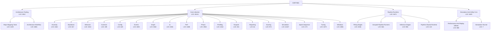

# Architecture Taxonomy

```mermaid
flowchart TB
    system["S3NTINEL"]
    architecture_tooling["Architecture Tooling\nLOC 3912"]
    system --> architecture_tooling
    architecture_tooling_repo_maps["Repo Mapping Tools\nLOC 1029"]
    architecture_tooling --> architecture_tooling_repo_maps
    architecture_tooling_workflow["Architecture Workflow\nLOC 2881"]
    architecture_tooling --> architecture_tooling_workflow
    core_libraries["Core Libraries\nLOC 40141"]
    system --> core_libraries
    core_libraries_anomaly["Anomaly\nLOC 1062"]
    core_libraries --> core_libraries_anomaly
    core_libraries_backbone["Backbone\nLOC 817"]
    core_libraries --> core_libraries_backbone
    core_libraries_behavior["Behavior\nLOC 1910"]
    core_libraries --> core_libraries_behavior
    core_libraries_common["Common\nLOC 199"]
    core_libraries --> core_libraries_common
    core_libraries_config["Config\nLOC 649"]
    core_libraries --> core_libraries_config
    core_libraries_events["Events\nLOC 3493"]
    core_libraries --> core_libraries_events
    core_libraries_graph["Graph\nLOC 3550"]
    core_libraries --> core_libraries_graph
    core_libraries_io["Io\nLOC 2006"]
    core_libraries --> core_libraries_io
    core_libraries_perf["Perf\nLOC 1088"]
    core_libraries --> core_libraries_perf
    core_libraries_phase["Phase\nLOC 2950"]
    core_libraries --> core_libraries_phase
    core_libraries_profiling["Profiling\nLOC 1552"]
    core_libraries --> core_libraries_profiling
    core_libraries_pyspark["Pyspark\nLOC 201"]
    core_libraries --> core_libraries_pyspark
    core_libraries_reporting["Reporting\nLOC 64"]
    core_libraries --> core_libraries_reporting
    core_libraries_scoring["Scoring\nLOC 974"]
    core_libraries --> core_libraries_scoring
    core_libraries_simulation["Simulation\nLOC 11507"]
    core_libraries --> core_libraries_simulation
    core_libraries_spark_sequence["Spark Sequence\nLOC 274"]
    core_libraries --> core_libraries_spark_sequence
    core_libraries_tuning["Tuning\nLOC 3479"]
    core_libraries --> core_libraries_tuning
    core_libraries_windows["Windows\nLOC 2806"]
    core_libraries --> core_libraries_windows
    pipeline_runtime["Pipeline Runtime\nLOC 3673"]
    system --> pipeline_runtime
    pipeline_runtime_fitting_stages["Fitting Stages\nLOC 2036"]
    pipeline_runtime --> pipeline_runtime_fitting_stages
    pipeline_runtime_grouped_runners["Grouped Pipeline Runners\nLOC 565"]
    pipeline_runtime --> pipeline_runtime_grouped_runners
    pipeline_runtime_inference_stages["Inference Stages\nLOC 906"]
    pipeline_runtime --> pipeline_runtime_inference_stages
    pipeline_runtime_pipeline_common["Pipeline Shared Runtime\nLOC 123"]
    pipeline_runtime --> pipeline_runtime_pipeline_common
    simulation_clis["Simulation And Utility CLIs\nLOC 1829"]
    system --> simulation_clis
    simulation_clis_performance_and_replay["Performance And Replay Utilities\nLOC 885"]
    simulation_clis --> simulation_clis_performance_and_replay
    simulation_clis_simulation_runner["Simulation Runner\nLOC 7"]
    simulation_clis --> simulation_clis_simulation_runner
```
