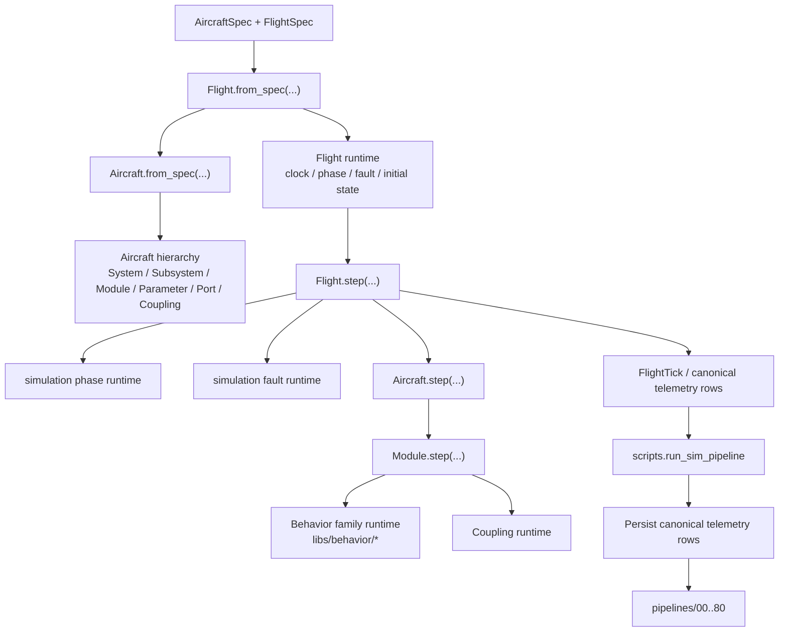

# Simulation Codepath

This note summarizes the **current** simulation codepath.

For current ownership and module names, prefer:
- [libs/simulation/README.md](../../libs/simulation/README.md)
- [scripts/README.md](../../scripts/README.md)
- [pipelines/README.md](../../pipelines/README.md)

This file exists to show the runtime flow, not to duplicate the package README.

## Current flow

## Responsibilities

### `Flight`

`Flight` owns:
- run clock state
- phase progression
- fault scheduling
- initial state application
- emission of canonical telemetry rows plus additive simulation metadata

### `Aircraft`

`Aircraft` owns:
- systems, subsystems, modules, parameters, ports
- couplings
- machine stepping once run context is already resolved

### `Module`

`Module` owns local execution:
- parameter state
- port state
- latent/controller/mode state
- local behavior stepping
- coupling handoff

## Key semantics

- `parameter_value_clean`
  - simulation truth/debug value
- `parameter_value`
  - observed telemetry value consumed downstream
- `fault`
  - simulation-side injected misbehavior
- `anomaly`
  - downstream detection/attribution output

## Downstream handoff

Simulation now emits canonical telemetry-shaped rows directly so the same persisted
fitting and inference pipeline can consume them.

The operational entrypoint is:
- `python -m scripts.run_sim_pipeline ...`

## Notes

- Older `assembly`, `native`, and wrapper-heavy descriptions are obsolete in the active codepath.
- If this note and the package README ever disagree, the package README should be treated as the implementation source of truth.
