# Simulation Coupling And Latent Propagation Diagram

This note isolates the coupling-heavy part of the simulation seam:

- input-port hydration
- latent update hooks
- latent-aware parameter generation
- output-port propagation
- inter-module transfer
- phase/scoped-mode gating

For the end-to-end execution view, see
[simulation_codepath_wire_diagram.md](simulation_codepath_wire_diagram.md).

## Diagram

```mermaid
flowchart LR
    subgraph M1["Source Module"]
        M1I["Input ports\nModuleRuntime.input_ports"]
        M1L["LatentUpdateSpec\nupdate_module_latent_state(...)"]
        M1LS["latent_state_by_name"]
        M1S["BehaviorStepInput\ncontext + latent_state"]
        M1G["Behavior generator\nRegulatedBehavior / InertialBehavior"]
        M1V["Optional violator"]
        M1P["BehaviorSample\nparameter_value_clean\nparameter_value"]
        M1O["Output port update\napply_module_sample_to_output_ports(...)"]
        M1OP["Output ports\nModuleRuntime.output_ports"]

        M1I --> M1L
        M1L --> M1LS
        M1LS --> M1S
        M1S --> M1G
        M1G --> M1V
        M1V --> M1P
        M1P --> M1O
        M1O --> M1OP
    end

    subgraph B["Behavior-local Target Resolution"]
        B1["context['latent_target_name'] ?"]
        B2["Use latent_state[named_target]\nmetadata.target_source = latent_state"]
        B3["Else use context['target_value']\nmetadata.target_source = context"]
        B1 --> B2
        B1 --> B3
    end

    subgraph X["Inter-Module Coupling"]
        X1["InterModuleCouplingSpec\nsource_module_id\nsource_port_name\ntarget_module_id\ntarget_port_name\nrelation_type\ngain / sign\nphase_gate / mode_gate"]
        X2["apply_inter_module_coupling(...)"]
        X3["Drain due delayed transfers\nindependent of current gate"]
        X4["Gate check\nphase_gate\nsource_mode_gate / target_mode_gate"]
        X5["relation_type\n drive / enable / inhibit"]
        X6["Transferred target input value"]
        X1 --> X2
        X2 --> X3
        X3 --> X4
        X4 --> X5
        X5 --> X6
    end

    subgraph M2["Target Module"]
        M2IP["Input ports\nModuleRuntime.input_ports"]
        M2H["inject_input_ports_into_step_inputs(...)"]
        M2S["Next BehaviorStepInput.context"]
        M2L["Next update_module_latent_state(...)"]

        M2IP --> M2H
        M2H --> M2S
        M2S --> M2L
    end

    M1S -.latent target lookup.-> B1
    M1OP --> X2
    X6 --> M2IP
```

## Current execution meaning

1. A source module hydrates parameter step inputs from its current input ports.
2. `LatentUpdateSpec` rules update module-local latent state from:
   - input ports, or
   - first-step context values
3. Runtime latent state is injected into each parameter’s `BehaviorStepInput`.
4. `RegulatedBehavior` and `InertialBehavior` can resolve their target from:
   - a named latent in `latent_state`, or
   - a plain `target_value` in `context`
5. The generated clean value is written back to the module’s output port when the
   `ParameterSpec` declares `output_port_name`.
6. After the source module’s full local sample set has been applied, inter-module
   coupling moves its output-port value into a target module input port subject to:
   - draining any already-queued delayed writes that are now due
   - `phase_gate`
   - scoped `source_mode_gate` / `target_mode_gate`
   - `relation_type`
7. The target module sees the transferred value on its next step as part of
   `BehaviorStepInput.context`.

## Current simplifications

These are still intentionally simple:

- `lag_seconds` uses a minimal queued write mechanism, not a full delay scheduler
- coupling is single-pass, not iterative
- `enable` / `inhibit` semantics are binary, not analog
- latent updates are direct transforms, not dynamic state equations
- target-port propagation uses the emitted clean value first, then observed value as fallback
- the legacy flat `mode_gate` field remains only as a compatibility fallback; the
  active semantics are source/target scoped gates

Those are reasonable simplifications for the current seam review.
