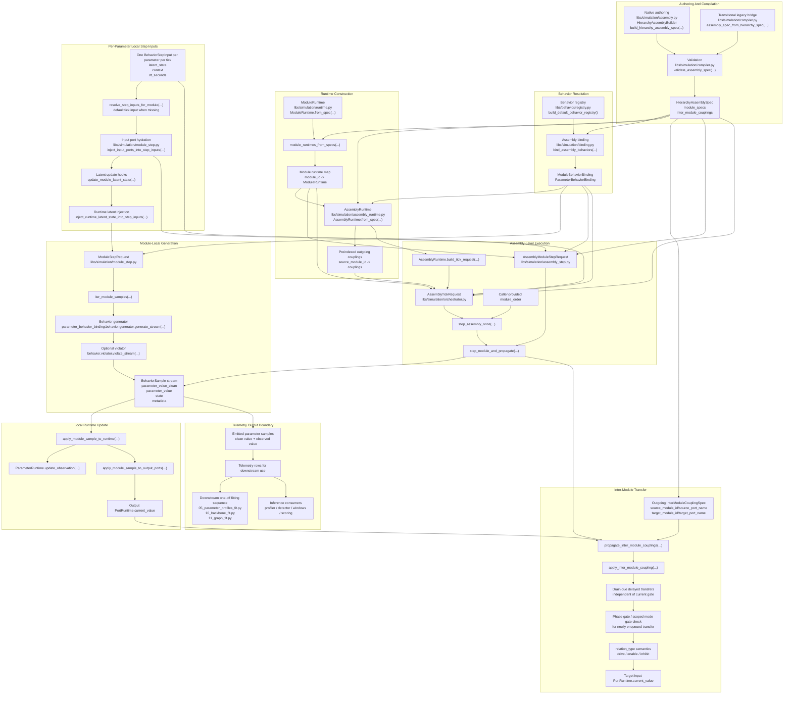

# Simulation Codepath Wire Diagram

This note shows the current simulation execution seam as it exists in code.

It is intentionally **monolithic**:

- native V2.1 assembly authoring
- transitional legacy compilation
- behavior binding
- runtime construction
- module-local stepping
- inter-module propagation
- assembly-wide ordered tick
- downstream handoff into the fitting/profile pipeline

For the broader simulation design rationale, see
[simulation_architecture.md](/home/jrs/code/S3NTINEL/sentinel/docs/simulation_architecture.md).
For a focused view of latent-state and inter-module transfer, see
[simulation_coupling_wire_diagram.md](/home/jrs/code/S3NTINEL/sentinel/docs/simulation_coupling_wire_diagram.md).
For the downstream one-off fitting order after simulation emits telemetry, see
[fitting_workflow.md](/home/jrs/code/S3NTINEL/sentinel/docs/fitting_workflow.md).
For a standalone browser-rendered view of both diagrams, open
[simulation_wire_diagrams.html](/home/jrs/code/S3NTINEL/sentinel/docs/simulation_wire_diagrams.html).

## Diagram

## Actual control flow in one ordered assembly tick

The current execution order is:

1. Build or compile a `HierarchyAssemblySpec`.
2. Validate module IDs and declared inter-module ports.
3. Resolve every `ParameterSpec.behavior_family_label` through the behavior registry.
4. Build `ModuleRuntime` objects from the validated module specs.
5. Build `AssemblyRuntime` as the precomputed execution context.
6. For each module in caller-provided `module_order`:
   - synthesize default one-tick step inputs for any bound parameter missing an explicit caller input
   - hydrate parameter step-input context from current input ports
   - update module-local latent state through `LatentUpdateSpec`
   - inject runtime latent state into each `BehaviorStepInput`
   - run the local behavior generator
   - optionally wrap the emitted stream through the behavior-local violator
   - write the module's emitted samples back to parameter runtime
   - write emitted clean values to output ports where declared
   - drain any due lagged transfers for outgoing couplings
   - enqueue and propagate any newly active inter-module couplings into downstream input ports
6. Return emitted samples grouped by `module_id`.

Main execution entrypoints:

- [assembly.py](/home/jrs/code/S3NTINEL/sentinel/libs/simulation/assembly.py)
- [assembly_runtime.py](/home/jrs/code/S3NTINEL/sentinel/libs/simulation/assembly_runtime.py)
- [binding.py](/home/jrs/code/S3NTINEL/sentinel/libs/simulation/binding.py)
- [runtime.py](/home/jrs/code/S3NTINEL/sentinel/libs/simulation/runtime.py)
- [module_step.py](/home/jrs/code/S3NTINEL/sentinel/libs/simulation/module_step.py)
- [transfer.py](/home/jrs/code/S3NTINEL/sentinel/libs/simulation/transfer.py)
- [assembly_step.py](/home/jrs/code/S3NTINEL/sentinel/libs/simulation/assembly_step.py)
- [orchestrator.py](/home/jrs/code/S3NTINEL/sentinel/libs/simulation/orchestrator.py)

## Semantics that are already locked

- `parameter_value_clean`
  - clean generator-side value before observation noise or perturbation
- `parameter_value`
  - observed downstream value consumed by profiler, detector, windowing, and scoring
- `behavior_family_label`
  - simulation-side nominal behavior assignment on the parameter spec
- `behavior_family_profiled`
  - downstream fitted artifact, not simulation runtime state
- module/assembly step inputs
  - one `BehaviorStepInput` per parameter per tick
  - if the caller omits one for a bound parameter, the orchestrator synthesizes a default single-tick input
  - stream semantics belong inside behavior generators and violators, not the assembly seam

## What this codepath intentionally does not do yet

The current seam is still deliberately minimal.

Not implemented in this execution path yet:

- iterative settling or multi-pass propagation
- global scheduler beyond one explicit ordered pass
- richer controller dynamics
- assembly-wide fault scheduling
- automatic use of downstream fitted artifacts during simulation
- fully typed/scoped execution of all coupling relation types beyond the current
  minimal `drive` / `enable` / `inhibit` semantics

Those belong to the next layer of V2.1 simulation work, not this initial codepath.
